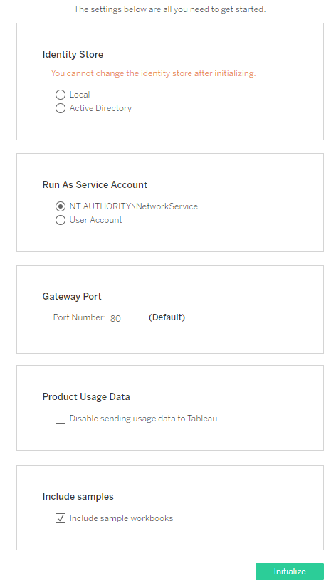

Running Setup
=============
This chapter describes how to install Tableau Server
[2020.3] on Windows and perform essential
configuration steps to get the server up and running. Installing the
software is the first step to sharing and connecting to workbooks. Later
chapters of this guide describe how to configure Tableau Server so users
can connect from anywhere to share, view, and publish data.

If you are upgrading your server, see [Upgrade Tableau Server[(Link
opens in a new
window)]](https://help.tableau.com/current/server/en-us/upgrade.htm).

The *Everybody\'s Install Guide* is only published for the current
version ([2020.3]) of Tableau Server. If you want to
install an earlier version of Tableau Server, refer to the deployment
content for the version that you wish to install. See [Archived Help
Content[(Link opens in a new
window)]](https://www.tableau.com/support/help).

Let\'s review
----------------------------------------------------------------------------------------------------------------------

In the previous chapter ([Planning Your
Deployment](https://help.tableau.com/current/guides/everybody-install/en-us/everybody_admin_planning.htm)) you figured out:

-   How you\'re going to license your server (by users or by cores).

-   What hardware you\'ll need in order to run your server.

-   How your users are going to authenticate with Tableau
    Server---either using Windows Active Directory or using local
    authentication on Tableau Server.

-   Whether you need to create a domain account for the Run As User
    account.

Right? If not, go back and spend some time on these issues. This is
where an ounce of prevention really does save a pound of cure. For
example, if you go through this chapter and guess at the authentication
configuration, and you get it wrong ... well, you\'ll have to uninstall
the server and start over. Or worse, if you undersize your hardware
specs for the usage your organization requires, then eventually everyone
will be grumpy because things run too slowly.

Before you install
---------------------------------------------------------------------------------------------------------------------------

Compared to about 98.7% of the other server products on the planet,
Tableau Server has an amazingly simple install program. Still, there are
a few things you must do before you proceed.

###  Make sure you have the right version of Tableau Server software 

Our recommendation is this: use the same version (for example,
[2020.3]) of Tableau Desktop and Tableau Server
across your organization. To get the latest version of Tableau Server
software, go to the [Customer Portal[(Link opens in a new
window)]](http://customer.tableau.com/). When you purchase
Tableau, you get a user name and password to sign in to the Customer
Portal.

To get an older version of Tableau Server, go to [Tableau Server Product
Downloads and Release
Notes](https://www.tableau.com/support/releases/server).

If you\'re in a situation where you must run different versions of
Tableau on different computers, read the article [Desktop and Server
Compatibility[(Link opens in a new
window)]](https://help.tableau.com/current/desktopdeploy/en-us/desktop_deploy_compatibility.htm).

###  Get a product key and make sure you\'re registered 

Using the user name and password that you received when you purchased
Tableau, go to the [Customer Portal[(Link opens in a new
window)]](http://customer.tableau.com/) and get your product
key.

Also make sure that you\'ve registered an email address. We need a
contact email to associate with each product key. You should provide us
with an email address that is checked frequently and that will not
expire.

### Make sure you have the right Windows version

The following 64-bit Microsoft Windows Server operating systems are
supported:

-   Windows Server 2012

-   Windows Server 2012 R2

-   Windows Server 2016

-   Windows Server 2019

###  Make sure you have Administrator permissions

To run the Tableau Server installation program, you must be signed in to
the computer as a \"local admin\"---a user who\'s a member of the
**Administrators** group in the **Local Users and Groups** management
console in Windows. The \"local\" part means that you\'re an
administrator for the local computer only, not for any other resources
or computers on the network.

You can install Tableau Server as a local administrator even if you\'re
running in an environment that uses Active Directory, which your
security-minded IT person will appreciate. (You might need to be an
Active Directory user when you configure the Run As User account, which
is a post-installation task that we\'ll cover later.)

###  Make sure you\'re installing on a \"clean\" computer 

As we discussed in the planning chapter, we recommend that you install
Tableau Server on a computer that\'s dedicated to running Tableau
Server. Here\'s why:

-   Performance. As Tableau Desktop users discover the data liberation
    that Tableau Server enables, they\'ll use Tableau Server to share
    data sources, and to view, share, and host workbooks as part of
    their daily decision making process. This data transformation
    requires a server computer that is fast and stable. Tuning
    performance is much more straightforward when Tableau Server is not
    competing with other resources, especially other database
    applications.

-   Security. A general security best practice is to segregate server
    applications as much as possible. Tableau Server acts as a conduit
    between your users and data that might be spread across your
    network. Tableau Server also stores extracts of your important data.
    All Tableau Software is built with disciplined security engineering
    practices, and we do a lot of work to protect data, accounts, and
    sensitive information with our default installation. But to reduce
    the risk of security incidents, you should reduce the attack surface
    of the computer running Tableau Server by removing (or not
    installing) other server software.

-   Interoperability. A highly experienced administrator can get Tableau
    Software to interoperate happily with lots of other server software
    that might be installed on the same computer. But we\'re assuming
    that you want to minimize the time you spend manually configuring
    the server.

    For example, if the server computer has Microsoft Internet
    Information Services (IIS) installed on it, then it\'s likely that
    IIS will already be configured to use port 80, which means that port
    won\'t be available for Tableau Server. Sure, you can configure
    Tableau Server to use a different port, like 8000. But that means
    that anytime your users connect to Tableau Server, they\'ll have to
    put that port number into the URL (`http://your-server:8000/`). You
    can see how this would pretty much guarantee a steady stream of
    emails to you about how to connect to Tableau Server. It\'s not
    pretty and it\'s not conducive to a data revolution. Best practice,
    therefore, is to make sure Tableau Server has the server computer
    all to itself.

Ready? Let\'s lay those bits down ...

Step 1: Run Server Setup
-------------------------------------------------------------------

After you download the Tableau Server installation file, double-click
the installation file and then follow the on-screen instructions to
complete setup and install the application.

###  Choose an installation path

We recommend that you let the setup process install Tableau Server in
the default path (`C:\Program Files\Tableau\Tableau Server`). If you
change paths, you might need to set some permissions manually after
setup. If you do specify a different path, be sure to read [Verify
Folder Permission[(Link opens in a new
window)]](https://help.tableau.com/current/server/en-us/runas_confirm_read_ex.htm).

Click [Next].

The [Installation Type] page will display:

You\'re installing a new server, so leave the default selection, [Create
a new Tableau Server installation], and then click
[Next].

The Ready to Install page will display. Click [Install].

After installation completes, click **Next** to start Tableau Services
Manager (TSM). Starting TSM can take a few minutes.

Step 2: Sign in to TSM
-----------------------------------------------------------------

The remainder of the setup process is performed with TSM in a web
browser. After the first part of installation is complete, the Setup
program will launch your browser and prompt you for your credentials:

Sign into TSM with the administrator credentials that you are using to
run Setup.

Step 3: Activate and register Tableau Server
---------------------------------------------------------------------------------------

When TSM starts, it will launch the Activate page.

Tableau Server requires at least one product key that is used both to
activate the server and to set your license type (user-based or
core-based).

If the computer running Tableau Server is not connected to the internet,
then you\'ll have to activate the server offline. If this is your
situation, be sure to read [Activate Tableau Offline[(Link opens in a
new
window)]](https://help.tableau.com/current/server/en-us/activate_off.htm).

Step 4: Configure essential Tableau Server settings
----------------------------------------------------------------------------------------------

After you finish activating and registering, the Tableau Server
configuration options page appears.

You must set the authentication type (aka: Identity Store). If your
deployment plan requires updating that account to an Active Directory
user account, we also recommend setting Run As User now.

And if you\'ve installed Tableau Server onto a computer where you\'re
running another application that is listening on port 80, you\'ll need
to determine how you are going to resolve that conflict.

You can install a set of sample workbooks too. These are handy for
organizations where Tableau Server is new. You can let your users get a
feel for Tableau Server while not risking loss or intentional edits to
real workbooks. Users can log on to Tableau Server and view, edit, and
download the sample workbooks.

###  Set the authentication type

Under **Identity Store**, set the authentication type.

###  Make sure you\'ve got the authentication type right 

Make sure that you\'ve set this appropriately *before* you click
[Initialize]. Clicking [Initialize] here sets
the authentication type for the life of this server installation. If you
want to change it after that, you have to reinstall Tableau Server.

The default is local authentication (Local), so you only need to change
this if you\'re going to use Active Directory authentication.

If you\'re going to use Active Directory, select [Active
Directory]. Then in the [Domain] field, enter
the fully qualified domain name (FQDN) of your domain, and in the
**NetBIOS** field, enter the domain\'s NetBIOS name, or nickname.

The NetBIOS name is usually the left-most node of the FQDN. The first
time your users sign in, they\'ll need to use the fully qualified domain
name (for example, `example.lan\jsmith`). On subsequent sign-ins, they
can use the nickname (`example\jsmith`).

###  Set Run As service account 

If you have determined that your deployment plan requires updating the
Run As service account with a domain account, enter that account in the
[User Account] field.

**Important**: Include the domain name with the user name---for example,
`example\tableaurunas`.

Enter the password that you created for this account.

### Set the port

If the port number displayed in the **Gateway** section says **80**,
you\'re golden.

If the port number isn\'t 80 (for example, it\'s 8000), you\'ll need to
figure out what application on the server computer has already claimed
HTTP port 80. (As noted earlier, if port 80 unavailable, it\'s often
because Microsoft IIS is running on the server computer.)

If you\'re not sure how to proceed here, bring in an IT expert in to
help.

If you must have other applications on the server that default to use
port 80, we recommend that you reset ports on those other applications
so that Tableau Server can use port 80.

###  Continue configuration

To continue the configuration, click **Initialize**.

Tableau Server saves the configuration changes, and will initialize.
This can take a while.

When finished, the following page will be displayed:

Click **Continue** to launch the final step of setup.

Step 5: Create a Tableau Server administrator user
---------------------------------------------------------------------------------------------

The final step is to add an administrator user for Tableau Server. After
the configuration is all set, Tableau launches your browser and presents
a page where you set the administrator user for Tableau Server.

The Tableau Server administrator is a user within Tableau Server who can
manage all aspects of Tableau, including managing sites, users, groups,
and projects, plus change server configuration settings.

-   If you are using Active Directory for authentication, then the
    account that you specify here must be a user in the directory.

-   On the other hand, if you are running Tableau Server with local
    authentication, the username and password that you specify here will
    be used to create the administrative account. Enter a strong
    password for this account.

Use this account to access the Tableau Server admin web pages. See [Sign
in to Tableau Server Admin Pages[(Link opens in a new
window)]](https://help.tableau.com/current/server/en-us/sign_in_server_admin.htm).

Keep the user name and password for the administrator in a secure place!
First, the administrator user in Tableau Server has complete control
over the server, so make sure that the credentials are kept secret.
Second, you need these credentials to create additional users on the
server, and this user is your ultimate entry point into the server if
something happens.

You can add or change server admin accounts anytime. We\'ll cover that
later in the [Creating
Users](https://help.tableau.com/current/guides/everybody-install/en-us/everybody_admin_organize_users_groups.htm) chapter.

#####  Wait\... there
are two different admin tools?

Strictly speaking, no, there are five different paths to administrating
Tableau Server. The table here should clear it up. (The first two tools
should be all you need.)

Your server is installed!
--------------------------------------------------------------------

After you create the administrator user, you\'re signed in as the
administrator to Tableau Server, using the web interface. You can poke
around the UI to get a sense of what you can do. You can also try
[publishing a workbook[(Link opens in a new
window)]](https://help.tableau.com/current/pro/desktop/en-us/help.htm#publish_workbooks_howto.html)
to the server from Tableau Desktop.

But before you roll out Tableau Server to all colleagues, you must
perform a few more steps. First: back up your server. Even though you
don\'t have any users or data on your Tableau Server, you should do a
quick back up. Our back up is quick and straightforward.

After you back up the server, you\'ll probably want to secure access to
your server by configuring SSL and (optionally) providing secure access
from internet clients.

After that, we\'ll describe how to add users, create groups, and then
configure projects so the right people have access to the right content.

