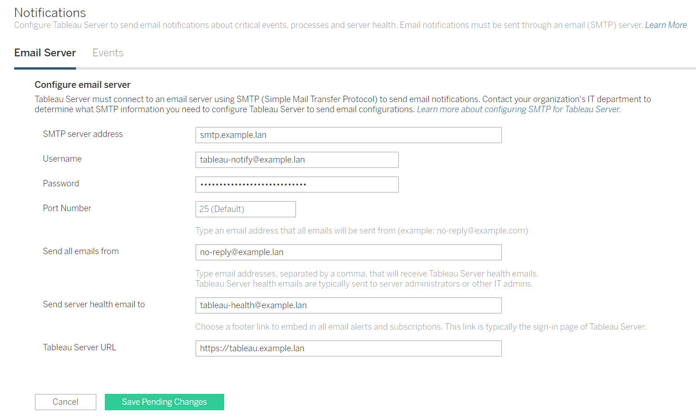
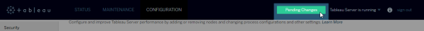

Configure SMTP Setup
====================
[Tableau Server] can email server administrators
about system failures, and email server users about subscribed views and
data-driven alerts. First, however, you need to configure the SMTP
server that [Tableau Server] uses to send email.
After configuring SMTP, complete the steps to configure notifications
([Configure Server Event
Notification](https://help.tableau.com/current/server/en-us/email.htm)), then when you start or restart the server, it will trigger an
email notification, which confirms that you have set up notifications
correctly.

Configuring SMTP requires that you restart Tableau Server services.

Secure SMTP
------------

To enable and configure TLS for SMTP, you must use the TSM CLI as
described in this topic.

If your organization does not use public certificates for verifying TLS
connections, then you can upload a private certificate to Tableau Server
to verify trusted connections. For more information, see the [tsm
security custom-cert
add](https://help.tableau.com/current/server/en-us/cli_security_tsm.htm#custom-cert-add) command.

You may also configure SMTP TLS for encryption-only by disabling the
certificate validation process. For more information, see the section,
*Configuration file reference*,in the *Use the TSM CLI* tab below.

- Use the TSM web interface
- Use the TSM CLI

1.  Open TSM in a browser:

    https://\<tsm-computer-name\>:8850. For more information, see [Sign
    in to Tableau Services Manager Web
    UI](https://help.tableau.com/current/server/en-us/sign_in_tsm.htm)

2.  Click [Notifications]on the [Configuration]
    tab and click [Email Server].

3.  Enter the SMTP configuration information for your organization:

    

4.  Click [Save Pending Changes] after you\'ve entered your
    configuration information.

5.  Click [Pending Changes] at the top of the page:

    

6.  Click [Apply Changes and Restart].

7.  Run the `tsm email test-smtp-connection` to view and verify the
    connection configuration. See [tsm email
    test-smtp-connection](https://help.tableau.com/current/server/en-us/cli_email.htm#tsm)
