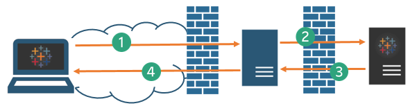
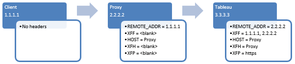

Configuring Communication with the Internet
===========================================
In the [previous
chapter](https://help.tableau.com/current/guides/everybody-install/en-us/everybody_admin_config_ssl.htm)
we discussed how to set up SSL to help secure traffic between clients
(browsers, mobile devices, etc.) and Tableau Server. Configuring SSL is
always a good idea, but it\'s *essential* if you\'re going to allow
clients from outside your network (that is, from the public internet) to
access Tableau Server. If you skipped that chapter but you might allow
people to access Tableau Server from outside your network, please go
back and review it. Really, you absolutely *should not* allow to access
the server unless you\'ve got SSL set up.

If you intend to allow external access, you also have to set up a
reverse proxy server. This chapter discusses proxy servers---what they
are and why you use them. We also provide some guidance about how to
configure proxy servers.

 

Time to call your IT friend
-----------------------------

Unlike most of the other chapters of *[Tableau Server: Everybody\'s
Install Guide]*, where you can complete server
configuration with only minimal aid of an IT professional, we\'ve
written this chapter for the IT professional. We\'ve tried to describe
the concepts in ways that we hope everyone can follow, but setting up
proxy servers involves certificate management, configuring proxy and
gateway settings, and advanced network configuration. If you\'re not an
IT professional and you\'ve been going at it alone so far with this
guide, now is the time to reach out to a professional.

How Tableau communicates with the internet
-------------------------------------------------------------------------------------------

Tableau Server requires outbound access to the internet for these
scenarios:

-   Working with maps. Tableau uses map data that is hosted externally.
    Tableau Server needs to connect to maps locations using port 443. If
    it cannot make this connection, maps may fail to load. By default,
    Tableau uses OpenStreetMaps for map data.

    Tableau Server needs to connect to the following internet locations
    for maps:

    -   mapsconfig.tableau.com
    -   api.mapbox.com

    For versions 2019.1.x and earlier Tableau Server needs to connect to
    this location for maps:

    -   maps.tableausoftware.com

-   Connecting to the Tableau send-logs server.

    You can upload log files to Tableau when working with Support. To
    successfully upload files to Tableau, your Tableau Server must be
    able to communicate with the send-logs server on port 443:

    report-issue.tableau.com

-   Licensing. Tableau products connect to the internet to activate
    product keys. Unless you activate Tableau software with the [Offline
    Activation Tool](http://www.tableau.com/support/activation), all
    Tableau products must have continuous access to the internet to
    validate their licenses.

    Tableau Server needs to connection to the following internet
    locations for licensing purposes:

    -   licensing.tableau.com:443

    -   atr.licensing.tableau.com:443

    -   s.ss2.us

    -   ocsp.rootg2.amazontrust.com

    -   ocsp.rootca1.amazontrust.com

    -   ocsp.sca1b.amazontrust.com

    -   crt.sca1b.amazontrust.com

    -   crt.rootca1.amazontrust.com

    -   ocsp.sca0a.amazontrust.com

    -   crt.sca0a.amazontrust.com

    -   ocsp.sca1a.amazontrust.com

    -   crt.sca1a.amazontrust.com

    -   ocsp.sca2a.amazontrust.com

    -   crt.sca2a.amazontrust.com

    -   ocsp.sca3a.amazontrust.com

    -   crt.sca3a.amazontrust.com

    -   ocsp.sca4a.amazontrust.com

    -   crt.sca4a.amazontrust.com

    -   crl.rootca1.amazontrust.com

    -   crl.rootg2.amazontrust.com

    -   crl.sca1b.amazontrust.com

    Requests to the above domains may be on port 80 or 443.

    If Tableau Server cannot make a connection while attempting to
    activate its license, you will be prompted to do an offline
    activation.

-   Working with external or cloud-based data.

Tableau Server can run without internet access, but in most
organizations, the scenarios in the list require Tableau to be able to
access the internet.

Tableau Server and proxy servers
---------------------------------------------------------------------------------

Tableau Server was designed to operate inside a protected internal
network. Therefore, our first strong recommendation is this: do not set
up Tableau Server on the computer that\'s acting as your organization\'s
internet gateway. As we recommended at the beginning, put Tableau Server
on a dedicated computer that runs no other processes, and in this case,
that is not directly exposed to the internet.

Instead, you should configure a *proxy server*---a computer that
mediates traffic between a local (internal) network and the internet.
*Forward proxy servers* mediate traffic from inside the network to
targets on the internet. *Reverse proxy servers* mediate traffic from
the internet to targets inside the network.

If you\'re working in a big organization, your IT department has
undoubtedly set up proxy servers already. If you\'re setting up
everything yourself, this is, as noted, where might need to consult with
someone who\'s got experience with proxy servers. But let\'s start with
an overview of proxy servers.

**Important**: As we discussed in the [Planning Your
Deployment](https://help.tableau.com/current/guides/everybody-install/en-us/everybody_admin_planning.htm) chapter, we do not recommend installing Tableau Server on a
computer that is running IIS. Additionally, if you are running antivirus
software, you should follow the recommendations in the [Knowledge
Base[(Link opens in a new
window)]](http://kb.tableau.com/articles/howto/improving-performance-by-using-antivirus-exclusions)
to exclude the Tableau Server directories. The procedures in this
chapter assume that you\'ve installed Tableau Server onto a clean
computer.

### Forward proxy server
A forward proxy is a server that sits between the computers inside your
network and the internet. When an application on a network computer
needs access to the internet, it doesn\'t send the request directly to
the internet. Instead, it sends the request to the forward proxy, which
in turn, well, forwards the request. Forward proxies help administrators
manage traffic out to the internet for tasks such as load balancing,
blocking access to sites, etc.

Many organizations use a forward proxy on their network. In those
organizations, the computers inside the network must be configured to
send traffic to the forward proxy. This is generally necessary even if
users themselves aren\'t trying to access the internet. For example, in
order for users to be able to create workbooks that include maps,
Tableau Desktop and Tableau Server must have access to the Tableau map
servers that are hosted on the internet. In addition, by default, the
licensing component for Tableau products connects to the internet to
activate our products. Unless you activate Tableau software with the
[Offline Activation Tool[(Link opens in a new
window)]](http://www.tableau.com/support/drivers/activation),
all Tableau products must have access to the internet to validate their
licenses.

If your organization runs a forward proxy server, you must make sure
that Tableau Desktop and Server are configured to use that proxy server.
If your proxy server authenticates users for outbound connections, you
need to configure Windows Internet Options on Tableau Server to use the
Run As User account as the security context.

The [Additional
resources](https://help.tableau.com/current/guides/everybody-install/en-us/everybody_admin_client_access.htm#additional_resources)
section later includes a link to more information about how to set up a
forward proxy server.

#### Reverse proxy server

A reverse proxy is a server that receives requests from external
(internet) clients and forwards them to Tableau Server. Why use a
reverse proxy? The basic answer is security. A reverse proxy makes
Tableau Server available to the internet without having to expose the IP
address of that server to the internet. A reverse proxy also acts as an
authentication and pass-through device, so that no data is stored where
people outside the company can get to it (in the DMZ, for those who know
that term). This requirement can be important for organizations that are
subject to various privacy regulations such as PCI, HIPAA, or SOX.

####  An illustration of how a reverse proxy work with Tableau Server

The following diagram illustrates the communication path when a client
makes a request to Tableau Server that is configured to work with a
reverse proxy server.

1.  An external client initiates a connection to Tableau Server. The
    client uses the public URL that\'s been configured for the reverse
    proxy server, such as `https://tableau.example.com`. (The client
    does not know that it\'s accessing a reverse proxy.)

2.  The reverse proxy passes the request to Tableau Server. The reverse
    proxy can be configured to authenticate the client (using SSL/TLS)
    as a precondition to passing the request to Tableau Server.

3.  Tableau Server gets the request and sends its response to the
    reverse proxy.

4.  The reverse proxy sends the content back to the client. As far as
    the client is concerned, it just had an interaction with Tableau
    Server, and has no way to know that the communication was mediated
    by the reverse proxy.

**Proxy servers and SSL**

For better security, you should configure the proxy servers to use SSL
for any traffic that\'s external to your network. This helps to ensure
privacy, content integrity, and authentication. Unless you\'ve deployed
other security measures to protect traffic between your internet gateway
and Tableau Server, we also recommend configuring SSL between the
gateway proxy and Tableau Server. As noted in the previous chapter,
[Securing Traffic Between Clients and Your
Server](https://help.tableau.com/current/guides/everybody-install/en-us/everybody_admin_config_ssl.htm), you can use internal or self-signed certificates to encrypt
traffic between Tableau Servers and other internal computers.

We actually recommend that traffic be secured by SSL along each
hop---from outside to the reverse proxy server, and from the reverse
proxy to Tableau Server. In this scenario, we recommend that you
configure the reverse proxy to reject connections that do not use
SSL (that is, that don\'t use `https://` in the URL).

If you\'ll be using Kerberos authentication, you must configure Tableau
Server for your proxy before you configure Tableau Server for Kerberos.

For more information, see [Configure Kerberos[(Link opens in a new
window)]](https://help.tableau.com/current/server/en-us/help.htm#config_kerberos.htm).
Additionally, you can use SAML, OpenID Connect, or Trusted Tickets with
a reverse proxy.

Configure Tableau Server to work with a reverse proxy server
-------------------------------------------------------------------------------------------------------------

Ok, we\'ve talked you into using a reverse proxy. Before you configure
Tableau Server, you\'ll need to collect the following information about
the proxy server configuration. Unless you\'re the person who set up the
reverse proxy server, you\'ll need to ask your IT person for this
information.

+--------------------+-------------------------------------------------+
| Item               | Description                                     |
+====================+=================================================+
| [IP                | You can either enter an IP address or a CNAME   |
| ad                 | for this option.                                |
| dress]{style="font |                                                 |
| -weight: normal;"} | The public IP address or addresses of the proxy |
| or `CNAME`         | server. The IP address must be in IPv4 format,  |
|                    | such as `203.0.113.0`, and it must be a static  |
|                    | IP.                                             |
|                    |                                                 |
|                    | If you are unable to provide a static IP, or if |
|                    | you are using cloud proxies or external load    |
|                    | balancers, you can specify the CNAME (Canonical |
|                    | Name) DNS value that clients will use to        |
|                    | connect to Tableau Server. This CNAME value     |
|                    | must be configured on your reverse proxy        |
|                    | solution to communicate with Tableau Server.    |
+--------------------+-------------------------------------------------+
| FQDN               | The fully qualified domain name that people use |
|                    | to reach Tableau Server, such as                |
|                    | `tableau.example.com`. Tableau Server does not  |
|                    | support a FQDN with information beyond the      |
|                    | domain name, such as `example.com/tableau`.     |
|                    | (Your IT pro might understand this to mean that |
|                    | Tableau Server does not support context         |
|                    | switching.)                                     |
+--------------------+-------------------------------------------------+
| Non-FQDN           | Any subdomain names for the proxy server. In    |
|                    | the example of `tableau.example.com`, the       |
|                    | subdomain name is `tableau`.                    |
+--------------------+-------------------------------------------------+
| Aliases            | Any public alternative names for the proxy      |
|                    | server. In most cases, aliases are designated   |
|                    | using CNAME values. An example would be a proxy |
|                    | server `bigbox.example.com` and CNAME entries   |
|                    | of `ftp.example.com` and `www.example.com`.     |
+--------------------+-------------------------------------------------+
| Ports              | Port numbers for traffic from the client to the |
|                    | reverse proxy server, and for traffic from the  |
|                    | proxy server to Tableau Server.                 |
+--------------------+-------------------------------------------------+

To configure Tableau Server, use Tableau Services Manager (TSM). Tableau
Services Manager is a the management toolset used to install, configure,
and manage Tableau services.

1.  Enter the following command to set the FQDN that clients will use to
    reach Tableau Server through the proxy server, where
    `name` is the FQDN:

    `tsm configuration set -k gateway.public.host -v "name"`

    For example, if Tableau Server is reached by entering
    `https://tableau.example.com` in the browser, enter this command:

    `tsm configuration set -k gateway.public.host -v "tableau.example.com"`

2.  Enter the following command to set the address or the CNAME of the
    proxy server, where `server_address` is
    the IPv4 address or CNAME value:

    `tsm configuration set -k gateway.trusted -v "server_ip_address"`

    If your organization uses multiple proxy servers, enter multiple
    IPv4 addresses , separating them with commas. IP ranges are not
    supported. To improve start up and initialization of Tableau Server,
    minimize the number of entries for `gateway.trusted`.

3.  Enter the following command to specify alternate names for the proxy
    server, such as its fully qualified domain name, any not fully
    qualified domain names, and any aliases. If there\'s more than one
    name, separate the names with a comma.

    `tsm configuration set -k gateway.trusted_hosts -v "name1, name2, name3"`

    For example:

    `tsm configuration set -k gateway.trusted_hosts -v "proxy1.example.com, proxy1, ftp.example.com, www.example.com"`

4.  If the proxy server is using SSL to communicate with the internet,
    run the following command, which tells Tableau that the reverse
    proxy server is using port 443 instead of port 80:

    `tsm configuration set -k gateway.public.port -v 443`

    **Note**: If the proxy server is using SSL to communicate with
    Tableau Server, SSL must be configured and enabled on Tableau
    Server.

5.  Enter the following command to commit the configuration change and
    to restart Tableau Server:

    `tsm pending-changes apply`

Configure the reverse proxy server to work with Tableau Server
---------------------------------------------------------------------------------------------------------------

Enabling client access from the internet through a reverse proxy
requires that specific message headers are preserved (or added) for
Tableau Server. The following graphic shows this.

The headers that Tableau Server require are:

-   `REMOTE_ADDR` and `X-FORWARDED-FOR` (`XFF`). Tableau Server needs
    these headers to determine the IP address of origination for
    requests.

-   `HOST` and `X-FORWARDED HOST` (`XFH`). These headers are used to
    generate absolute links to Tableau Server when it replies to the
    client.

-   `X-FORWARDED-PROTO` (`XFP`). This header is required if you are
    running SSL at the proxy, but not on Tableau Server. As noted, we
    recommend running SSL on each hop.

Troubleshooting and notes for reverse proxies
----------------------------------------------------------------------------------------------

Because there are different proxy solutions, we can\'t spell out steps
for setting up the end-to-end configuration. However, we\'ve collected
some tips and other information related to enabling a reverse proxy with
Tableau Server.

### Configuring headers

-   The `X-FORWARDED-PROTO` headers are important for scenarios where
    HTTP or HTTPS is not maintained along each hop of the message route.
    For example, if the reverse proxy requires SSL for outside requests,
    but traffic between the reverse proxy and Tableau Server is not
    configured to use SSL, `X-FORWARDED-PROTO` headers are required.
    Some proxy solutions add the `X-FORWARDED-PROTO` headers
    automatically, while others do not. Finally, depending on your proxy
    solution, you might have to configure port forwarding to translate
    the request from port 443 to port 80.

-   Some proxy servers require a rule in addition to the
    `X-FORWARDED-PROTO` header. For example, an F5 proxy device requires
    that you apply an iRule to the virtual server that is hosting the
    URL namespace for Tableau Server.

-   Proxy servers and external load balancers can be mixed and stacked
    in multiple formations. In the case where there are multiple hops,
    the order of headers presented to Tableau Server must match the
    sequence of hops the traffic has taken to reach Tableau Server. In
    addition, to enable trusted tickets, all proxy servers in the chain
    must be specified in the `gateway.trusted` and `trusted.hosts`
    settings.

-   If you have multiple IPs in the `gateway.trusted` setting, you must
    separate the values with a comma *and* a space when you issue the
    command, such as `"203.0.113.0, 10.32.56.78"`. The entire string
    must also be enclosed in double quotation marks, as shown.

### Authentication

-   If you\'ll be using Kerberos authentication, you must configure
    Tableau Server for your proxy before you configure Tableau Server
    for Kerberos.

    For more information, see [Configure Kerberos[(Link opens in a new
    window)]](https://help.tableau.com/current/server/en-us/help.htm#config_kerberos.htm)
    in the Tableau Server Help.

-   Apache reverse proxy servers are not supported if Tableau Server is
    using SSPI (Active Directory with Enable automatic logon) for
    authenticating Tableau Server users. Apache reverse proxy servers
    *are* supported if Tableau Server is authenticating server users
    with just Active Directory (no **Enable automatic logon**).

-   Configure your proxy to authenticate with SSL. Do not configure your
    proxy server to prompt users for authentication.

Continue to [Creating
Users](https://help.tableau.com/current/guides/everybody-install/en-us/everybody_admin_organize_users_groups.htm).

Additional resource
--------------------

-   [Configuring Proxies for Tableau Server[(Link opens in a new
    window)]](https://help.tableau.com/current/server/en-us/proxy.htm).
    A topic in the Tableau Server Help that provides configuration
    information for complex deployments.

-   [Desktop Deployment Guide[(Link opens in a new
    window)]](https://help.tableau.com/current/desktopdeploy/en-us/desktop_deploy_welcome.htm).
    This guide provides information about how to plan, install, and
    upgrade Tableau Desktop for yourself or for multiple users.
