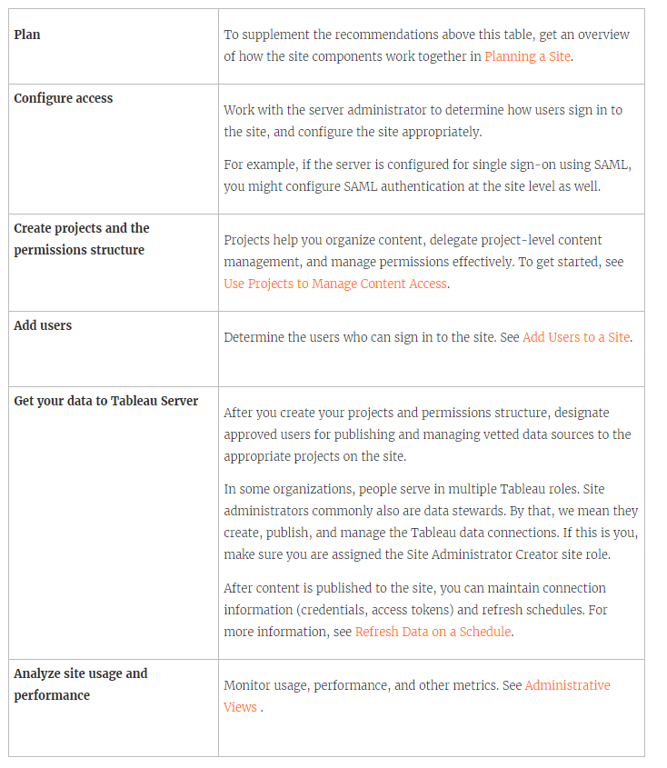

What is a site
==============

You might be used to using the term *site* to mean "a collection of
connected computers," or perhaps as the short form of "website." In
Tableau-speak, we use site to mean a collection of users, groups, and
content (workbooks, data sources) that's walled off from any other
groups and content on the same instance of [Tableau
Server]. Another way to say this is that [Tableau
Server] supports multi-tenancy by allowing server
administrators to create sites on the server for multiple sets of users
and content.

All server content is published, accessed, and managed on a per-site
basis. Each site has its own URL and its own set of users (although each
server user can be added to multiple sites). Each site's content
(projects, workbooks, and data sources) is completely segregated from
content on other sites.

Site administrator tasks
-------------------------

Where the Server Administrator site role gives a user unrestricted
access to the entire [Tableau Server] deployment,
the Site Administrator site roles give a user unrestricted or minimally
restricted access at the site level. The differences between Site
Administrator Creator and Site Administrator Explorer are in the level
of data connection and publishing access. Both site roles allow
administering the site itself and managing site users. For more
information, see [Set Users' Site
Roles](https://help.tableau.com/current/server/en-us/users_site_roles.htm).

Although a server administrator can work at both the server and site
levels, we make a distinction between the two levels of task. The site
administrator is typically in charge of creating and maintaining the
framework that enables Tableau users in the organization to publish,
share, manage, and connect to data sources and workbooks. In this vein,
site administrator tasks include any of the following (and both site
roles allow this level of access):

-   Creating project hierarchies to organize the site's data sources and
    workbooks.
    This can include delegating project-level management to project
    leaders.
-   Creating groups and assigning permissions that allow users to access
    only the content they need.
-   Adding and removing users, assigning their site roles.
    This is allowed by default on a site; however, a server
    administrator can restrict this access to the server level only.
-   Managing the site's extract and subscription schedules.
-   Monitoring site activity.

Steps for setting up your site
-------------------------------------

The table below shows a loose sequence of steps for setting up a site,
along with links to topics where you can get more information. You can
complete the steps in any order that makes sense for you.

However, before you perform the steps to configure the site, we
recommend spending some time with the articles in this section, learning
about site authentication, site roles, projects, and permissions.
Ideally you would document a plan for your projects, groups, and overall
permissions strategy. Then set up a few projects and add a preliminary
set of users, to test the plan and resolve issues before you add the
remaining users. You can change many site settings after your users are
working with the site, but try to go in with the intention of minimizing
post-production changes.

