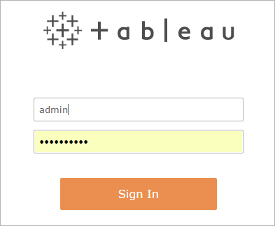
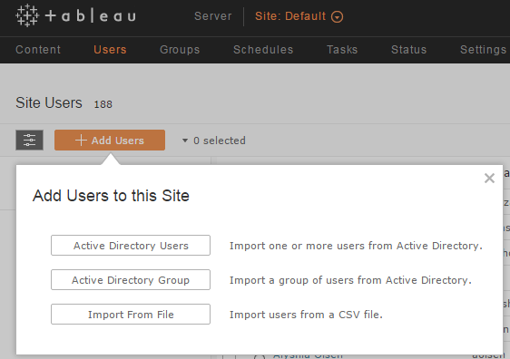

Creating Users
==============

The reason you have Tableau Server is to allow users to share their
Tableau workbooks and data sources! So one of your tasks is to set up
your server so that your coworkers can sign in, publish their work, and
view the work of others. How you do this depends on whether you
configured your server to use Active Directory identity store or local
identity store.

Unless you are running with a Guest user (someone who can see views but
can't interact with them, anyone who accesses your Tableau Server has to sign
in --- that is, be authenticated. Tableau Server stores information about
users, and when someone signs in, they have to be identified as one of
the users who's defined on the server.

About users, groups, and sign-in
---------------------------------

There are two ways to create users in Tableau Server. If the server is
configured to use Active Directory, you import the users from your
organization\'s Active Directory store. This copies user names and email
addresses of users from Active Directory to Tableau Server. (It doesn\'t
copy the password.)

If you configured the server to use local identity store, you create a
user name, password, and optional email address for each user. If you
have to create a lot of users, you can make this process more convenient
by first creating a text file with the information for all the users,
and then importing the text file.

We\'ll walk you through the steps for creating users in both
configurations---Active Directory and local identity store---later in
this chapter.

### User limits and your license

Your server license determines how many users you can create. If you
have a user-based license, the license tells you the maximum number of
registered users you can have, across a range of user-based license
types. If you have a core-based license, you can create as many users as
you want.

### Sites

Before we talk about users and roles, we must quickly talk about
*sites*. You might be used to using the term *site* to mean \"a
collection of connected computers,\" or perhaps as the short form of
\"website.\"  But in Tableau-speak, we use *site* to mean a collection
of content (workbooks, data sources, users, etc) that\'s walled off from
any other content on the server.

Imagine an entirely separate server with users, projects, workbooks, and
data connection configurations. That\'s what another site is like on
your instance of Tableau Server. There\'s no way for users of one site
to access any information on another site, even though the sites (and
users) are hosted on the same physical computer. The only users who can
access other sites are server administrators.

Why might you create separate sites? One reason is to test functionality
before you make changes to your main site. Another reason that
organizations create separate sites is to host different types of
content that must not be intermingled or even be visible to different
users. For example, some financial companies might be required by law to
maintain ethical boundaries between divisions. Such a company could set
up a Tableau Server with two sites: one for investors, one for bankers.
Each site has its own URL and its own set of users, and each site has
completely segregated content, projects, and data sources.

When you install Tableau Server, it comes preconfigured with a site
whose name is, unsurprisingly, [Default]. For the purposes
of this guide, where you\'re running a single server and you want to get
up and running with the least amount of fuss, we recommend using the
default site.

### Users and site roles

When you create a user, that user is in a specific site. For the tasks
in this guide, you'll be creating users in the [Default]
site.

You also have to assign the user a site role, which defines the maximum
access the user has. In this guide we assume that you, as the person who
created the administrator user at the end of the Tableau Server
installation process, have the [Server Administrator] site
role. This site role allows access to everything on your server and
across all sites.

Levels of access that other site roles allow include:

-   [Site Administrator Explorer], as you can probably
    guess, can perform administrative functions, such as managing users
    and content, on a given site. The site administrator doesn't have
    permissions to administer the server itself.

-   [Explorer (Can Publish)] can publish data sources or
    workbooks to the server and edit published content.

-   [Explorer] can view *and* interact with workbooks.

-   [Viewer] can view workbooks but not change anything in
    them.

Site roles are the first step in assigning permissions to users. As
mentioned above, a good way to think about a site role is that it
determines the maximum capabilities that a user will ever have on a
given site. For example, if a user's site role is [Viewer],
the user can view content on the site but can't publish to that site,
regardless of what other permissions the user is granted later. (You
assign a site role when you create a user, but you can change it later.)

For now, we recommend that you assign the site role of [Explorer (Can
Publish)] for new users who aren't administrators. (In
[Structure Content Projects, Groups, and
Permissions](https://help.tableau.com/current/guides/everybody-install/en-us/everybody_admin_permissions.htm), we'll describe how to implement a content permissions model that
fits your organization.)

Finally, you can assign the [Unlicensed] site role to users
when you want to create a user name and password for the user, but you
don't want that user to count against your user-based license limit. You
can create as many users as you want that have the
[Unlicensed] role.

### Groups

Tableau Server lets you organize users into groups, which makes it more
convenient for certain tasks, such as assigning permissions. For now,
your goal is just to add users to your Tableau Server site, so we'll go
into detail when we talk about permissions. However, we mention groups
here because if you're working with Active Directory, you can import
users from Active Directory groups to Tableau Server groups.

Sign in to Tableau Server
----------------------------------------------------------------------------------

When you add users to Tableau Server, you create or import them using
the Tableau Server administrator page, which you access with a web
browser. Before you sign in, you'll need this information:

-   The URL that you use to sign in to your instance of Tableau Server.
    The URL depends on whether you're working directly on the server
    computer or accessing the server from a different computer. If you
    don't know the server name or IP address, check with your IT person.

    If no IT person is available, sign in to the computer where Tableau
    is running. Then, on the Windows [Start menu],
    right-click [Computer] and then choose
    [Properties]. The [Properties] window lists
    the computer name for the server computer.

-   You also need to know what port Tableau Server is using. If another
    process had already claimed port 80 when you installed Tableau
    Server, Tableau Server will listen on a different port. (By default,
    the alternate port that Tableau Server will set is 8000.)

    To review ports and related information, see [Running
    Setup](https://help.tableau.com/current/guides/everybody-install/en-us/everybody_admin_install.htm)

If your IT department set up your server, they might have set a custom
virtual directory or another type of namespace mapping to accommodate
multiple web destinations on a single computer. If that\'s the case for
your installation, check with your IT department for the URL for your
server.

Here's how to sign in to Tableau Server:

1.  Open your browser and enter the server URL. Here are some examples
    of what the URL might look like:

    `http://localhost/` (if you're opening a browser directly on the
    server computer)

    `http://MarketingServer/` (if you know the server name)

    `http://10.0.0.2/` (if you know the server's IP address)

    If the server is *not* using port 80, you need to include the port
    number in the URL, as in these examples:

    `http://localhost:8000/`

    `http://MarketingServer:8080/`

    `http://10.0.0.2:8888/`

    \... where `8000` or `8080` or `8888` is the port that you
    configured.

    Tableau Server displays a page where you can enter a user name and
    password:

    

2.  Enter the credentials for the server administrator that you created
    when you finished the installation.

    You're then taken to the main page of the [Default]
    site, and you're ready to create users.

Create users: Active Directory
---------------------------------------------------------------------------------------

If you configured Tableau Server to use Active Directory, you import
users into Tableau Server from your organization\'s Active Directory.
You can import users individually, but if you have a lot of users, you
can also import them in a batch. Either way, you\'ll need to specify a
site role for the users you\'re importing.

**Note**: In the context of user and group synchronization, Tableau
Server configured with LDAP identity store is equivalent to Active
Directory. Active Directory synchronization features in Tableau Server
function seamlessly with properly configured LDAP directory solutions.

#### Import users individually

1.  Sign in to Tableau Server.

2.  At the top of the page, click [Site].

3.  Click the [Users] tab, click [Add Users],
    and then click [Active Directory Users].

4.  In the [Import Users from Active Directory] dialog box,
    enter the user names for the Active Directory accounts that you want
    to import. The user name is often the same as the left-hand side of
    an email address. For example, John Smith might have a user name of
    `jsmith` or `johns`. To import multiple users, enter their names
    separated with a semicolon.

    The first time you import users, or if you\'re importing users from
    another trusted domain, you might have to enter the domain nickname
    with the user name. For example, if your domain nickname is
    `exampleco`, enter user names in this format: `exampleco\jsmith`.

    After you enter the user names, set the [Site role] to
    [Explorer (Can Publish)] and then click
    [Import].

#### Import an Active Directory group of users

1.  Sign in to Tableau Server.

2.  At the top of the page, click [Site].

    

3.  Click the [Users] tab, click [Add Users],
    and then click [Active Directory Group].

4.  In [Import a Group from Active Directory], enter the
    friendly name of the group that you want to import.

5.  Select the group that you want to import.

6.  In [Site role], select [Explorer (Can
    Publish)], and then click [Import].

    Tableau Server imports the users. Because the import process is
    designed to handle hundreds or even thousands of users (probably not
    in your case, of course), Tableau Server runs the import process as
    a background task. Therefore, it might take a short while before all
    the users have been imported and are available for you to view.

If you don\'t want to license every single user in a given Active
Directory group, you can either delete those users after importing the
group, or you can set the site role for those users to be
[Unlicensed].

### Should you delete group containers after importing users from Active Directory?

When you import users from Active Directory groups, corresponding groups
are created in Tableau Server. This is helpful if you want to map your
groups from Active Directory directly to content permissions in Tableau
Server. If that\'s useful to you, you might want to schedule periodic
[synchronization of Active Directory groups[(Link opens in a new
window)]](https://help.tableau.com/current/server/en-us/help.htm#groups_globalsync.htm)
with Tableau Server. Read the next chapter, [Structure Content Projects,
Groups, and
Permissions](https://help.tableau.com/current/guides/everybody-install/en-us/everybody_admin_permissions.htm), to understand how groups interact with projects.

We\'ve found that in most cases, Active Directory groups don\'t map to
the groups that you need in Tableau Server. Instead, Tableau Server
admins usually create groups directly in Tableau Server for managing
user access to content and data sources. In that case, you can delete
the groups that are imported from Active Directory. (Deleting a group
does not delete the users in it.) Again, the [Structure Content
Projects, Groups, and
Permissions](https://help.tableau.com/current/guides/everybody-install/en-us/everybody_admin_permissions.htm) chapter might help you decide how you want to use groups in
Tableau Server. If you decide later that you do want to sync Active
Directory and Tableau Server groups, you can always re-create the
groups.

To delete a group, do this:

1.  Sign in to Tableau Server.

2.  At the top of the page, click [Server].

3.  Click the [Groups] tab and then select the group that
    you want to delete.

4.  Click the [Actions] drop-down menu, and then click
    [Delete].

Create users: local identity store
-------------------------------------------------------------------------------------------

If you configured Tableau Server to use local identity store when you
installed it, you create users by entering user information directly
into Tableau Server for each person who can sign in.

1.  Sign in to Tableau Server.

2.  At the top of the page, click [Users].

3.  Click [Add Users] and then click [Local
    User].

4.  In the [New Local User] dialog box, enter the user name,
    password, and site role. If you don\'t have a specific site role in
    mind for the user, pick [Interactor]. Make a note of the
    user names and passwords, because you'll need to distribute these
    credentials to your users when you [Open for
    Business!](https://help.tableau.com/current/guides/everybody-install/en-us/everybody_admin_open_for_biz.htm)

    You can also enter an email address for the user. This can be useful
    if you want to enable notifications for users, as we\'ll describe
    later in this guide.

5.  Click [Create].

### Import users with CSV file

For bigger batches of users, you can save time by creating a text file
that lists the user name, password, and site role, and then importing
the file.

If that seems useful to you, you can read more about it in [CSV
Import[(Link opens in a new
window)]](https://help.tableau.com/current/server/en-us/users_import.htm)
in the Tableau Server Help.

