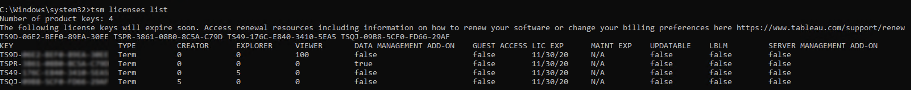

View Server Licenses
====================
Server administrators can view the license and product key information for [Tableau Server].

##### Viewing licenses from the [Tableau Server] web UI

How you navigate to the Licenses page in [Tableau
Server] depends on whether you have a single
site, or multiple sites.

-   On a server with a single site, click [Settings] and
    [Licenses]:

-   On a multi-site server, click [Manage all sites] on the
    site menu, [Settings], and [Licenses]:

    **Note:** The [Manage all sites ]option only displays
    when you are signed in as a server administrator.

This page displays information for any licenses that have been activated
on your server, including any user-based (term) or core-based licenses.

### Use the TSM web interface

1.  Open TSM in a browser:

    http://\<tsm-computer-name\>:8850

2.  Click **Configuration** , and then click [Licensing ]:

    The table displays the product key, expiration date, and expiration
    of maintenance.

    **Note**: The TSM Web UI provides a limited amount of licensing
    information. Use the TSM CLI or the Tableau Server Web UI to see
    additional licensing information, including the number of each type
    of user-based license (Creator, Explorer and Viewer).

### Use the TSM CLI

  of user-based license (Creator, Explorer and Viewer).

1.  Open a command prompt as administrator on the initial node (the node
    where TSM is installed).

2.  Run the following command:

    `tsm licenses list`

The command lists licenses that are activated on the Tableau Server
deployment.

For example, a server with five Creator licenses, five Explorer
licenses, 100 Viewer licenses, and a Data Management Add-on would
provide command output similar to the following:

The following fields are returned:

-   **KEY**: A globally unique 16-character string that identifies the
    license.
-   **TYPE**: Describes the type of license
    -   Term: Term licenses map to a subscription schedule and must be
        renewed. The expiration date is listed under the LIC EXP field.
    -   Perpetual: Perpetual licenses are purchased once and do not need
        to be renewed but must be refreshed to update the MAINT EXP or
        maintenance expiration date.
    -   Cores: Core licenses are licenses that map to the number of
        cores on the computers running specific Tableau Server services.
        Core licensing allows for a guest user access to views on the
        server or embedded on other web servers. Core licenses also
        allow for unlimited Explorer and Viewer users.
-   **CREATOR**: The number of Creator licenses issued to the Tableau
    Server deployment.
-   **EXPLORER**: The number of Explorer licenses issued to the Tableau
    Server deployment.
-   **VIEWER**: The number of Viewer licenses issued to the Tableau
    Server deployment.
-   **DATA MANAGEMENT ADD-ON**:Tableau Server is licensed for the Data
    Management Add-on (`True`/`False`).
-   **GUEST ACCESS**: Tableau Server is licensed for a Guest User.
    The ability to leverage a Guest User requires Core licensing. See
    TYPE field.
-   **LIC EXP**: The date that the license expires and Tableau Server
    will stop working. Term licenses expire. See TYPE field. Visit the
    Tableau [Customer Portal(Link opens in a new
    window)](https://customer.tableausoftware.com/) to refresh licenses.
-   **MAINT EXP**: Applies only to legacy perpetual licenses (TYPE =
    Perpetual). For Term licenses, this field will output, `N/A`.
    MAINT EXP displays the date that the maintenance contract for the
    Tableau Server deployment expires. 
-   **UPDATABLE**: Specifies whether the license is an updatable
    subscription license (`True`/`False`).
-   **LBLM**: Specifies if login-based license management (LBLM) is
    enabled for the Tableau Server deployment (`True`/`False`). When
    enabled, LBLM allows users to log into Tableau Server to license
    their instance of Tableau Desktop or Prep, rather than entering a
    product key.
-   **SERVER MANAGEMENT ADD-ON**: Tableau Server is licensed for the
    Server Management Add-on (`True`/`False`).

**Note**: The license terms for Creator, Explorer and Viewer users are
set according to the terms of the user-based license (term license), if
present. So, a server with only a core-based license will have unlimited
Explorer and Viewer users and guest access, but no Creator users.