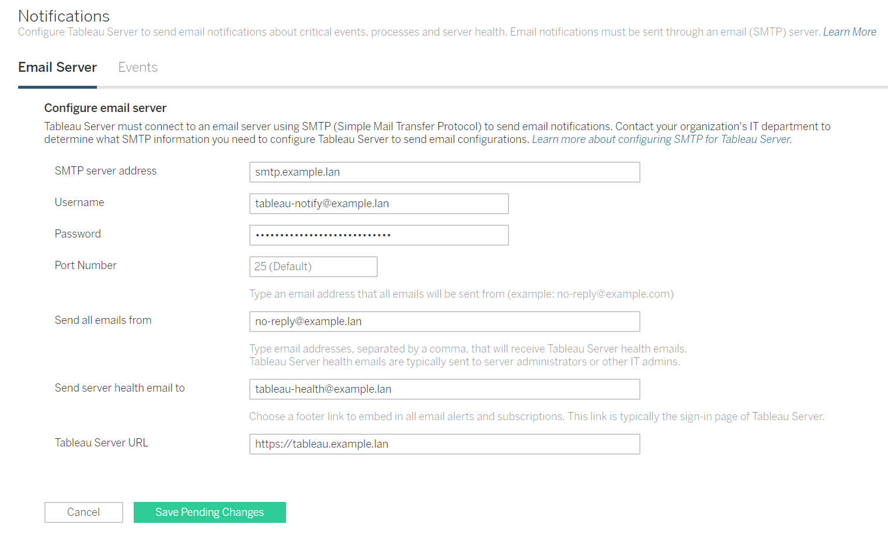
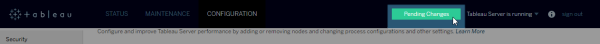
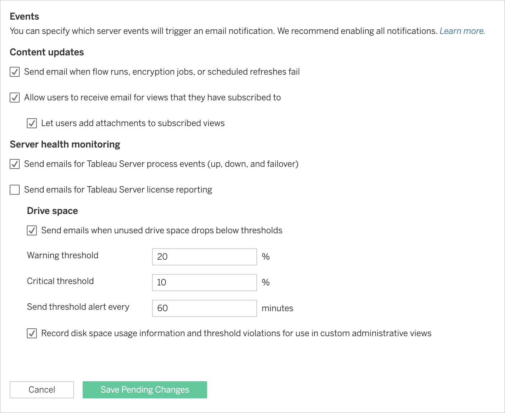
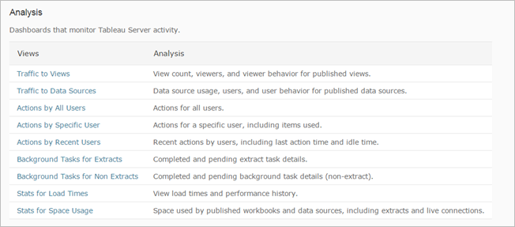
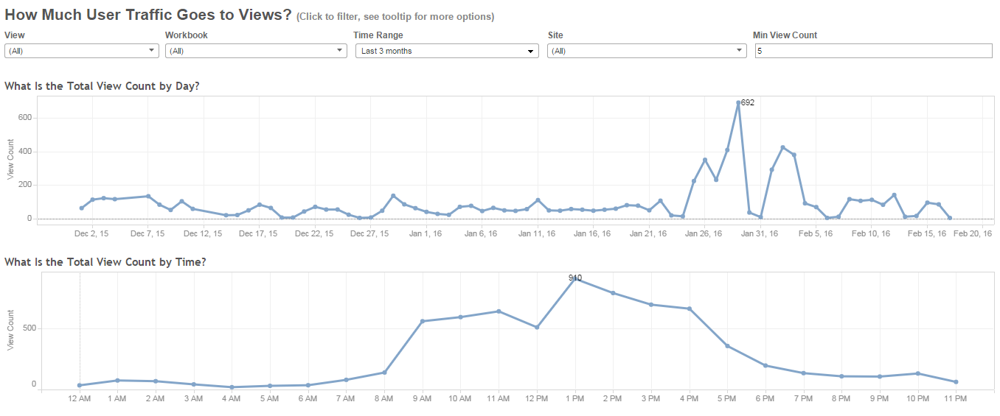
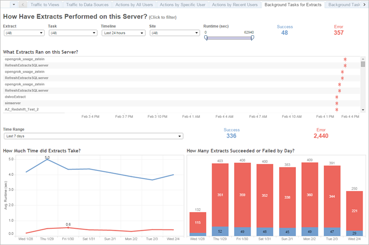
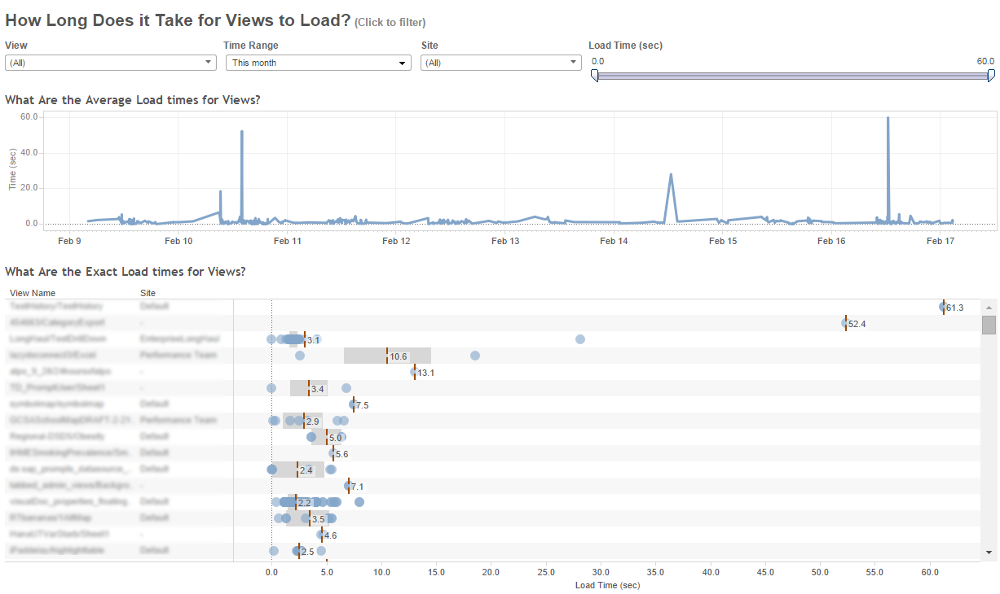
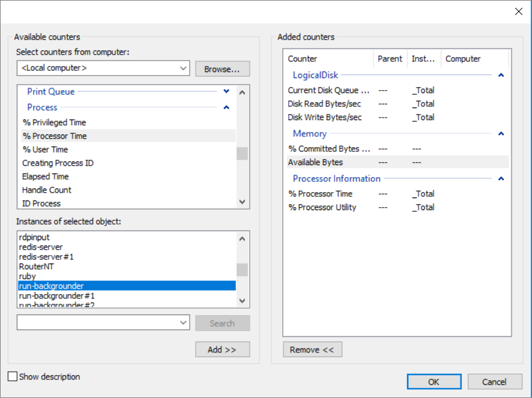

Notifications, Monitoring, and Tuning
=====================================
So you've finished setting up users and extracts and Tableau Server
seems to be humming along---now you can relax, right? Almost. This
chapter describes how to monitor the health of Tableau Server. In
theory, the steps in this chapter are optional: you don\'t *have* to set
up notifications or keep your finger on the server\'s pulse. But we
really recommend that you spend the effort to do so, because it will go
a long way toward ensuring that things keep humming along and will
provide useful information that you can use to tune server performance.

Alerts: Get notifications for server events
--------------------------------------------------------------------------------------

Alerts are email notifications that you receive when something happens
on [Tableau Server]. You can set up alerts for
when the server is running out of disk space and for when server
processes stop or start. These conditions often mean that there is an
immediate problem.

**Note**: We discuss alerts in this section as a tool for getting
information about server health. But as an entirely separate benefit,
users can also make use of alerts. After you set up alerts, your users
can subscribe to views to periodically receive a snapshot of views they
are interested in on a recurring basis.

To send alerts, [Tableau Server] must connect to
a mail server, also known as a Simple Mail Transfer Protocol (SMTP)
server. An SMTP server is a service that you can send outbound email
messages to. It then relays the messages to whoever they\'re addressed
to. (It doesn\'t handle incoming email.) To set up alerts, you must
configure [Tableau Server] to communicate with
your SMTP mail server.

### SMTP information you\'ll need

Many organizations already have an SMTP server in-house. Before you
continue, ask your IT department if there is an SMTP server that you can
use.

Here\'s the SMTP server information that you need from your IT
department:

-   The server address. This is often something like `smtp.example.com`
    or `mail.example.com`, but other addresses are also possible.

-   The port. This is 25 for most servers.

-   A user name.

-   A password.

Some servers don\'t require a user name or password because they are
only meant for internal use.

You\'ll also need to decide on a **from** address for the alerts that
the server sends. When people receive an alert email from [Tableau
Server], this is the name that\'s on the **from**
line of the message. Because alerts are simply informational, you
generally don\'t need to worry about who\'s on the **from** line, so
people use addresses like `no-reply@example.com` or
`tableau-admin@example.com`.

###  Step 1: Configure SMTP information for Tableau Server

1.  Open TSM in a browser:

    https://\<tsm-computer-name\>:8850. For more information, see [Sign
    in to Tableau Services Manager Web UI[(Link opens in a new
    window)]](https://help.tableau.com/current/server/en-us/sign_in_tsm.htm).

2.  Click [Notifications]on the [Configuration]
    tab and click [Email Server].

3.  Enter the SMTP configuration information for your organization:

    

4.  Click [Save Pending Changes] after you\'ve entered your
    configuration information.

5.  Click [Pending Changes] at the top of the page:

    

6.  Click [Apply Changes and Restart].

###  Step 2: Set up notifications

1.  Open TSM in a browser:

    https://\<tsm-computer-name\>:8850. For more information, see [Sign
    in to Tableau Services Manager Web UI[(Link opens in a new
    window)]](https://help.tableau.com/current/server/en-us/sign_in_tsm.htm).

2.  Click [Notifications]on the [Configuration]
    tab and click [Events].

3.  Configure notification settings for your organization:

    

4.  Click [Save Pending Changes] after you\'ve entered your
    configuration information.

5.  Click [Apply Changes and Restart].

If you do select all the check boxes, here are the alerts that get
activated.

#### Subscriptions to views

Users can periodically receive a snapshot of views that they\'re
interested in. This can be useful if your users want to see information
about views on a recurring basis. For example, users can get a view in
their inboxes every week.

See the [Additional
resources](https://help.tableau.com/current/guides/everybody-install/en-us/everybody_admin_monitor.htm#additional-resources)
section at the end to read more about how users can set up
subscriptions.

#### Server component events

For installations of Tableau Server on a single computer (as described
in this guide), you can receive a notification when Tableau Server
processes stop or start. Because part of the server must be running to
send an alert that processes have stopped, you only see notifications
when the data engine, repository, and gateway processes stop. However,
you see notifications for all Tableau Server processes that start. For
installations of Tableau Server on multiple computers, which we\'re not
covering in this guide, this setting also lets the administrator get
notifications when individual Tableau Server processes stop responding.

Anytime that server processes stop or that the server restarts
unexpectedly, you should investigate the cause of the restart.

For example, you may discover that the Windows Server computer is
configured to restart automatically after Windows updates---in which
case you may want to schedule updates for off-peak hours.

#### Low disk space

You can receive a notification when the disk space on the server
computer falls below a threshold that you specify. As a general rule, we
recommend that the server computer maintain at least 20% free disk
space. The farther that the disk space falls below this threshold, the
more likely that the server\'s performance will be affected. Eventually,
the server may even stop responding.

The defaults we recommend here set email alerts to send hourly when the
20% warning threshold is hit, and sets the critical threshold for 10%.

Administrative views
---------------------------------------------------------------

Administrative views are views that are built into Tableau Server and
that provide an easy way for you to start understanding activity on
Tableau Server---whether the activity comes from users or from server
tasks like extracts.

1.  Sign in to Tableau Server as a server administrator.

2.  Click **Status**. Tableau Server displays a list of administrative
    views.

    

Here are the most important administrative views that you should look at
when monitoring Tableau Server:

###  Traffic to views

Use this view to identify peak hours for user traffic. (This is easier
if you use the Time Range filter. For example, in the screenshot below,
the filter is set to **Last 3 months**.) If you know when users need
your server most for their work, you can make sure that you schedule
things like extract refreshes (which can take up server resources) for
when usage is lightest.

For example, in the screenshot, you can see that peak hours are between
1 PM and 3 PM. You can also tell that there is less traffic in the
mornings than in the afternoons, and that traffic drops sharply outside
of business hours. Conclusion: if this were your data, you\'d want to
set your extract refresh schedule for the period between 11:00 PM and
6:00 AM.

###  Background tasks for extracts

Use this view to identify times of the day when extract refresh tasks
take longer than usual and to identify extract refresh tasks that did
not complete. If there are peak times for extract refresh tasks,
distribute the extract refresh schedule so that fewer extracts run at
the same time.

Alternatively, if individual extracts are taking a long time, see if you
can use Tableau Desktop to reduce the amount of data pulled into the
extract---for example, you can sample rows, hide unused fields, and
aggregate data for visible dimensions.

If you notice that there are particular extract refresh tasks that do
not complete, try to connect to the data source from outside of Tableau
Server to confirm that the connection information is correct and that
the data source is available.

For example, in the screenshot you can see that many extracts are
failing, but you can also see that the failed extracts had very short
runtimes. This might indicate that the data source for those extracts is
unavailable.

### Stats for load times

Use this view to identify which views are loading slowly. This helps you
pinpoint workbooks that are very processing-intensive for the
server---inefficient workbooks are one of the most common reasons for
poor server performance. (We list some resources later that can help you
optimize and troubleshoot workbooks.)

Alternatively, it may be that a view is not processor-intensive but
takes a long time to load because of data source constraints.

You can use some of the suggestions we provide later in the [Windows
performance
monitoring](https://help.tableau.com/current/guides/everybody-install/en-us/everybody_admin_monitor.htm#windows-performance-monitoring)
section to see whether there\'s a spike in CPU usage while a view is
loading. If there isn\'t a spike, the view is not processor-intensive
and you should examine the data source. You can also use extracts to
avoid making live requests to a slow data source.

For example, in the administrative view below, you can use the exact
load times for views to see that the top views load significantly more
slowly than the rest.

Windows performance monitoring
-------------------------------------------------------------------------

So far the monitoring information that we've looked at has been gathered
by Tableau Server. However, you can also use the Windows Performance
Monitor (PerfMon) included with Windows Server to monitor server
processes and resource utilization.

You can use PerfMon to gather very detailed information about every part
of a server installation, including how often the computer is using the
CPU, how much memory is being used, and even information about each
Tableau Server process. For those who are new to PerfMon, it works by
taking a snapshot of selected processes at regular intervals.

The first step in using PerfMon is to set up a data collector set, which
is how PerfMon stores the data that it collects. To collect information
about Tableau Server processes with PerfMon, Tableau Server must be
running when you create the data collector set.

###  Step 1: Create a new data collector set

1.  Click the Windows Start menu and search for \"performance\".

2.  Right-click **Performance Monitor** and then click **Run as
    administrator**.

3.  In the left pane, click **Data Collector Sets**.

4.  In the right pane, right-click **User Defined**, click
    [New], and then click **Data Collector Set**.

5.  In the **Create new Data Collector Set** wizard, enter a name for
    the data collector set. For example, you might enter **Tableau
    Server Performance**.

6.  Select **Create manually (Advanced)** and then click **Next**.

7.  Under **Create data logs**, select **Performance counter**, and
    click **Next**.

### Step 2: Select performance counters

1.  Set the sample interval to 30 seconds.

2.  Click **Add**.

3.  Select performance counters from the list.

    The following table lists some performance counters that we
    recommend for tracking Tableau Server performance.

    +----------------------+----------------------+----------------------+
    | Category             | Performance Counters | Notes                |
    +======================+======================+======================+
    | Logical Disk         | Current Disk Queue   | The number of        |
    |                      | Length               | outstanding write    |
    |                      |                      | requests and the     |
    |                      | Disk Read Bytes/sec  | amount of bytes read |
    |                      |                      | and written to the   |
    |                      | Disk Write Bytes/sec | server's hard disk.  |
    |                      |                      | Select these         |
    |                      |                      | counters for the     |
    |                      |                      | disk on which you    |
    |                      |                      | installed Tableau    |
    |                      |                      | Server (referred to  |
    |                      |                      | as the *instance* in |
    |                      |                      | PerfMon).            |
    +----------------------+----------------------+----------------------+
    | Memory               | \% Committed Bytes   | The percentage of    |
    |                      | in Use               | virtual memory in    |
    |                      |                      | use, and the amount  |
    |                      | Available MBytes     | of memory available  |
    |                      |                      | in megabytes.        |
    +----------------------+----------------------+----------------------+
    | Processor            | %Processor Time      | The percentage of    |
    | Information          |                      | time that the        |
    |                      | \% Processor Utility | processor spends     |
    |                      |                      | active, and the      |
    |                      |                      | percent of           |
    |                      |                      | processing capacity  |
    |                      |                      | being used by the    |
    |                      |                      | processor.           |
    +----------------------+----------------------+----------------------+
    | Process              | \% Processor Time    | The percentage of    |
    |                      |                      | processing capacity  |
    |                      | Private Bytes        | being used by a      |
    |                      |                      | particular process,  |
    |                      |                      | and the amount of    |
    |                      |                      | memory reserved for  |
    |                      |                      | the process. Select  |
    |                      |                      | these counters for   |
    |                      |                      | the following        |
    |                      |                      | processes (referred  |
    |                      |                      | to as *instances* in |
    |                      |                      | PerfMon):            |
    |                      |                      |                      |
    |                      |                      | -                    |
    |                      |                      |   `run-backgrounder` |
    |                      |                      |     (Backgrounder)   |
    |                      |                      | -   `run-dataserver` |
    |                      |                      |     (Data server)    |
    |                      |                      | -   `redis-server`   |
    |                      |                      |     (Cache server)   |
    |                      |                      | -   `hyperd` (Data   |
    |                      |                      |     engine)          |
    |                      |                      | -                    |
    |                      |                      |    `run-vizqlserver` |
    |                      |                      |     (VizQL Server)   |
    +----------------------+----------------------+----------------------+

    To select each performance counter:

    a.  Double-click to select a category in the drop-down list.

    b.  Select the performance counter or counters that you want to use.

    c.  Under [Instances of selected object], if
        appropriate, select the process (or instance) that you want to
        collect information about.

        

    d.  Click **Add**.

    e.  Click **OK** and then click **Next**.

###  Step 3: Save the data collector set

1.  Browse to the directory where you want to store the data, and then
    click **Next**.

    **Important:** You must store the data in a place that\'s accessible
    by Tableau. For example, you might want to store the data on a
    network drive. If you don\'t have a network drive mapped,
    right-click **This PC** and select **Add a Network Location**.

2.  Click **Finish**.

3.  In the left pane of the main **Performance Monitor** window, select
    the data collector set that you created.

4.  In the right pane, right-click the performance counter
    **DataCollector01** and then click **Properties**.

5.  Select **Comma separated** as the log format and then click **OK**.

### Step 4: Run the data collector set

In the left pane, right-click the name of the data collector set that
you created and click **Start**. The Windows Performance Monitor tool
starts monitoring your server and storing information in the location
that you specified.

###  Step 5: Analyze the data

Finally the moment that you've been waiting for! Open the log file for
the data collector set in Tableau Desktop and start analyzing.

The following section provides some guidelines and recommendations for
how to improve server performance based on the data that you collect.

Tuning: Tweaking the server for better performance
---------------------------------------------------------------------------------------------

Because no two server environments are identical, we can\'t provide hard
and fast rules for tuning server performance.

Instead, we recommend that you look for patterns in the data that you
collected from the administrative views and from Windows Performance
Monitor.

For example, are there recurring spikes? Do any of the patterns that you
notice in the administrative views correspond to similar patterns in
Windows Performance Monitor?

Try to foster a practice of observing, testing, and incremental tuning.

In the end, most performance tuning for Tableau Server boils down to two
general approaches:

-   Optimizing for user traffic. This tunes the server to be responsive
    to users who are publishing and (especially) viewing workbooks.

-   Optimizing for extract refreshes. This tunes the server to put its
    horsepower to work in updating data extracts from a database or
    other source.

Rendering views and refreshing extracts generate the most load on the
server, so you should optimize for the task that your organization is
most interested in.

###  Optimize for user traffic

Here are some signs that you should optimize for user traffic:

-   During peak traffic hours, overall resource utilization for the
    processor and memory are consistently high.

-   The VizQL server process has a high percent processor time and large
    amount of private bytes dedicated.

-   Spikes in user traffic noticeably affect view load times.

If you\'re seeing evidence of this type of activity, try making the
following changes one at a time and observing how they affect
performance.

#### Refresh the cache less often

If your users do not always need the most up-to-date data, you can
improve the performance of views by configuring Tableau Server to cache
and reuse data as much as possible.

You can tune caching to increase the amount of time before data is
cached. We covered cache configuration in the last chapter. See
[Configure data connection
caching](https://help.tableau.com/current/guides/everybody-install/en-us/everybody_admin_data.htm#Configur) .

#### Increase the number of VizQL server processes

The VizQL server process is responsible for loading views and responding
to user interaction, so adding more processes may help when dealing with
many users. Because VizQL server processes can consume a lot CPU and
memory, though, adding too many processes could end slowing down the
server. Start by adding one server process at a time and measuring the
effect with more performance monitoring.

1.  Open TSM in a browser:

    https://\<tsm-computer-name\>:8850. For more information, see [Sign
    in to Tableau Services Manager Web UI[(Link opens in a new
    window)]](https://help.tableau.com/current/server/en-us/sign_in_tsm.htm).

2.  Click the [Configuration ]tab.

3.  Select the [VizQL]dropdown menu and increment the number
    of processes by at least one.

4.  Click [Pending Changes ]at the top right, and [Apply
    Changes and Restart] to commit the changes and restart
    Tableau Server.

###  Optimize for extract refreshes

Here are some signs that you should optimize for extract refreshes:

-   Extracts are failing or taking a long time to finish.

-   The backgrounder process consistently has a high percentage of
    processor time.

-   The VizQL server process has a low percentage of processor time and
    small amount of private bytes dedicated, even during peak traffic
    hours.

If you\'re seeing any of these things, try the following.

#### Adjust the extract refresh schedule

Use the administrative view for extracts to identify optimal times for
running extracts. In addition to running extracts in off-peak hours, you
can distribute the running of extract refreshes to minimize concurrent
server load. If extract refreshes continue to cause problems, reduce the
frequency of extract refreshes as much as possible.

-   Schedule extracts for times when the server isn\'t busy. (Use the
    administrative view to check traffic.)

-   Reduce the frequency of refreshes.

#### Configure extract refreshes to run in parallel

When you create an extract refresh schedule, ensure that the refresh
runs in parallel execution mode.

#### Increase backgrounder processes

1.  Open TSM in a browser:

    https://\<tsm-computer-name\>:8850. For more information, see [Sign
    in to Tableau Services Manager Web UI[(Link opens in a new
    window)]](https://help.tableau.com/current/server/en-us/sign_in_tsm.htm).

2.  Click the [Configuration ]tab.

3.  Select the [Backgrounder]dropdown menu and increment the
    number of processes by at least one.

4.  Click [Pending Changes ]at the top right, and [Apply
    Changes and Restart] to commit the changes and restart
    Tableau Server.

Continue to [Open for
Business!](https://help.tableau.com/current/guides/everybody-install/en-us/everybody_admin_open_for_biz.htm)

Additional resources
---------------------------------------------------------------

-   [Scheduled Extract Refreshes[(Link opens in a new
    window)]](https://help.tableau.com/current/server/en-us/publish.htm).
    A section of the Tableau Server Help that covers how to schedule
    refreshes for extracts.

-   [Subscribe to
    Views](https://help.tableau.com/current/pro/desktop/en-us/help.html#subscribe_user.html).
    A topic in the Tableau User Help that explains how users subscribe
    to a view.

-   [Windows Performance
    Monitoring](https://technet.microsoft.com/en-us/library/cc749249.aspx).
    Documentation on the Microsoft TechNet site for the Windows
    Performance Monitor.

-   [Tableau Server
    Processes](https://help.tableau.com/current/server/en-us/help.htm#processes.htm).
    A list in the Help of all the Tableau Server processes.

-   [Troubleshoot Disk Usage on Tableau Server
    Nodes](https://help.tableau.com/current/server/en-us/help.htm#trouble_disk_space.htm).
    A topic in the Tableau Server Help that provides suggestions for
    viewing disk usage and freeing up disk space.

-   [Designing Efficient
    Workbooks](http://www.tableau.com/learn/whitepapers/designing-efficient-workbooks).
    A whitepaper on the Tableau.com site that decribes best practices
    for users in order for them to produce effective, well-performing
    workbooks.
