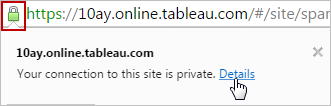
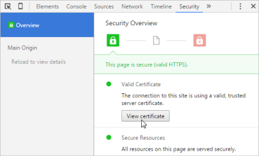

Securing Traffic Between Clients and Your Server
================================================
This chapter describes how Tableau Server communicates with other
computers, and what you can do to make that traffic more secure.

 

{.roadsign-img}

[[]{.icon--med-lg .icon--arrow-up .heading-item__icon}](https://help.tableau.com/current/guides/everybody-install/en-us/everybody_admin_config_ssl.htm#){.heading-item__link .print-hidden} A few curves ahead
--------------------------------------------------------------------------------------------------------------------------------------------------------------------------------------------------------------

Whereas previous chapters of *[Tableau Server: Everybody\'s Install
Guide]{.VariablesEAGuideTitle}* might have felt like cruising an empty
highway on a clear day, this one might be more like heading up a
mountain pass. Not a one-lane service road exactly, but one that
requires a little more focus nonetheless.

It might help to know that some of this stuff can be tricky even for IT
pros. But when we\'re talking about security of your sensitive data,
would you trust an approach that was *too* easy?

If you\'ve been going at it alone so far with this guide, now\'s the
time to bring in your local IT professional. If you don\'t have an IT
pro in-house, consider enlisting the help of Tableau Professional
Services.

Even with IT help, we think it\'s important that anyone administering
Tableau Server should understand the principles and procedures behind
securing the environment. Plus, we don\'t want to decide for you what
you\'ll enjoy learning about, or maybe even want to become pro at
yourself. So we\'ll do our best here to convey what you need to get set
up. Beyond that, you can find loads of info online---including in
Tableau\'s own Help and KnowledgeBase articles.
:::

[[]{.icon--med-lg .icon--arrow-up .heading-item__icon}](https://help.tableau.com/current/guides/everybody-install/en-us/everybody_admin_config_ssl.htm#){.heading-item__link .print-hidden} An overview of HTTP and client-server communication {#overview-of-http-and-client-server-communication}
-----------------------------------------------------------------------------------------------------------------------------------------------------------------------------------------------------------------------------------------------

By default, Tableau Server, like many server applications, communicates
with clients using the standard web protocol, namely HTTP. In HTTP, when
a browser sends a request to the server, and when the server responds,
the information is sent back and forth in clear text. That means anyone
who can snoop on that communication can read its content.

Some of the information that your users and the server send back and
forth might be sensitive. For example, a user might access Tableau
Server through a web browser and send a user name and password to sign
in to the server. Or a user might request a Tableau view created with
sensitive data. If someone can see this traffic (and snooping on HTTP
isn\'t hard for an experienced IT person), they might see information
that they shouldn\'t.

[[]{.icon--med-lg .icon--arrow-up .heading-item__icon}](https://help.tableau.com/current/guides/everybody-install/en-us/everybody_admin_config_ssl.htm#){.heading-item__link .print-hidden} Your security goals: privacy and trust
----------------------------------------------------------------------------------------------------------------------------------------------------------------------------------------------------------------------------------

When it comes to securing communication between Tableau Server and its
clients, you\'re after privacy and trust. To achieve privacy, you make
HTTP content unreadable to anyone who might snoop. You do this by
*encrypting* the traffic.

But you also need a trust relationship between the server and client.
This means that when the server sends information, the client can trust
that the information is coming from the server that the client thinks
it\'s communicating with. Trust is established through *authentication*,
similar to the way you as a user are authenticated when you provide a
user name and password to sign in to your computer. Authentication helps
to prevent a client from being fooled into communicating with a
malicious site.

[[]{.icon--med-lg .icon--arrow-up .heading-item__icon}](https://help.tableau.com/current/guides/everybody-install/en-us/everybody_admin_config_ssl.htm#){.heading-item__link .print-hidden} Using SSL to encrypt Tableau Server communication
---------------------------------------------------------------------------------------------------------------------------------------------------------------------------------------------------------------------------------------------

SSL (secure sockets layer) is a protocol similar to HTTP, except that it
that lets computers send encrypted information across a network such as
the web. (We\'re using the term *SSL* as the generic name for this
protocol; you might also see it referred to as *TLS*.) SSL accomplishes
the two goals mentioned earlier---privacy and trust---through the
encryption and authentication that we just mentioned. When SSL is
enabled for Tableau Server, users can use `https://` instead of just
`http://` to request content from the server.

Enabling SSL significantly improves the security of client-server
traffic. If your instance of Tableau Server is accessible from the
internet (not just on your internal network), configuring SSL for the
server is *essential*. Making a server available on a public network
without SSL is a serious security concern. Even if your server is not
publicly accessible, a good practice is to enable SSL for client-server
communication on your local network.

The following sections provide some background about how SSL works. We
also describe requirements for using SSL with Tableau Server, whether
you want to help secure traffic over the internet or on your local
network. It describes how to enable SSL and points you to external
resources for additional information. How you enable SSL on your local
network depends on many factors in your environment. Your friend in IT
will know how best to handle it for your particular server installation.

### [[]{.icon--med-lg .icon--arrow-up .heading-item__icon}](https://help.tableau.com/current/guides/everybody-install/en-us/everybody_admin_config_ssl.htm#){.heading-item__link .print-hidden} SSL and VPN

Some of your Tableau Server users might access your server from offsite
using a VPN (virtual private network) connection to your network. In
that case, although the users are offsite, the VPN connection itself
provides both privacy and trust. It\'s still a good practice to enable
SSL, but it\'s not essential if access to Tableau Server for your users
is across a VPN.

### [[]{.icon--med-lg .icon--arrow-up .heading-item__icon}](https://help.tableau.com/current/guides/everybody-install/en-us/everybody_admin_config_ssl.htm#){.heading-item__link .print-hidden} SSL certificates

To support SSL, the server requires a *digital certificate*. You can
obtain a digital certificate from a publicly trusted, third-party entity
known as a *certificate authority*, or CA. A trusted CA verifies your
organization\'s identity and then issues a signed certificate that is
unique to your organization. Examples of trusted CAs include Symantec
(VeriSign), thawte, and GlobalSign. There are many others.

\"Publicly trusted\" means that all operating systems, Tableau-supported
browsers, and other clients inherently trust the root certificates from
these CAs. They meet web-industry standards for recommended encryption,
and they require less of work from you to configure the client-server
trust relationship.

After you\'ve gone through the steps to get a certificate, the CA sends
you your certificate as a set of files. When you receive the certificate
files, you install them on your server. Then when a client tries to
access the server, the information the client gets from the server\'s
certificate allows the client to authenticate the server. This covers
your goal of trust. The certificate also includes a public key, which
enables the client to establish encrypted communications with the
server. This covers the goal of privacy.

To describe this vetting process at a high level, when a client wants to
start an encrypted session with the server, the client requests the
server\'s certificate. (By the way, this all happens automatically when
a user enters `https://` at the beginning of a URL.) The server replies
with its certificate. The server\'s certificate usually points to the
certificate of the issuer, which might in turn point to a certificate by
a different issuer, all the way up to the CA---in practice, there\'s
usually a whole chain of certificates. The client examines the
certificate, or all the certificates in the chain, and compares the CA
information in the certificate against CA information that the client
already has. (Browsers and other clients maintain a store of known CAs.)
If the client determines that the certificates are valid and trusted,
the client and server can begin an encrypted session and exchange
information.

### [[]{.icon--med-lg .icon--arrow-up .heading-item__icon}](https://help.tableau.com/current/guides/everybody-install/en-us/everybody_admin_config_ssl.htm#){.heading-item__link .print-hidden} Mutual (two-way) SSL {#mutual-ssl}

We\'ll just mention here that it\'s possible to configure *mutual SSL*,
sometimes called *two-way SSL*, where both the server and the client
have certificates. Mutual SSL is particularly useful if your users will
be accessing the server from public locations, especially over public
wifi, because it helps make sure that only preconfigured clients are
allowed access to the server.

The client certificate for mutual SSL is typically generated by IT
people inside your organization. The client certificate contains a user
name and information to make sure the certificate can\'t be forged. With
mutual SSL, when the client starts a session with the server, the client
requests and examines the server\'s certificate, as usual. Then the
server requests and examines the client\'s certificate to determine its
validity.

We won\'t say more about mutual SSL in this guide, but later in this
chapter we\'ll have links to more information in case this seems like a
feature you want to enable for your Tableau Server installation.

### [[]{.icon--med-lg .icon--arrow-up .heading-item__icon}](https://help.tableau.com/current/guides/everybody-install/en-us/everybody_admin_config_ssl.htm#){.heading-item__link .print-hidden} Self-signed certificates

Your organization can generate its own certificate without going through
the vetting process that a CA offers. This creates a *self-signed
certificate*. A self-signed certificate allows the client and server to
establish encrypted sessions. However, it doesn\'t let the client verify
the server\'s identity (authenticate the server). When users connect to
the server, they see a message that says something like \"This
certificate is not trusted.\" The exact text depends on the browser or
other client.

By default, many Tableau clients, including Tableau Mobile, will not
work with a self-signed certificate on Tableau Server. For some clients
(like iOS devices), you can configure the device to trust a self-signed
certificate. If you\'re curious about this, take a look at the
KnowledgeBase article about using Tableau Mobile with an SSL server,
listed in the additional resources section at the end of this chapter.

We recommend that instead of trying to work with the \"certificate not
trusted\" browser warning, or configuring devices to work with
self-signed certificates (with potential for unreliable results), you
get a publicly trusted certificate from a known CA.

[[]{.icon--med-lg .icon--arrow-up .heading-item__icon}](https://help.tableau.com/current/guides/everybody-install/en-us/everybody_admin_config_ssl.htm#){.heading-item__link .print-hidden} SSL for client-server traffic inside your organization
--------------------------------------------------------------------------------------------------------------------------------------------------------------------------------------------------------------------------------------------------

The certificate that you obtain from the trusted CA helps secure traffic
between your server and users working on computers outside your
organization---that is for traffic from the internet. For this scenario,
clients use your server\'s *fully qualified* (public) *domain name*,
such as `https://www.example.com/`. (Notice the `s` at the end of
`https://`)

You can also enable SSL encryption on traffic *inside* your local
network. This protects traffic when your colleagues are accessing the
server using an internal host name, such as `https://tableauserver`.

The following sections describe some options for enabling SSL for
internal traffic. Our recommendations follow these descriptions. Get
together with your IT partner to determine which one suits your
environment best and then help you configure it.

### [[]{.icon--med-lg .icon--arrow-up .heading-item__icon}](https://help.tableau.com/current/guides/everybody-install/en-us/everybody_admin_config_ssl.htm#){.heading-item__link .print-hidden} Use your organization\'s existing internal CA and self-signed root certificate {#use-your-organizations-existing-internal-ca-and-selfsigned-root-certificate}

If your organization has an IT team, ask them if they have their own
internal certificate authority. If they do, ask them to create a
certificate for you. Often, these certificates will be automatically
trusted by your Tableau users\' computers, so you don\'t have to go
through the process of configuring each client to trust the certificate.

If you don\'t have an internal CA, an alternative is to use OpenSSL, an
open-source tool that comes with Tableau Server, to create an internal
CA. Then you set each client to trust the internal CA. When you need to
update the certificate, you can push it out to clients through the
system management tool you use, such as Group Policy.

Although steps to do this are documented in the Tableau Server Help and
out on the web, they require coordinating many moving parts at the
system level of your computer. We do not encourage doing this without an
experienced IT partner.

### [[]{.icon--med-lg .icon--arrow-up .heading-item__icon}](https://help.tableau.com/current/guides/everybody-install/en-us/everybody_admin_config_ssl.htm#){.heading-item__link .print-hidden} Create a self-signed certificate for your server, and configure clients to support it {#create-a-selfsigned-certificate-for-your-server-and-configure-clients-to-support-it}

Yes, we really are saying the exact opposite of what we just said in the
section about using self-signed certificates for public traffic. But
here\'s why it\'s okay: for client-server traffic that\'s isolated
inside your organization\'s private network, you don\'t need
public-level trust that you get with a CA-issued certificate.

Even for your internal traffic, you\'ll have to configure browsers on
each user\'s computer, iOS devices, and other clients to support the
self-signed certificate. Otherwise you\'ll have to tell your users how
to deal with the \"untrusted site\" warning that appears in the browser
when they try to connect. Another caveat is that even if you configure
clients, you\'ll need to do it again when the certificate expires and
you need to reissue it.

### [[]{.icon--med-lg .icon--arrow-up .heading-item__icon}](https://help.tableau.com/current/guides/everybody-install/en-us/everybody_admin_config_ssl.htm#){.heading-item__link .print-hidden} How to decide which option to use

When it comes to enabling SSL for internal traffic to Tableau Server,
here\'s our order of preference. If the preferred option is impractical
for your organization (for example, you have no internal CA), try the
next option.

1.  If your organization has an internal CA, use it. This enables you to
    enable SSL internally, while sparing your users the pesky
    \"untrusted certificate\" browser messages.

2.  Use a self-signed certificate, and configure clients to trust it, or
    explain to users that it\'s okay to make an exception for Tableau
    Server and ignore the \"untrusted site\" browser message.

3.  Obtain a certificate from a publicly trusted CA.

4.  If none of the first three options is available, enlist your IT
    department to help you with the process described for creating an
    internal CA.

[[]{.icon--med-lg .icon--arrow-up .heading-item__icon}](https://help.tableau.com/current/guides/everybody-install/en-us/everybody_admin_config_ssl.htm#){.heading-item__link .print-hidden} Get and install a public certificate for Tableau Server {#getting-and-installing-a-public-certificate-for-tableau-server}
---------------------------------------------------------------------------------------------------------------------------------------------------------------------------------------------------------------------------------------------------

The process for obtaining a certificate is different for each CA, and
cost varies by CA and level of certificate you get. If your organization
doesn\'t have an IT department, the best way to start is by searching
the web using a phrase like \"get ssl certificate\" and reading through
the offerings from different CAs.

If your organization *does* have an IT department, ask them if they have
a relationship with public certificate authorities and can streamline
the acquisition process.

Your IT pro will need to know the following requirements for
certificates you install on Tableau Server. (The acronyms represent
different encryption algorithms. For the purposes at hand, you don\'t
need to learn more about them other than to satisfy any curiosity you
might have.)

-   The server certificate must be a PEM-encoded x509 certificate.

    Other formats are possible, so make sure that you get a PEM-encoded
    certificate, or use a tool such as OpenSSL to save the certificate
    in PEM format.

-   The certificate `.key` file contains the key in RSA or DSA format
    and an embedded passphrase, and the file itself is not password
    protected.

-   If the server certificate is not signed by a root CA directly, the
    issuer should provide a chain file.

    The chain file must likewise be in PEM format and must contain all
    of the intermediate certificates between the server certificate and
    the root certificate. Including the root certificate (or \"trust
    anchor\") is optional. The chain file is required if you want users
    of Tableau Mobile or Tableau Desktop on the Mac to connect to the
    server.

### [[]{.icon--med-lg .icon--arrow-up .heading-item__icon}](https://help.tableau.com/current/guides/everybody-install/en-us/everybody_admin_config_ssl.htm#){.heading-item__link .print-hidden} Enable SSL

1.  Open TSM in a browser:

    https://\<tsm-computer-name\>:8850. For more information, see [Sign
    in to Tableau Services Manager Web UI[(Link opens in a new
    window)]{.sr-only}](https://help.tableau.com/current/server/en-us/sign_in_tsm.htm).

2.  On the [Configuration] tab, select
    [Security] \> [External SSL].

3.  Under [External web server SSL], select [Enable SSL for
    server communication].

4.  Upload the certificate and key files, and if required for your
    environment, upload the chain file and enter the passphrase key:

    

5.  Click [Save Pending Changes].

6.  Click [Pending Changes] at the top of the page:

    

7.  Click [Apply Changes and Restart].

### [[]{.icon--med-lg .icon--arrow-up .heading-item__icon}](https://help.tableau.com/current/guides/everybody-install/en-us/everybody_admin_config_ssl.htm#){.heading-item__link .print-hidden} View the certificate

After you install the files, you can navigate to your site in a browser
and view the certificate. We\'ll use Tableau Online on Google Chrome to
show you how this works.

1.  Open your browser and go to `online.tableau.com`.

2.  Click the green padlock that appears in the address bar.

    

3.  Click the [Details] link. The site\'s security overview
    appears.

    

    The display shows that Chrome has determined that the site uses a
    valid, trusted certificate. As you click around in the security
    overview, you can also see the CA that issued the certificate and
    the chain of trust. Click [View certificate] here to see
    more specific information (although don\'t worry that it doesn\'t
    mean much here).

    You can try this in different browsers to see how each displays the
    certificate information, or different sites that you sign in to,
    such as an online banking account.

[[]{.icon--med-lg .icon--arrow-up .heading-item__icon}](https://help.tableau.com/current/guides/everybody-install/en-us/everybody_admin_config_ssl.htm#){.heading-item__link .print-hidden} Be nice to your future self
-----------------------------------------------------------------------------------------------------------------------------------------------------------------------------------------------------------------------

When you get the certificate files, make a note of their expiration
date, and set up a plan now to update the certificate before it expires.
Set a reminder on your calendar three months before the expiration date.
Take notes on who you contacted to get the certificate, include purchase
orders, receipts, and ticket numbers.

Also be nice to someone else who might be doing this work next time, and
include this information in your system documentation.

Continue to [Configuring Communication with the
Internet](https://help.tableau.com/current/guides/everybody-install/en-us/everybody_admin_client_access.htm).

[[]{.icon--med-lg .icon--arrow-up .heading-item__icon}](https://help.tableau.com/current/guides/everybody-install/en-us/everybody_admin_config_ssl.htm#){.heading-item__link .print-hidden} Additional resources
----------------------------------------------------------------------------------------------------------------------------------------------------------------------------------------------------------------

-   [Creating your own CA[(Link opens in a new
    window)]{.sr-only}](http://datacenteroverlords.com/2012/03/01/CREATING-YOUR-OWN-SSL-CERTIFICATE-AUTHORITY/).
    A third-party article that describes how to set up a self-signed
    certificate for SSL traffic on your local network.

-   [Obtaining an SSL Certificate for Tableau Server[(Link opens in a
    new
    window)]{.sr-only}](https://help.tableau.com/current/server/en-us/ssl_cert_create.htm).
    A topic in the Tableau Server Help that walks through the process of
    how to get a certificate from a CA.

-   [Using Tableau Mobile with a Server Configured for SSL[(Link opens
    in a new
    window)]{.sr-only}](http://kb.tableau.com/articles/knowledgebase/mobile-app-connect-ssl).
    An article in the Tableau Knowledge Base that discusses how to use
    mobile devices to connect to Tableau Server.

-   [Configure External SSL[(Link opens in a new
    window)]{.sr-only}](https://help.tableau.com/current/server/en-us/help.htm#ssl_config.htm).
    A topic in the Tableau Server Help that discusses how to configure
    the server to use a certificate.

-   [Quick Start on Mutual SSL[(Link opens in a new
    window)]{.sr-only}](https://help.tableau.com/current/server/en-us/ssl_config_mutual.htm).
    A short article in the Tableau Server Help that discusses how to set
    up mutual (two-way) SSL.
