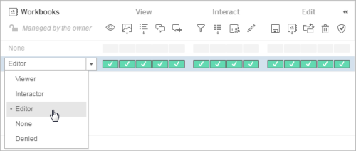

Structure Content Projects, Groups, and Permissions
===================================================

When your Tableau authors want to share their data sources and
reports (*content*) on your Tableau Server, they need to know where they
should publish that content, so that the people they want to share it
with can find it easily.

To publish or view content on Tableau Server, users must sign in to the
server. After signing in, each user must have permissions to work with
content.

As the Tableau administrator, part of setting up your server is to build
a *content management* framework that meets the following goals:

-   Makes your permissions model predictable and scalable as your
    Tableau community grows.

-   Helps users to help themselves.

**Note:** Although this article is created for Tableau Server admins,
permissions and projects work the same on Tableau Online, so you can use
most of these guidelines for your Tableau Online site as well.

[[]{.icon--med-lg .icon--arrow-up .heading-item__icon}](https://help.tableau.com/current/guides/everybody-install/en-us/everybody_admin_permissions.htm#){.heading-item__link .print-hidden} []{#groups-projects-perms-content-core}Groups, projects, and permissions: at the core of content management {#overview-of-tableau-permissions}
--------------------------------------------------------------------------------------------------------------------------------------------------------------------------------------------------------------------------------------------------------------------------------------------------------

To set up a successful Tableau Server content environment, you
coordinate the following pieces:

-   **Groups**---sets of users who need the same type of access to
    content.

-   **Projects**---containers for workbooks and data sources, each of
    which generally represents a category of content.

-   **Permissions**---sets of capabilities that define *who* can work
    with *what* content.

    Tableau comes with a few pre-defined *permissions roles*. These are
    sets of capabilities for typical ways of using content. Applying a
    permissions role is easier to manage than granting or denying each
    capability manually.

    Projects, data sources, and workbooks each have their own selection
    of permissions roles. We'll take advantage of these in the
    walkthrough later.

### [[]{.icon--med-lg .icon--arrow-up .heading-item__icon}](https://help.tableau.com/current/guides/everybody-install/en-us/everybody_admin_permissions.htm#){.heading-item__link .print-hidden} []{#groups-for-access-type}Use groups to keep permissions manageable

We *strongly recommend* that you organize users into groups. You can
then set permissions at the group level, to apply a set of capabilities
to all users in the group. When you get a new Tableau user, just add
them to the groups that give the access they need.

### [[]{.icon--med-lg .icon--arrow-up .heading-item__icon}](https://help.tableau.com/current/guides/everybody-install/en-us/everybody_admin_permissions.htm#){.heading-item__link .print-hidden} []{#projects-for-self-service}Use projects to separate content categories

While publishing content, the publisher must select the project on
Tableau Server in which to put their content. You use projects to keep
related content together, whether you categorize by audience (e.g.
finance), role (e.g. administrators), or function (e.g. production
versus sandbox).

Projects are a great place to help users help themselves. You can set
them up so that project names clearly indicate the type of content they
hold, and that, of the total list of projects, each user sees only the
projects they need to work with.

You can also create project hierarchies to sub-divide content within a
top-level category. To learn more, see [Use Projects to Manage Content
Access[(Link opens in a new
window)]{.sr-only}](https://help.tableau.com/current/server/en-us/projects.htm "Opens topic in a new browser tab").

[[]{.icon--med-lg .icon--arrow-up .heading-item__icon}](https://help.tableau.com/current/guides/everybody-install/en-us/everybody_admin_permissions.htm#){.heading-item__link .print-hidden} []{#permissions-group-example}Project permissions on functional groups (example) {#perms-groups-functional}
-----------------------------------------------------------------------------------------------------------------------------------------------------------------------------------------------------------------------------------------------------------------------------

This example shows how group permissions set at the project level
coordinate with site roles to determine who (which groups) are allowed
to access which content in the project.

A good practice is to create groups based on functional
categories---Content Creators, Content Viewers, Data Stewards. Or even
combine functional category with department; something like Marketing
Viewers and Marketing Creators. The point is to create groups whose
members need to work with content in the same way. If you need to add a
user to multiple groups, they get the permissions from all of those
groups.

The following image shows a couple of groups for users who need
different types of access to a project called Marketing.

For example, two groups cover three types of user:

-   Ashley and Adam need to publish and manage workbooks. They are
    members of the Content Developers group, and their site role is
    [Creator]

-   Henry needs to view and interact with workbooks. He belongs to the
    Content Viewers group, and his site role is [Explorer]

-   Susan needs to view workbooks online (with no other interaction).
    She also belongs to the Content Viewers group, and her site role is
    [Viewer]

Remember that site roles determine maximum permissions, and you can
assign a unique site role to each user on each site. In this example,
you can put Susan and Henry in the same group and grant their group
[Explorer]

In the walkthrough, we'll explain further how to set the permissions
roles to accommodate these three user types.

[[]{.icon--med-lg .icon--arrow-up .heading-item__icon}](https://help.tableau.com/current/guides/everybody-install/en-us/everybody_admin_permissions.htm#){.heading-item__link .print-hidden} []{#content-mgt-walkthrough}Walkthrough of a common content-management approach {#walkthrough-practical-permissions}
----------------------------------------------------------------------------------------------------------------------------------------------------------------------------------------------------------------------------------------------------------------------------

To show you how projects and permissions work, we'll walk you through
the following processes:

[1. Set permissions defaults in the Default
project](https://help.tableau.com/current/guides/everybody-install/en-us/everybody_admin_permissions.htm#step1-set-perms-default-project)

[2. Create a new project for a hypothetical Marketing
department](https://help.tableau.com/current/guides/everybody-install/en-us/everybody_admin_permissions.htm#step2-create-project)

[3. Create groups based on users' content
needs](https://help.tableau.com/current/guides/everybody-install/en-us/everybody_admin_permissions.htm#step3-create-functional-groups)

[4. Create the temporary users for this
exercise](https://help.tableau.com/current/guides/everybody-install/en-us/everybody_admin_permissions.htm#step4-create-users)

[5. Add the users to the
groups](https://help.tableau.com/current/guides/everybody-install/en-us/everybody_admin_permissions.htm#step5-add-users-groups)

[6. Assign permissions to the groups at the project
level](https://help.tableau.com/current/guides/everybody-install/en-us/everybody_admin_permissions.htm#step6-assign-perms-project)

[7. Lock project
permissions](https://help.tableau.com/current/guides/everybody-install/en-us/everybody_admin_permissions.htm#step7-lock-project)

To follow along with these steps, you must be signed in to Tableau
Server as an administrator.

### [[]{.icon--med-lg .icon--arrow-up .heading-item__icon}](https://help.tableau.com/current/guides/everybody-install/en-us/everybody_admin_permissions.htm#){.heading-item__link .print-hidden} []{#step1-set-perms-default-project}1. Set permissions defaults in the Default project {#set-defaults-in-the-default-project}

Every site in Tableau Server has a [Default] project. The
default project is designed to be a template for new projects in the
site, and is useful for creating a default set of permissions.

1.  While you're signed in to Tableau Server as an administrator, select
    the [Content] menu at the top of the page, and then
    select [Projects].

2.  Open the permissions for the [Default] project. On the
    [Actions] menu (\...), select [Permissions].

3.  Next to [All Users] (a default group), select the **. .
    .** button and then [Edit].

4.  Under [Project], [Workbooks], and [Data
    Sources], select [None].

5.  Click [Delete] to apply the changes.

    

{.roadsign-img}

### [[]{.icon--med-lg .icon--arrow-up .heading-item__icon}](https://help.tableau.com/current/guides/everybody-install/en-us/everybody_admin_permissions.htm#){.heading-item__link .print-hidden} Why *removing* some default permissions makes your life easier {#why-remove-all-users-group-permissions}
:::

The [All Users] group deserves special mention because every
site has an [All Users] group. And every user that you add
to a site becomes a member of the [All Users] group. Every
new project you create includes permissions for the [All
Users] group.

In very simple or specific scenarios, the [All Users] group
can make your life easier. The group has predefined permissions, meaning
every user on the site already has a set of permissions out of the gate.
The idea is that even if you don't do anything with permissions, users
can start publishing and using content on the server.

In our example, though, we want to show how to grant each group only the
permissions they need. If users of those groups also get permissions
from the [All Users] group, it's hard to tell exactly what
they will be able to do, and they might end up with permissions you
don't intend.

So if you decide to use this process in the future, just remember to
remove permissions from the [All Users] group *before* you
set any other permissions.
:::

### [[]{.icon--med-lg .icon--arrow-up .heading-item__icon}](https://help.tableau.com/current/guides/everybody-install/en-us/everybody_admin_permissions.htm#){.heading-item__link .print-hidden} []{#step2-create-project}2. Create a new project for a hypothetical Marketing department {#create-a-new-project}

For the purpose of this walkthrough, you'll create a project named
Marketing.

1.  In the menu at the top of the page, click [Projects],
    and then click [New Project].

2.  Name the project [Marketing], and then click
    [Create].

    

{.roadsign-img}

### [[]{.icon--med-lg .icon--arrow-up .heading-item__icon}](https://help.tableau.com/current/guides/everybody-install/en-us/everybody_admin_permissions.htm#){.heading-item__link .print-hidden} Plan your groups and permissions {#plan-your-permissions}
:::

In your real world, before you start creating groups and assigning
permissions, we recommend that you create a table or spreadsheet that
lists groups for people who need access to content, and what you expect
each group to be able to do. You can then refer back to your permissions
plan later if needed.
:::

### [[]{.icon--med-lg .icon--arrow-up .heading-item__icon}](https://help.tableau.com/current/guides/everybody-install/en-us/everybody_admin_permissions.htm#){.heading-item__link .print-hidden} []{#step3-create-functional-groups}3. Create groups based on users' content needs {#create-groups}

Next, you'll create two groups for these users. The groups will let you
assign permissions to the users, based on what the users need to be able
to do in the Marketing project. These are the groups you'll be creating:

-   **Marketing -- Content Developers**---This group is for users who
    can publish, edit, and manage workbooks, and connect to data
    sources.

-   **Marketing -- Content Viewers**---This group is for users who can
    view and sometimes interact with content in the project, but can't
    publish or save anything.

As with the user names, we give verbose names for purposes of the
walkthrough. But notice that we include the functional role of the
members (Content Developers).

Always use descriptive, meaningful language for your group names.

1.  In the menu at the top of the page, select [Groups].

2.  Click [New Group] and then name the group [Marketing --
    Content Developers].

3.  Repeat these steps to create the other group. When you're done, your
    list of groups look like the list in the following image.

    

### [[]{.icon--med-lg .icon--arrow-up .heading-item__icon}](https://help.tableau.com/current/guides/everybody-install/en-us/everybody_admin_permissions.htm#){.heading-item__link .print-hidden} []{#step4-create-users}4. Create the temporary users for this exercise {#create-users}

For this walkthrough, you'll add four local users, all of whom you can
delete when you are finished with this exercise.

{.roadsign-img}

### [[]{.icon--med-lg .icon--arrow-up .heading-item__icon}](https://help.tableau.com/current/guides/everybody-install/en-us/everybody_admin_permissions.htm#){.heading-item__link .print-hidden} What if you're using Active Directory? {#create-users-for-ad}
:::

If you've already configured [Tableau Server] to
use Active Directory, you could have your Active Directory administrator
to create these temporary users for you to use in this walkthrough.
You'll also need to import them to [Tableau
Server]. After you have finished the walkthrough
and feel confident that you can configure real users, you can delete the
temporary users.
:::

Just for the projects in this walkthrough (not for your own projects),
and to help you easily identify the user's site role and project role,
you'll give users verbose names in this form: *\<name\> - \<project
role\> - \<site role\>*:

-   Ashley - Content Developer - Creator

-   Adam - Data Analyst - Creator

-   Henry - Content Viewer - Explorer

-   Susan - Content Viewer - Viewer

1.  In the menu at the top of the page, select [Users].

2.  Click [Add Users].

3.  Click [Local User], and then enter the user details for
    Ashley. For [Display name], use the verbose name, for
    [Username], enter **Ashley**. Skip [Email],
    and set Ashley's site role as described above step 1.

    

4.  Do the same to create the other three users, and assigning them the
    site roles that are suggested in their verbose names.

    When you're done, you'll see a list of users like the one in the
    following image.

    

### [[]{.icon--med-lg .icon--arrow-up .heading-item__icon}](https://help.tableau.com/current/guides/everybody-install/en-us/everybody_admin_permissions.htm#){.heading-item__link .print-hidden} []{#step5-add-users-groups}5. Add the users to the groups {#add-users-to-groups}

With your groups set up and users added to the server, you can add users
to them.

1.  In the menu at the top of the page, click [Users].

2.  Select Adam and Ashley, and then in the [Actions] menu
    (\...), click [Group Membership].

3.  Select [Marketing -- Content Developers], and then click
    [Save].

    

4.  Follow the same steps to assign Henry and Susan to the [Marketing --
    Content Viewers] group.

### [[]{.icon--med-lg .icon--arrow-up .heading-item__icon}](https://help.tableau.com/current/guides/everybody-install/en-us/everybody_admin_permissions.htm#){.heading-item__link .print-hidden} []{#step6-assign-perms-project}6. Assign permissions to the groups at the project level {#assign-permissions-to-the-groups}

Now we can establish who can do what.

At the risk of repeating ourselves, we're *not* assigning permissions to
individual users---users will get their permissions from the groups
they're in.

1.  In Tableau Server, go to [Content]\>
    [Projects].

2.  On the [Marketing] project, open the
    [Actions] menu (\...), and select
    [Permissions].

    

    The [Permissions] pane shows the groups and users that
    you've assigned permissions to. When you first set up a site, [All
    Users] is the only group listed, and it remains listed
    here even if you remove all permissions from it, as you did earlier.

3.  Click [Add a user or group rule], and then select the
    [Marketing -- Content Developers] group.

    If you don't see the group names, make sure [Group] is
    selected in the drop-down to the right.

    

    Here you create a group permissions *rule* that will be associated
    with this project and its workbooks and data sources.

    The page updates so that you can select permission roles under
    [Project], [Workbooks], and [Data
    Sources].

    

    These are the permissions roles we referred to earlier, which are
    predefined sets of capabilities that make setup easier.

    If you select a role, and then assign capabilities to adjust what
    you want users to be able to do, the role will show as
    [Custom]. So if you can, try to avoid setting
    capabilities explicitly.

4.  Under [Project], select the [Publisher]
    permission role.

    To see what capabilities are included for the role, click the expand
    icon next to [Project].

    

    Selecting the [Publisher] role sets the project's
    [View] and [Save] capabilities to
    [Allowed], but the [Project Leader]
    capability is left [Unspecified].

    

    Notice also that individual project capabilities are shown as icons.
    To see the capability name, hover over the icon. Or click the link
    above the icons to show capabilities captions.

    

5.  Under [Workbooks], select the [Editor]
    permissions role.

    

6.  Under [Data Sources], select [Connector].

    

7.  Click [Save] to save the permissions settings.

    

    The combination of permissions for this set of permissions roles
    lets members of the [Marketing -- Content Developers]
    group create and manage workbooks in the site.

8.  Starting with step 3 of this procedure, repeat the steps to add the
    [Marketing -- Content Viewers] group and set its
    permissions. This time, use the following permission roles:

    -   Project: [Viewer]

    -   Workbooks: [Interactor]

    -   Data Sources: [None]

    The combination of permissions that are granted by this set of
    permissions roles lets members of the [Marketing -- Content
    Viewers] group view and interact with content in the
    site, subject to the limitations of their site roles.

    Leave the [Permissions] pane open for the next section.

### [[]{.icon--med-lg .icon--arrow-up .heading-item__icon}](https://help.tableau.com/current/guides/everybody-install/en-us/everybody_admin_permissions.htm#){.heading-item__link .print-hidden} []{#step7-lock-project}7. Lock project permissions {#7-lock-project-permissions}

Now, everything might be great if you stopped here. However, there's a
twist. During the publishing process, publishers have an option to set
permissions on their content. In the closed permissions model that we're
advocating, you don't want well-meaning publishers to mess up your nice,
clean server. So we are going to lock the permissions to the project,
making the option to set permissions inaccessible to publishers, even
though they are still the content owners.

1.  With the [Permissions] pane still open, above the matrix
    on the right side, click [Edit Content Permissions] next
    to the text that refers to unlocked permissions.

    

2.  In the [Content Permissions in Project] dialog box,
    select [Locked to the project], and then click
    [Save].

    

Now when someone wants to publish to the Marketing project, they cannot
change the default permissions you set on the server.

{.roadsign-img}

### [[]{.icon--med-lg .icon--arrow-up .heading-item__icon}](https://help.tableau.com/current/guides/everybody-install/en-us/everybody_admin_permissions.htm#){.heading-item__link .print-hidden} How does project locking or unlocking affect permissions? {#how-are-default-permissions-used}
:::

Before we move on, allow us to elaborate on the workings of default
permissions. In a perfect world---that is, where content publishers do
not mess with permissions during the publishing process---content
resources that are published to a project take the permissions set at
the project level. Think of the resource getting a permissions stamp
upon entry to the project.

But what happens if you change those default permissions set at the
project level *after* workbooks and data sources have been published to
it?

-   If you edit the default permissions for a **locked** project, the
    changes are automatically pushed to all content in the project when
    you save the changes.

-   If you edit default permissions in an **unlocked** project,
    workbooks and data sources published after the changes will get the
    new defaults. However, existing workbooks and data sources will
    retain their initial default permissions--- until you lock the
    project.
:::

[[]{.icon--med-lg .icon--arrow-up .heading-item__icon}](https://help.tableau.com/current/guides/everybody-install/en-us/everybody_admin_permissions.htm#){.heading-item__link .print-hidden} []{#view-test}View and test your work
----------------------------------------------------------------------------------------------------------------------------------------------------------------------------------------------------------------------------------

Let's check your work. The following images show what you'll see in the
[Permissions] pane when you're done setting permissions for
your groups.

When you expand [Project], you see this:

When you expand [Workbooks], you see this:

When you expand [Data Sources], you see this:

### [[]{.icon--med-lg .icon--arrow-up .heading-item__icon}](https://help.tableau.com/current/guides/everybody-install/en-us/everybody_admin_permissions.htm#){.heading-item__link .print-hidden} Test permissions by publishing and interacting

If everything looks good in the [Permissions] pane, the next
test is to go through the tasks that users need to do. You want to be
sure that users can perform the tasks that they need to, and not tasks
that you have not granted them access to.

1.  From Tableau Desktop, take a turn signing in as each user and
    testing that user's ability to publish workbooks.

2.  Back in the Tableau Server browser environment, sign in as each
    user, and test access to editing and saving workbooks, interacting
    with views, changing ownership, setting permissions. 

    You should be able to set permissions only when you are signed in as
    a server or site administrator.

[[]{.icon--med-lg .icon--arrow-up .heading-item__icon}](https://help.tableau.com/current/guides/everybody-install/en-us/everybody_admin_permissions.htm#){.heading-item__link .print-hidden} []{#next-level-content}Next-level content management {#nextlevel-content-management}
-------------------------------------------------------------------------------------------------------------------------------------------------------------------------------------------------------------------------------------------------

This is the end of the walkthrough. You stuck it out til the end!

Now you're ready to try this with your real world permissions scenarios.
You should have enough information now to get started setting up
permissions on your own, but there's always more to learn.

In particular, here are links to information in the Tableau Server Help
about a couple of inconspicuous settings that can affect your workflow
significantly:

-   Data access is evaluated differently for workbooks that connect to
    data sources that are published to Tableau Server.

    Learn about: [Data access for published Tableau data sources[(Link
    opens in a new
    window)]{.sr-only}](https://help.tableau.com/current/server/en-us/permissions.htm#data-access-for-published-tableau-data-sources "Opens topic in a new browser tab")

-   The [Project Leader] permissions role can help you
    delegate content administration to the owners who know it best.

    Learn about [Project-level administration[(Link opens in a new
    window)]{.sr-only}](https://help.tableau.com/current/server-linux/en-us/projects.htm#project-admin "Opens topic in a new browser tab").

Finally, if you're ready to work your way toward content management zen
master, start here: [Manage Content Access[(Link opens in a new
window)]{.sr-only}](https://help.tableau.com/current/server-linux/en-us/permissions_section.htm "Opens topic in a new browser tab").

Continue to [Connecting to Data
Sources](https://help.tableau.com/current/guides/everybody-install/en-us/everybody_admin_data.htm).
