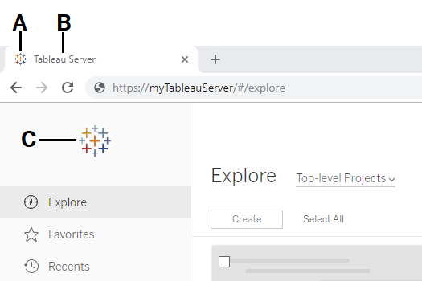

tsm customize
=============
You can use the `tsm customize` command to customize the look and feel
of the Tableau Server client browser experience.

  ------------------------------------------------------------------------
  Logo              Option flag        Minimum           Recommended size,
                                       size/Maximum      in pixels
                                       size, in pixels   
  ----------------- ------------------ ----------------- -----------------
  **A** - Window    cannot be changed  cannot be changed cannot be changed
  tab logo                                               

  **B** - Server    `--server-name`    does not apply    does not apply
  name                                                   

  **C** - Header    `--header-logo`    32 by 32 min, 160 48 by 48
  logo                                 by 160 max        

  **Not shown** -   `--signin-logo`    3000 by 3000 max   
  Sign in logo                                           

  Header logo/Sign  `--logo`           32 by 32 min, 160 48 by 48
  in logo                              by 160 max        

  **Not shown** -   `--compact-logo`   32 by 32 max      32 by 32
  Logo shown when                                        
  navigation pane                                        
  is minimized                                           
  ------------------------------------------------------------------------

The image files you use should be in GIF, JPEG, or PNG format.

The background colors on the header and sign in page are not the same.
If you use the same image for both locations (if you use the `--logo`
option, for example) your logo might look different depending on where
it appears in the server interface.

As part of your disaster recovery plan, we recommend keeping a backup of
the customization image files in a safe location off of the Tableau
Server. The image files that you add to Tableau Server will be stored
and distributed to other nodes by the Client File Service. However, the
files are not stored in a recoverable format. See [Tableau Server Client
File
Service](https://help.tableau.com/current/server/en-us/server_process_cfs.htm).

### [[]{.icon--med-lg .icon--arrow-up .heading-item__icon}](https://help.tableau.com/current/server/en-us/cli_customize.htm#){.heading-item__link .print-hidden} Synopsis

`tsm customize [options] [global options]`

After you run the `customize` command, you must run the following
command to apply changes:

`tsm pending-changes apply`

### [[]{.icon--med-lg .icon--arrow-up .heading-item__icon}](https://help.tableau.com/current/server/en-us/cli_customize.htm#){.heading-item__link .print-hidden} Options

**Note:** Use quotation marks around the path and image file if they
include any spaces.

\--compact-logo \"\<path-to-logo\>\"

Optional.

Specify a path to the image file that will be displayed when the
navigation pane size is minimized. The maximum (and optimal) size is 32
by 32 pixels.

\--header-logo \"\<path-to-logo\>\"

Optional.

Specify a path to the image file that will be displayed in the header
only.

\--logo \"\<path-to-logo\>\"

Optional.

Path to a single image file that will display for both the header and
the sign-in window.

\--restore-defaults

Optional.

Reset all customization options to default install state.

\--server-name \<server\_name\>

Optional.

Server name that appears in the browser tab, tooltips, and messages.

\--signin-logo \"\<path-to-logo\>\"

Optional.

Specify a path to the image file that will be displayed for sign-in
window only.

[[]{.icon--med-lg .icon--arrow-up .heading-item__icon}](https://help.tableau.com/current/server/en-us/cli_customize.htm#){.heading-item__link .print-hidden} Global options
---------------------------------------------------------------------------------------------------------------------------------------------------------------------------

-h, \--help

Optional.

Show the command help.

-p, \--password \<password\>

Required, along with `-u` or `--username` if no session is active.

Specify the password for the user specified in `-u` or `--username`.

If the password includes spaces or special characters, enclose it in
quotes:

`--password "my password"`

-s, \--server https://\<hostname\>:8850

Optional.

Use the specified address for Tableau Services Manager. The URL must
start with `https`, include port 8850, and use the server name not the
IP address. For example `https://<tsm_hostname>:8850`. If no server is
specified, `https://<localhost | dnsname>:8850` is assumed.

\--trust-admin-controller-cert

Optional.

Use this flag to trust the self-signed certificate on the
TSM controller. For more information about certificate trust and
CLI connections, see [Connecting
TSM clients](https://help.tableau.com/current/server/en-us/tsm_overview.htm#Connecti).

-u, \--username \<user\>

Required if no session is active, along with `-p` or `--password`.

Specify a user account. If you do not include this option, the command
is run using credentials you signed in with.
