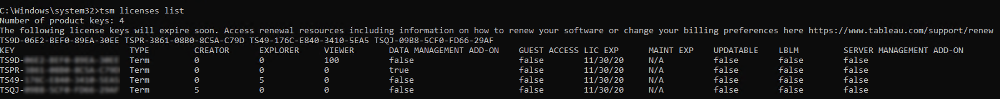

tsm licenses
============
You can use the `tsm licenses` commands to manage server license tasks
like activating or deactivating a [Tableau
Server] product key on- or off-line, and getting
associated files for offline activation or deactivation.

-   [tsm licenses
    activate](https://help.tableau.com/current/server/en-us/cli_licenses_tsm.htm#TSMActivate){.MCXref
    .xref}
-   [tsm licenses
    deactivate](https://help.tableau.com/current/server/en-us/cli_licenses_tsm.htm#TSMDeactivate){.MCXref
    .xref}
-   [tsm licenses
    get-offline-activation-file](https://help.tableau.com/current/server/en-us/cli_licenses_tsm.htm#TSMActivateFile){.MCXref
    .xref}
-   [tsm licenses
    get-offline-deactivation-file](https://help.tableau.com/current/server/en-us/cli_licenses_tsm.htm#TSMDeactivateFile){.MCXref
    .xref}
-   [tsm licenses
    list](https://help.tableau.com/current/server/en-us/cli_licenses_tsm.htm#TSMLicenseList){.MCXref
    .xref}
-   [tsm licenses
    refresh](https://help.tableau.com/current/server/en-us/cli_licenses_tsm.htm#TSMLicenseRefresh){.MCXref
    .xref}
:::

[[]{.icon--med-lg .icon--arrow-up .heading-item__icon}](https://help.tableau.com/current/server/en-us/cli_licenses_tsm.htm#){.heading-item__link .print-hidden} []{#TSMActivate}tsm licenses activate
-----------------------------------------------------------------------------------------------------------------------------------------------------------------------------------------------------

Activates a [Tableau Server] product key.

If the computer where you are running Tableau Server has been configured
to connect to the internet through a forward proxy, follow the procedure
in the topic, [Configure Product Key Operations with Forward
Proxy](https://help.tableau.com/current/server/en-us/activate_proxy.htm), before running this command.

### [[]{.icon--med-lg .icon--arrow-up .heading-item__icon}](https://help.tableau.com/current/server/en-us/cli_licenses_tsm.htm#){.heading-item__link .print-hidden} Synopsis

`tsm licenses activate --license-key <product-key> [global options]`

### [[]{.icon--med-lg .icon--arrow-up .heading-item__icon}](https://help.tableau.com/current/server/en-us/cli_licenses_tsm.htm#){.heading-item__link .print-hidden} Options

-f, \--license-file \<file.tlf\>

Required if doing offline activation.

Specifies the license file (\<file\>.tlf) used for offline activation.

-k, \--license-key \<product-key\>

Required if activating a valid product key.

Specifies the product key to use for online activation.

-t, \--trial

Required if activating a trial license.

Activate a trial license.

[[]{.icon--med-lg .icon--arrow-up .heading-item__icon}](https://help.tableau.com/current/server/en-us/cli_licenses_tsm.htm#){.heading-item__link .print-hidden} []{#TSMDeactivate}tsm licenses deactivate
---------------------------------------------------------------------------------------------------------------------------------------------------------------------------------------------------------

Deactivates a [Tableau Server] product key either
online or offline.

If the computer where you are running Tableau Server has been configured
to connect to the internet through a forward proxy, follow the procedure
in the topic, [Configure Product Key Operations with Forward
Proxy](https://help.tableau.com/current/server/en-us/activate_proxy.htm), before running this command.

### [[]{.icon--med-lg .icon--arrow-up .heading-item__icon}](https://help.tableau.com/current/server/en-us/cli_licenses_tsm.htm#){.heading-item__link .print-hidden} Synopsis {#synopsis1}

`tsm licenses deactivate --license-key <product-key> [global options]`

### [[]{.icon--med-lg .icon--arrow-up .heading-item__icon}](https://help.tableau.com/current/server/en-us/cli_licenses_tsm.htm#){.heading-item__link .print-hidden} Options

-f, \--license-file \<return\_file.tlr\>

Required if doing offline deactivation.

Specifies the license file (\<file\>.tlf) used for offline deactivation.

-k, \--license-key \<product-key\>

Required if deactivating a product key.

Specifies the product key to use for online deactivation.

[[]{.icon--med-lg .icon--arrow-up .heading-item__icon}](https://help.tableau.com/current/server/en-us/cli_licenses_tsm.htm#){.heading-item__link .print-hidden} []{#TSMActivateFile}tsm licenses get-offline-activation-file {#tsm-licenses-getofflineactivationfile}
----------------------------------------------------------------------------------------------------------------------------------------------------------------------------------------------------------------------------

Generate an offline activate file to use for activating [Tableau
Server] offline. To learn more, see [Activate
Tableau Server Offline - Adding a
License](https://help.tableau.com/current/server/en-us/activate_off.htm).

### [[]{.icon--med-lg .icon--arrow-up .heading-item__icon}](https://help.tableau.com/current/server/en-us/cli_licenses_tsm.htm#){.heading-item__link .print-hidden} Synopsis {#synopsis2}

`tsm licenses get-offline-activation-file --license-key <product-key> --output-dir <path> [global options]`

#### Options

-k, \--license-key \<product-key\>

Required.

Specifies the product key to use for offline activation.

-o, \--output-dir \<path\>

Required.

The location where the offline activation file should be saved. This
location must exist.

[[]{.icon--med-lg .icon--arrow-up .heading-item__icon}](https://help.tableau.com/current/server/en-us/cli_licenses_tsm.htm#){.heading-item__link .print-hidden} []{#TSMDeactivateFile}tsm licenses get-offline-deactivation-file {#tsm-licenses-getofflinedeactivationfile}
--------------------------------------------------------------------------------------------------------------------------------------------------------------------------------------------------------------------------------

Generate an offline deactivation file to use for deactivating [Tableau
Server] offline. To learn more, see [Deactivate
Tableau Server
Offline](https://help.tableau.com/current/server/en-us/deactivate_off.htm).

### [[]{.icon--med-lg .icon--arrow-up .heading-item__icon}](https://help.tableau.com/current/server/en-us/cli_licenses_tsm.htm#){.heading-item__link .print-hidden} Synopsis {#synopsis3}

`tsm licenses get-offline-deactivation-file --license-key <product-key> --output-dir <path> [global options]`

### [[]{.icon--med-lg .icon--arrow-up .heading-item__icon}](https://help.tableau.com/current/server/en-us/cli_licenses_tsm.htm#){.heading-item__link .print-hidden} Options

-k, \--license-key \<product-key\>

Required.

Specifies the product key to use for offline deactivation.

-o, \--output-dir \<path\>

Required.

The existing location where the offline deactivation file should be
saved.

[[]{.icon--med-lg .icon--arrow-up .heading-item__icon}](https://help.tableau.com/current/server/en-us/cli_licenses_tsm.htm#){.heading-item__link .print-hidden} []{#TSMLicenseList}tsm licenses list
----------------------------------------------------------------------------------------------------------------------------------------------------------------------------------------------------

Lists licenses that are activated on the Tableau Server deployment.

For example, a server with five Creator licenses, five Explorer
licenses, 100 Viewer licenses, and a Data Management Add-on would
provide command output similar to the following:

The following fields are returned:

-   **KEY**: A globally unique 16-character string that identifies the
    license.
-   **TYPE**: Describes the type of license
    -   Term: Term licenses map to a subscription schedule and must be
        renewed. The expiration date is listed under the LIC EXP field.
    -   Perpetual: Perpetual licenses are purchased once and do not need
        to be renewed but must be refreshed to update the MAINT EXP or
        maintenance expiration date.
    -   Cores: Core licenses are licenses that map to the number of
        cores on the computers running specific Tableau Server services.
        Core licensing allows for a guest user access to views on the
        server or embedded on other web servers. Core licenses also
        allow for unlimited Explorer and Viewer users.
-   **CREATOR**: The number of Creator licenses issued to the Tableau
    Server deployment.
-   **EXPLORER**: The number of Explorer licenses issued to the Tableau
    Server deployment.
-   **VIEWER**: The number of Viewer licenses issued to the Tableau
    Server deployment.
-   **DATA MANAGEMENT ADD-ON**:Tableau Server is licensed for the Data
    Management Add-on (`True`/`False`). See [About Data Management
    Add-on](https://help.tableau.com/current/server/en-us/dm_overview.htm)
-   **GUEST ACCESS**: Tableau Server is licensed for a Guest User. See
    [Guest
    User](https://help.tableau.com/current/server/en-us/users_guest.htm) The ability to leverage a Guest User requires Core
    licensing. See TYPE field.
-   **LIC EXP**: The date that the license expires and Tableau Server
    will stop working. Term licenses expire. See TYPE field. Visit the
    Tableau [Customer Portal[(Link opens in a new
    window)]{.sr-only}](https://customer.tableausoftware.com/) to
    refresh licenses.
-   **MAINT EXP**: Applies only to legacy perpetual licenses (TYPE =
    Perpetual). For Term licenses, this field will output, `N/A`.
    MAINT EXP displays the date that the maintenance contract for the
    Tableau Server deployment expires. To update the license maintenance
    key see [Refresh Expiration Date for the Product
    Key](https://help.tableau.com/current/server/en-us/license_refresh.htm) Visit the Tableau [Customer Portal[(Link opens in a new
    window)]{.sr-only}](https://customer.tableausoftware.com/) to view
    maintenance purchase history and to purchase additional maintenance.
-   **UPDATABLE**: Specifies whether the license is an updatable
    subscription license (`True`/`False`).
-   **LBLM**: Specifies if login-based license management (LBLM) is
    enabled for the Tableau Server deployment (`True`/`False`). When
    enabled, LBLM allows users to log into Tableau Server to license
    their instance of Tableau Desktop or Prep, rather than entering a
    product key. For more information about LBLM, see [Login-based
    License
    Management](https://help.tableau.com/current/server/en-us/license_lblm.htm)
-   **SERVER MANAGEMENT ADD-ON**: Tableau Server is licensed for the
    Server Management Add-on (`True`/`False`). For more information
    about the Server Management Add-on, see [About Tableau Server
    Management
    Add-on](https://help.tableau.com/current/server/en-us/itm_intro.htm)

### [[]{.icon--med-lg .icon--arrow-up .heading-item__icon}](https://help.tableau.com/current/server/en-us/cli_licenses_tsm.htm#){.heading-item__link .print-hidden} Synopsis {#synopsis4}

`tsm licenses list [global options]`

 

[[]{.icon--med-lg .icon--arrow-up .heading-item__icon}](https://help.tableau.com/current/server/en-us/cli_licenses_tsm.htm#){.heading-item__link .print-hidden} []{#TSMLicenseRefresh}tsm licenses refresh
----------------------------------------------------------------------------------------------------------------------------------------------------------------------------------------------------------

Update the maintenance expiration date of all product keys on Tableau
Server.

If the computer where you are running Tableau Server has been configured
to connect to the internet through a forward proxy, follow the procedure
in the topic, [Configure Product Key Operations with Forward
Proxy](https://help.tableau.com/current/server/en-us/activate_proxy.htm), before running this command.

### [[]{.icon--med-lg .icon--arrow-up .heading-item__icon}](https://help.tableau.com/current/server/en-us/cli_licenses_tsm.htm#){.heading-item__link .print-hidden} Synopsis {#synopsis5}

`tsm licenses refresh [global options]`

[[]{.icon--med-lg .icon--arrow-up .heading-item__icon}](https://help.tableau.com/current/server/en-us/cli_licenses_tsm.htm#){.heading-item__link .print-hidden} Global options
------------------------------------------------------------------------------------------------------------------------------------------------------------------------------

-h, \--help

Optional.

Show the command help.

-p, \--password \<password\>

Required, along with `-u` or `--username` if no session is active.

Specify the password for the user specified in `-u` or `--username`.

If the password includes spaces or special characters, enclose it in
quotes:

`--password "my password"`

-s, \--server https://\<hostname\>:8850

Optional.

Use the specified address for Tableau Services Manager. The URL must
start with `https`, include port 8850, and use the server name not the
IP address. For example `https://<tsm_hostname>:8850`. If no server is
specified, `https://<localhost | dnsname>:8850` is assumed.

\--trust-admin-controller-cert

Optional.

Use this flag to trust the self-signed certificate on the
TSM controller. For more information about certificate trust and
CLI connections, see [Connecting
TSM clients](https://help.tableau.com/current/server/en-us/tsm_overview.htm#Connecti).

-u, \--username \<user\>

Required if no session is active, along with `-p` or `--password`.

Specify a user account. If you do not include this option, the command
is run using credentials you signed in with.
