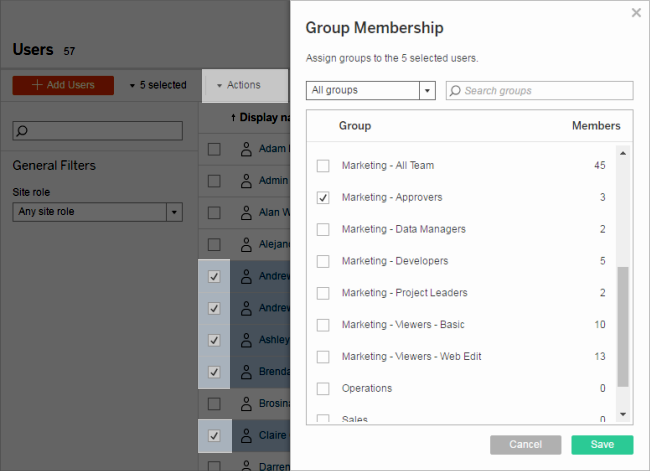
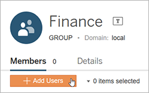

Add Users to a Group
====================

You can organize [Tableau Server] users into
groups to make it easier to manage multiple users. You can create groups
on the server or import groups from Active Directory.

**Note**: In the context of user and group synchronization, Tableau
Server configured with LDAP identity store is equivalent to Active
Directory. Active Directory synchronization features in Tableau Server
function seamlessly with properly configured LDAP directory solutions.

To keep Active Directory group membership up-to-date:

-   Site administrators can synchronize selected groups on demand in a
    site. For more information, see [Synchronize Active Directory Groups
    on a
    Site](https://help.tableau.com/current/server/en-us/groups_create_adsync.htm).

-   Server administrators can synchronize all Active Directory groups on
    the server based on a schedule or on-demand. For more information,
    see [Synchronize All Active Directory Groups on the
    Server](https://help.tableau.com/current/server/en-us/groups_globalsync.htm).

To add a user to a group, the group must already exist.

##### Add users to a group (Users page)
----------------------------------------------------------------------------------------------------------------

1.  In a site, click **Users**.

2.  Select the users you want to add to a group, and then click
    **Actions** \> [Group Membership].

    

3.  Select the groups and then click **Save**.

##### Add users to a group (Groups page)
-----------------------------------------------------------------------------------------------------------------

1.  In a site, click **Groups**, and then click the name of the group.

2.  In the group\'s page, click **Add Users**.

    

3.  Select the users to be added, and then click **Add Users**.
