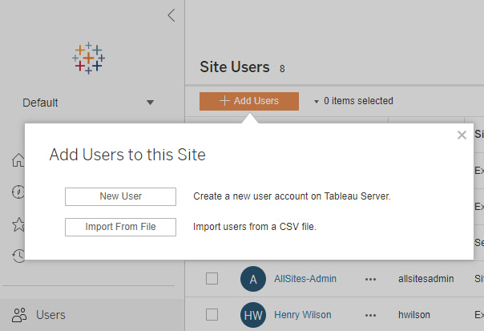
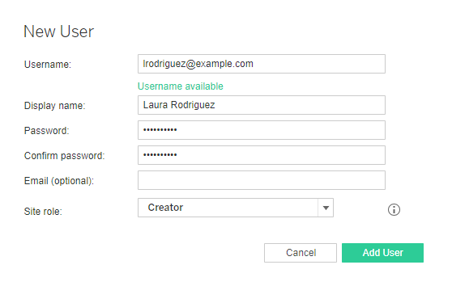
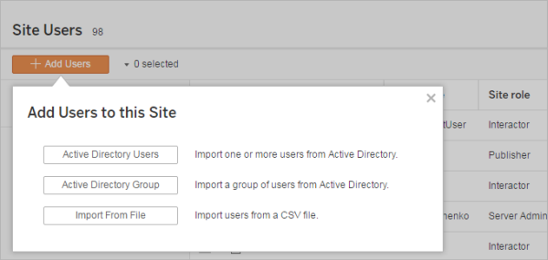

Add Users to a Site
===================
Everyone who needs to access [Tableau
Server]---whether to browse, publish, edit
content or administer the site---must be added as a user. Administrators
have the following options for adding users:

-   Add a local user account or a user account from Active Directory,
    described later in this article.

    You can also add users by importing an Active Directory group. See
    [Create Groups via Active
    Directory](https://help.tableau.com/current/server/en-us/groups_create_ad.htm)

-   [Import
    Users](https://help.tableau.com/current/server/en-us/users_import.htm)
 via a CSV file that you create using the [CSV Import File
    Guidelines](https://help.tableau.com/current/server/en-us/csvguidelines.htm)

##### Site administrator access to user management
----------------------------------------------------------------------------------

By default site administrators can add and remove users on a site. On
the site's Settings page, server administrators can revoke that
capability, so that only server administrators can manage the site's
users.

A site administrator can edit an existing local user account only if the
administrator has access to all of the sites the user is a member of.
For example, if User1 is a member of sites A and B, an administrator of
only site B cannot edit User1's full name or reset the password.

##### Add local users to a site
---------------------------------------------------------------------------------------------------------------------------

1.  Sign in to [Tableau Server] as an
    administrator, and if applicable select the site.

2.  Select [Users]. On the Users page, click [Add
    Users], and then click [New User].

    

3.  Enter a user name. With local authentication, using an email address
    for the user name is the best way to avoid user name collisions (for
    example, *lrodriguez\@example.com* instead of *lrodriguez*).

    

    User names are not case sensitive. Characters not allowed in user
    names include the semi-colon (;) and colon (,).

    Also enter information in the following fields:

    -   [Display Name]---Type a display name for the user
        (e.g., *Laura Rodriguez*).

    -   [Password]---Type a password for the user.

    -   [Confirm password]---Retype the password.

    -   [Email]---This is optional and can be added at a
        later time in the user profile settings.

4.  Select a site role.

    For site role definitions, see [Set Users' Site
    Roles](https://help.tableau.com/current/server/en-us/users_site_roles.htm)

5.  Click [Add User].

##### Add Active Directory users to a site
---------------------------------------------------------------------

Before adding users to a site, be sure to review [User Management in
Deployments with External Identity
Stores](https://help.tableau.com/current/server/en-us/users_manage_ad.htm) to understand how multiple domains, domain naming, NetBIOS, and
Active Directory user name format influence Tableau user management.

1.  In a site, click [Users], and then click [Add
    Users], and then click [Active Directory
    User].

    

2.  Enter one or more user names (separated by semicolons).

    For example, *tdavis; jjohnson; hwilson*

    If you are adding a user that is from the same Active Directory
    domain that the server is running on, you can type the AD user name
    without the domain. The server's domain will be assumed.

    **Note:**Do not enter the user's full name in this field; it can
    cause errors during the importing process.

3.  Select a site role.

    For site role definitions, see [Set Users' Site
    Roles](https://help.tableau.com/current/server/en-us/users_site_roles.htm)

4.  Click [Import Users].

##### Remove local users
-----------------------------------------------------------------------------------------------------------------------

1.  Sign in to [Tableau Server] as an
    administrator, select the site, and open the [Users]
    page.

2.  Select the check boxes next to the users' names, and on the
    [Actions] menu, select [Remove].

    If a user is a member only of the current site, and they do not own
    any content, the user is removed from the server.

    If a user you remove from the current site is a member of other
    sites on the server, their status remains unchanged on those sites.

##### Related information
--------------------------------------------------------------------------------------------------------------

-   You can also [Add Users to Tableau
    Server](https://help.tableau.com/current/server/en-us/users_add.htm)
, without site affiliation.

-   Upgrading [Tableau Server] to version 2018.1
    or later from a pre-2018.1 version, without activating user-based
    licenses, affects users who were assigned the [Viewer]
    site role in the pre-2018.1 server version.

    To learn more, see the section "User-based licenses" in the
    [Licensing
    Overview](https://help.tableau.com/current/server/en-us/license_server_overview.htm#User-based)
 and see [Set Users' Site
    Roles](https://help.tableau.com/current/server/en-us/users_site_roles.htm)
