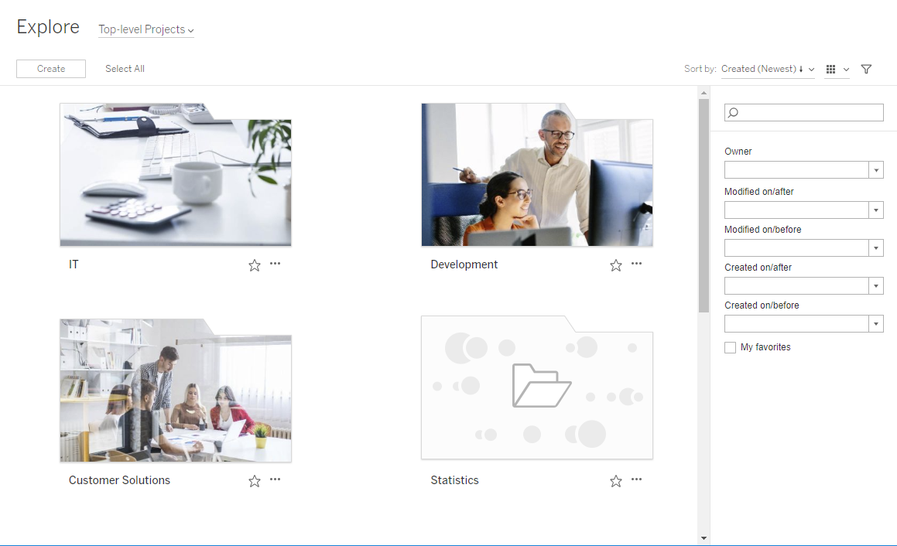
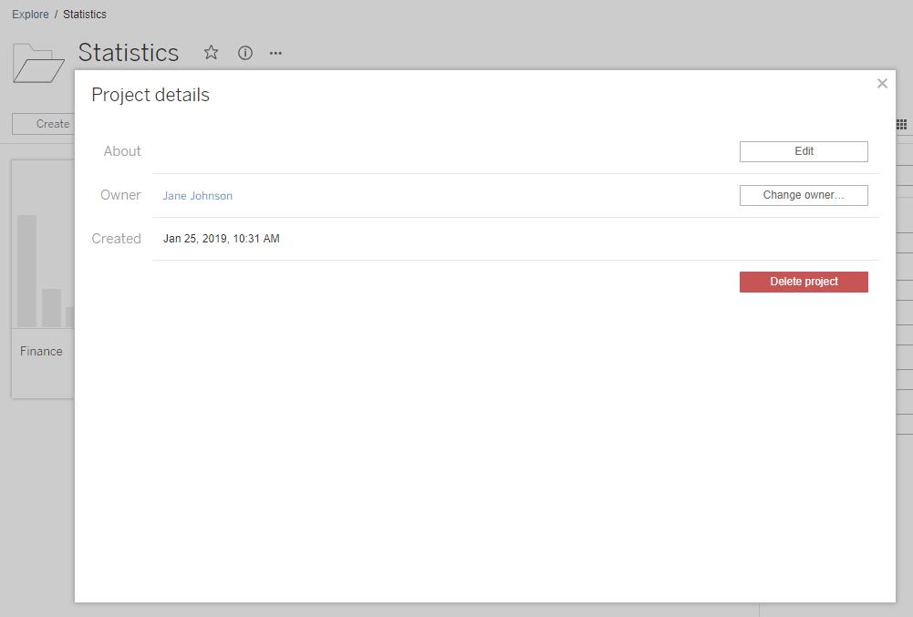
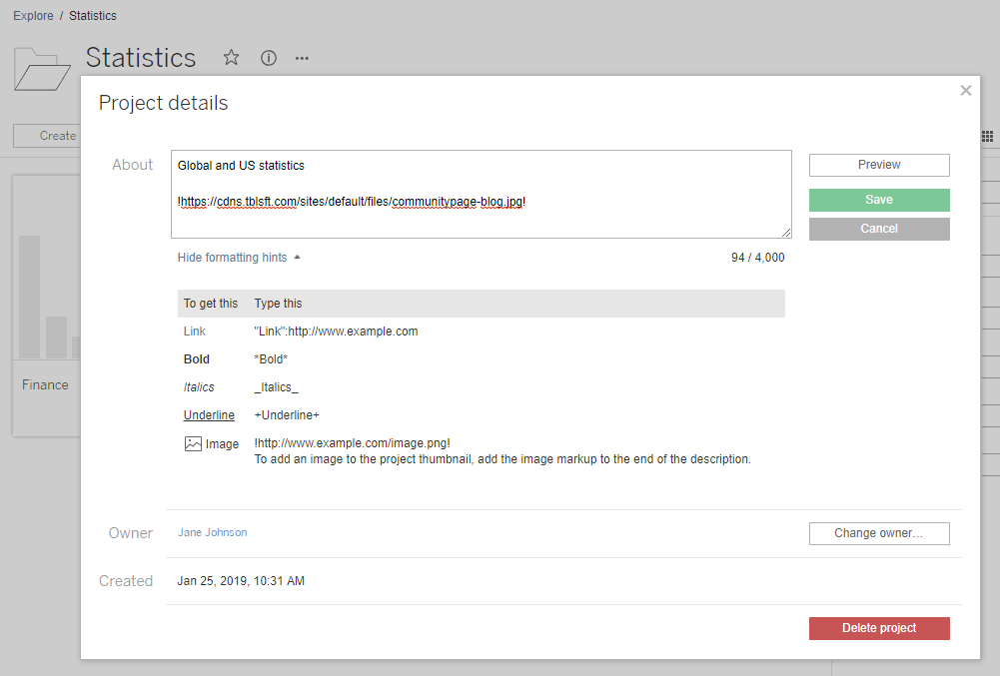
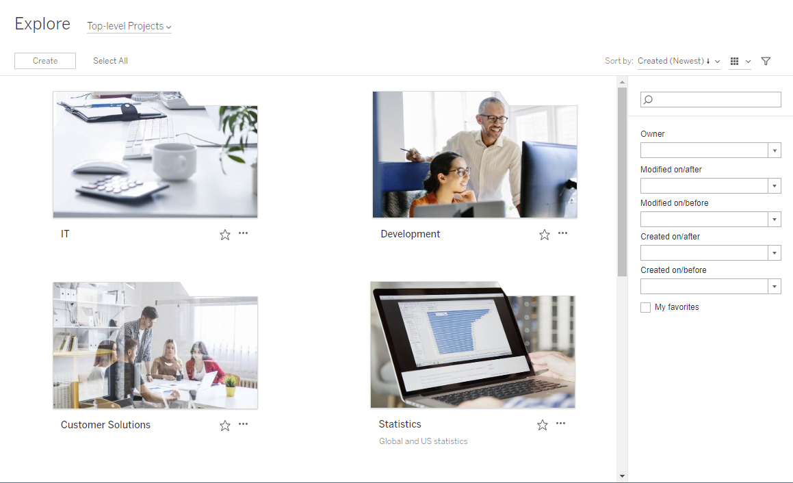

Add a Project Image
===================
To help distinguish projects you manage on [Tableau
Server] (and help your users find them), you can
add an image that appears in the thumbnail. Your image must meet the
following requirements:

-   The image must be accessible using HTTPS protocol. Shared network
    directory and related protocols (UNC, SMB, AFP, NFS, etc) are not
    supported. HTTP protocol for project images is not supported by
    Google Chrome.
-   All users who access the project must have, at a minimum,
    \"read-only\" permission on the target image.
-   The image must be common internet format: .jpg, png, or gif.

##### Set a project image
------------------------------------------------------------------------------------------------------

1.  Sign in to a site on [Tableau Server]. In the
    list of [Top-level Projects] you have access to, select
    or navigate to the project you want to update. In this example,
    we\'ll add an image to the Statistics project folder.

    If you\'re not sure where to find a child project, use the
    [Explore] drop-down list and select [All
    Projects].

2.  Click the [Details] icon (i), to open the [Project
    details] dialog box, and then click [Edit].

    

3.  In the [About] field, you can enter a description for
    your project (optional), for example \"Global and US statistics.\"
    At the end of the project description, add the URL for your image
    using the following syntax:

    `!http://www.example.com/image.png!`

    

    Select [Show formatting hints] to see how you can format
    description text.

    **Note:** Images embedded in project descriptions cannot be resized
    or positioned. Recommended size is (300 x 184 pixels). Images that
    are not 300 x 184 pixels may be stretched, shrunk, or cropped to fit
    the width of the thumbnail. In addition, they must be added at the
    end of the project description and be enclosed in **!** (exclamation
    marks), otherwise they will not be displayed as the thumbnail.

4.  Click [Save].

    
