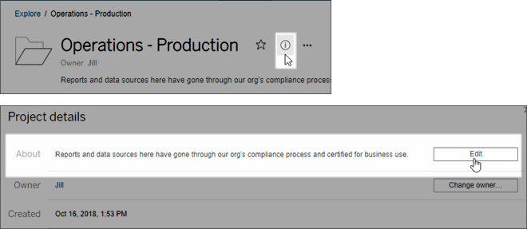

Configure Projects, Groups, and Permissions for Managed Self-Service
====================================================================
Tableau Online and Tableau Server each provide an environment for easy
open publishing and collaborative analysis of visualizations created in
Tableau Desktop or web authoring. With that flexibility comes the
challenge of making sure the *right* content is easy to find for the
people who rely on it for their work. Likewise, making sure the access
you allow doesn't create performance or management nightmares on the
site.

To address these challenges, many administrators set up their Tableau
sites for what we'll refer to as *managed self-service*. This is just a
way of saying that the site allows areas of open collaboration and web
editing, alongside areas in which access to data and reports is more
controlled. As the site administrator, you put guidelines in place to
help users figure out where to go for the type of work they need to do.

To get started with a managed self-service approach, the following
sections discuss how you as the site administrator can meet the
following objectives:

-   Create projects on the Tableau Server or Tableau Online site to
    match the ways people need to work with content.
    -   For example, some projects are open to all for collaboration;
        others are visible only to authorized publishers.
-   Create user groups based on the type of access users need to the
    content.
-   Create a clear and scalable permissions strategy.

**Note:** The information provided here is adapted and simplified from
practices of existing Tableau Zen Masters and customers who have shared
their experiences. Links to their talks are available at the [bottom of
this
page](https://help.tableau.com/current/server/en-us/projects_data_gov.htm#customer-stories).

[[]{.icon--med-lg .icon--arrow-up .heading-item__icon}](https://help.tableau.com/current/server/en-us/projects_data_gov.htm#){.heading-item__link .print-hidden} Create a project team and adopt a permissions strategy
-----------------------------------------------------------------------------------------------------------------------------------------------------------------------------------------------------------------------

Although changing the project structure on your site after your users
are publishing to it is not impossible, it's difficult and can be
daunting. So before you make any lasting decisions or take definitive
actions on your Tableau site, we recommend that you recruit users from
various segments of your Tableau population, to create a project team of
people who have differing uses for Tableau content.

Your permissions strategy will help your environment scale as you add
new Tableau users. Make sure it incorporates two important
practices: manage permissions only for groups, and set permissions only
at the project level. Setting permissions at the individual user level
and on individual content resources becomes unmanageable quickly. If you
need to deviate from this practice, make sure you document and
communicate your strategy to other administrators and project leaders.

**Important**: We strongly recommend familiarizing yourself with
Tableau's
[Permissions](https://help.tableau.com/current/server/en-us/permissions.htm) before proceeding.

[[]{.icon--med-lg .icon--arrow-up .heading-item__icon}](https://help.tableau.com/current/server/en-us/projects_data_gov.htm#){.heading-item__link .print-hidden} []{#coord-projects-groups}Steps to coordinate projects and groups
----------------------------------------------------------------------------------------------------------------------------------------------------------------------------------------------------------------------------------

To get projects and permissions (content) to work together with groups
(people) in a managed self-service environment, you generally take the
following steps:

1.  [1. Plan your
    permissions](https://help.tableau.com/current/server/en-us/projects_data_gov.htm#plan-perms){.MCXref
    .xref}: Find common themes in the type of access users need. This
    helps determine projects and groups.
2.  [2. Remove permissions that will cause
    ambiguities](https://help.tableau.com/current/server/en-us/projects_data_gov.htm#baseline){.MCXref
    .xref}
3.  [3. Create
    groups](https://help.tableau.com/current/server/en-us/projects_data_gov.htm#groups-for-content-access){.MCXref
    .xref}
4.  [4. Assign permissions to the
    groups](https://help.tableau.com/current/server/en-us/projects_data_gov.htm#assign-perms-groups){.MCXref
    .xref}
5.  [5. Create projects and adjust
    permissions](https://help.tableau.com/current/server/en-us/projects_data_gov.htm#project-structure){.MCXref
    .xref}
6.  [6. Lock permissions in each
    project](https://help.tableau.com/current/server/en-us/projects_data_gov.htm#lock-perms){.MCXref
    .xref}

If you decide to follow the guidelines described here, you might want to
[Automate working with groups and
projects](https://help.tableau.com/current/server/en-us/projects_data_gov.htm#automate-management).

[[]{.icon--med-lg .icon--arrow-up .heading-item__icon}](https://help.tableau.com/current/server/en-us/projects_data_gov.htm#){.heading-item__link .print-hidden} []{#plan-perms}1. Plan your permissions {#1-plan-your-permissions}
--------------------------------------------------------------------------------------------------------------------------------------------------------------------------------------------------------

Before you create groups and start assigning permissions, create a list
of people who need access to content, and arrange them in groups
according to what they'll want to do.

For example, someone who publishes or moves a data source to a
*certified* content project would need different level of access than
someone who only consumes published reports. (We use the term
"certified" to mean "trusted" --- these are the data sources or reports
that your Tableau community can trust to be a source of truth for your
organization.)

Keep in mind also that you can set permissions differently for each
project. So someone who is a data steward for the Ops department might
not get the equivalent access to the Marketing content.

This exercise, done outside of the Tableau environment, can be the most
challenging part of setting up a site.

### [[]{.icon--med-lg .icon--arrow-up .heading-item__icon}](https://help.tableau.com/current/server/en-us/projects_data_gov.htm#){.heading-item__link .print-hidden} Use a closed permissions model for managed content

General models for setting permissions are *open* or *closed*. In an
open model, users get a high level of access, and you explicitly deny
capabilities. This model can work when your organization is very small,
and everyone has a similar level of responsibility.

In a closed model, users get only the access they need to do their jobs.
This is the model security professionals advocate, and the examples in
this article will attempt to show.

[[]{.icon--med-lg .icon--arrow-up .heading-item__icon}](https://help.tableau.com/current/server/en-us/projects_data_gov.htm#){.heading-item__link .print-hidden} []{#baseline}2. Remove permissions that will cause ambiguities {#2-remove-permissions-that-will-cause-ambiguities}
-------------------------------------------------------------------------------------------------------------------------------------------------------------------------------------------------------------------------------

Every site has a [Default] project and an [All
Users] group. Any user added to the site becomes a member of
the All Users group automatically. The Default project works as a
template for new projects in the site and cannot be deleted, but you can
change the permissions. Creating groups and setting baseline permissions
here helps you to know and manage exactly who gets what level of access
for each new project.

In the managed self-service context, setting baseline permissions means
*removing* the permissions from the [All Users] group, so
that the permissions are enabled only on groups you create and have
control over.

1.  Select the [Content] tab to open the top-level projects
    on the site.
2.  On the [Default] project's [Action]
    ([...]) menu, select [Permissions].
3.  Next to the [All Users] group name, select
    [...], and then select [Edit].
4.  For the tabs for [Project], [Workbooks], and
    [Data Sources], use the template drop down and select
    [None].
5.  Select [Delete] to apply the changes.

[[]{.icon--med-lg .icon--arrow-up .heading-item__icon}](https://help.tableau.com/current/server/en-us/projects_data_gov.htm#){.heading-item__link .print-hidden} []{#groups-for-content-access}3. Create groups {#3-create-groups}
---------------------------------------------------------------------------------------------------------------------------------------------------------------------------------------------------------------

You create groups to match what people need to do with a set of content.
In this case "a set of content" refers to the workbooks and data sources
in a project.

When you create your groups, use descriptive names that make sense for
your organization. For example, one possible set of groups might be as
follows:

-   **Project leaders.** You might also think of these as project-level
    administrators. Users who can perform all available capabilities on
    data sources, with the possible exception of setting permissions on
    them. People in this group can be site administrators, or users
    whose job it is to approve or certify data models or reports. To
    grant administrator capabilities at the project level, you can
    assign the [Project Leader] setting to users with the
    appropriate site roles. For more information, see [Set a project
    leader](https://help.tableau.com/current/server/en-us/permissions.htm#Set)

-   **Analysts/Publishers.** This group is for users who can publish
    workbooks to production and other open projects, use web editing on
    some projects, and connect to data sources certified by the data
    stewards. This group is not allowed to set permissions on content or
    move it between projects.

-   **Business Users.** This group is the most likely to include people
    who do not use Tableau Desktop, but use data to answer questions and
    make business decisions. They can view and interact with workbooks
    only in specific projects, and they can't publish, edit, save, or
    delete anything.

-   **Administrators.** Depending on the size of your deployment,
    managing site or server administrators as a group helps you keep
    track of who has that level of access.

    **Note:** Users with the Server Administrator or Site Administrator
    Creator site role have access to everything on the site, regardless
    of the groups you add them to.

If you have multiple Tableau roles per department, creating
corresponding groups manually can be labor intensive. For alternatives,
see [Automate working with groups and
projects](https://help.tableau.com/current/server/en-us/projects_data_gov.htm#automate-management) later in this article.

**Learn more:** [Add Users to a
Group](https://help.tableau.com/current/server/en-us/users_add_group.htm)

[[]{.icon--med-lg .icon--arrow-up .heading-item__icon}](https://help.tableau.com/current/server/en-us/projects_data_gov.htm#){.heading-item__link .print-hidden} []{#assign-perms-groups}4. Assign permissions to the groups {#4-assign-permissions-to-the-groups}
----------------------------------------------------------------------------------------------------------------------------------------------------------------------------------------------------------------------------

After you create groups, you can assign permissions in one of the
following ways:

-   In the Default project, apply a core set of permissions on each
    group that will stay more or less the same for all projects. You can
    then make minor adjustments in specific projects.\
    Or
-   Keep the Default project clean, and apply permissions only on
    projects you create.

For more information, see [Permission
management](https://help.tableau.com/current/server/en-us/permissions.htm#permissionmanagement).

For the example we're using, it makes more sense to set permissions
templates in the Default project. You will want to explicitly deny some
capabilities across the board, and then allow them on only a few
projects where you want to allow more open access.

### [[]{.icon--med-lg .icon--arrow-up .heading-item__icon}](https://help.tableau.com/current/server/en-us/projects_data_gov.htm#){.heading-item__link .print-hidden} []{#perms-templates}Create permission rules

1.  While you have the Default project open, on the
    [Actions] menu (\...), select [Permissions].
2.  Create a permission rule for each group as follows:
    a.  Click [+ Add Group/User Rule] and start typing to
        search for a group or user.
    b.  For each tab, choose an existing template from the drop-down or
        create a custom rule by clicking the capabilities.
        i.  Templates are predefined sets of capabilities that make
            setup easier.
        ii. One click sets the capability to [Allowed], two
            clicks sets it to [Denied], and a third click
            clears the selection ([Unspecified]).
    c.  When finished, click Save.
3.  [Lock permissions to the
    project](https://help.tableau.com/current/server/en-us/projects_data_gov.htm#lock-perms).

Remember, a capability is only granted to a user if they are expressly
allowed it. Leaving a capability as Unspecified will result in it being
denied. For more information, see [Effective
permissions](https://help.tableau.com/current/server/en-us/permissions.htm#EffectivePermissions).

### [[]{.icon--med-lg .icon--arrow-up .heading-item__icon}](https://help.tableau.com/current/server/en-us/projects_data_gov.htm#){.heading-item__link .print-hidden} Example

For the groups defined above, here is one way you might set default
permissions.

 
:::
:::
:::
:::
:::

Project tab

Workbooks tab

Data Sources tab

Project Leader group

[Set a project
leader](https://help.tableau.com/current/server/en-us/permissions.htm#Set)

Analyst Publisher group

Publish template

Publish template

Publish template

Business User group

View template

Explore template

Set [Web Edit] and [Download Full Data] to
[Unspecified]\*

Explore template

\* This assumes you want to allow web editing and downloading data only
on select projects. You can allow those capabilities on specific
projects or workbooks.

[[]{.icon--med-lg .icon--arrow-up .heading-item__icon}](https://help.tableau.com/current/server/en-us/projects_data_gov.htm#){.heading-item__link .print-hidden} []{#project-structure}5. Create projects and adjust permissions {#5-create-projects-and-adjust-permissions}
--------------------------------------------------------------------------------------------------------------------------------------------------------------------------------------------------------------------------------

After the Default project is set with your custom permissions template,
you can create projects that allow the content use cases you identified.
For each project, you can adjust the default permissions as appropriate.

### [[]{.icon--med-lg .icon--arrow-up .heading-item__icon}](https://help.tableau.com/current/server/en-us/projects_data_gov.htm#){.heading-item__link .print-hidden} Example project structure

One way to structure projects could be to reflect the following use
cases:

**Workbooks shared for open collaboration on the server**

Anyone in the department can publish to the open-collaboration project
while their content is in development. Colleagues can collaborate using
web editing on the server. Some people call this a sandbox, some call it
staging, and so on. On this project you can allow web editing, saving,
downloading, and so on.

Here you want not only to enable collaboration, but also to enable
people who don't have Tableau Desktop to contribute and provide
feedback.

**Shared reports that cannot be edited**

This could be a project that people who create workbooks and data
sources (Analysts and Data Stewards) could publish to when they want to
make content available to business users for viewing, with confidence
that their work cannot be "borrowed" or modified.

For this type of project, you would deny all capabilities that allow
editing or getting the data off of the server for reuse. You would allow
viewing capabilities.

**Vetted data sources for Analysts to connect to**

This would be where Data Stewards publish the data sources that are meet
all of your data requirements and become the "source of truth" for your
organization. Project leaders on this project can certify these data
sources, so that they rank higher in search results and are included in
recommended data sources.

You would allow authorized Analysts (that is, the Publishers group
described earlier) to connect their workbooks to data sources in this
project, but not download or edit them. You would deny the view
capability to the Business Users group for this project, so those users
would not even see this project.

**Inactive content**

Another possibility is to segregate workbooks and data sources that the
site's administrative views show haven't been used for a period of time.
You could give content owners a time limit before their content is
removed from the server.

Whether you do this or delete directly from the working projects is up
to your organization. In an active environment, don't be afraid to be
intentional about removing content that is not being used.

**Source for workbook templates**

This is a project that people can download from but not publish or save
to, where authorized publishers or project leaders make template
workbooks available. Templates that have your organization's approved
fonts, colors, images, and even data connections built in can save
authors a lot of time and keep your reports looking consistent.

### [[]{.icon--med-lg .icon--arrow-up .heading-item__icon}](https://help.tableau.com/current/server/en-us/projects_data_gov.htm#){.heading-item__link .print-hidden} Help project leaders manage content and users find it

-   Devise a scalable project-naming scheme that makes sense in your
    organization.

    For example, basic structure might be **\<Department\> -
    \<ContentUse\>**; such as **Ops - Production**.

-   Use the project's [Description] field.

    The description you enter when you create a project appears when you
    hover the pointer over the project thumbnail, as well as on the
    [Project details] page.

[[]{.icon--med-lg .icon--arrow-up .heading-item__icon}](https://help.tableau.com/current/server/en-us/projects_data_gov.htm#){.heading-item__link .print-hidden} []{#lock-perms}6. Lock permissions in each project {#6-lock-permissions-in-each-project}
-------------------------------------------------------------------------------------------------------------------------------------------------------------------------------------------------------------------

After you refine the capabilities for each group in a project, you can
lock the project's permissions, either for the project itself or all
projects in the hierarchy. Do this on the Default project, too.

To configure the **Content Permissions**:

1.  You must be logged into the site as an administrator, project owner,
    or project leader
2.  Open the permissions dialog box for a project
3.  Click the Content Permissions **Edit** link in the upper left and
    select the desired option in the Content Permissions dialog box

Locking permissions prevents publishers from setting permissions
explicitly as part of the publishing process in Tableau Desktop.
Instead, content inherits permissions set on the project it's published
to, and only administrators and project leaders can set permissions.

For more information, see [Lock content
permissions](https://help.tableau.com/current/server/en-us/permissions.htm#LockProject).

[[]{.icon--med-lg .icon--arrow-up .heading-item__icon}](https://help.tableau.com/current/server/en-us/projects_data_gov.htm#){.heading-item__link .print-hidden} []{#automate-management}Automate working with groups and projects
----------------------------------------------------------------------------------------------------------------------------------------------------------------------------------------------------------------------------------

Creating multiple groups and projects and setting permissions manually
can get a little tedious. To automate these processes, as well as make
them repeatable for future updates, you can perform these tasks using
[REST API[(Link opens in a new
window)]{.sr-only}](https://help.tableau.com/current/api/rest_api/en-us/help.htm#REST/rest_api.htm)
commands.

You can use
[tabcmd](https://help.tableau.com/current/server/en-us/tabcmd.htm) commands for tasks such as adding or deleting a single project or
group and adding users, but not for setting permissions.

[[]{.icon--med-lg .icon--arrow-up .heading-item__icon}](https://help.tableau.com/current/server/en-us/projects_data_gov.htm#){.heading-item__link .print-hidden} Next steps
---------------------------------------------------------------------------------------------------------------------------------------------------------------------------

Besides projects, groups, and permissions, other data governance themes
include:

**User education** 

Help *all* of your Tableau users become good data stewards. The most
successful Tableau organizations create Tableau user groups, have
regular training sessions, and so on.

For a common approach to orienting users to the site, see
[Dashboard-based Custom
Portals](https://help.tableau.com/current/server/en-us/portal_dashboard.htm).

For publishing and data certification tips, see the following topics:

-   [Use Certification to Help Users Find Trusted
    Data](https://help.tableau.com/current/server/en-us/datasource_certified.htm){.MCXref
    .xref}

-   [Prepare for Publishing a Workbook[(Link opens in a new
    window)]{.sr-only}](https://help.tableau.com/current/pro/desktop/en-us/help.htm#publish_workbooks_prepare.html "Get tips for workbook publishing")
    (links to Tableau Help)

-   [Best Practices for Published Data Sources[(Link opens in a new
    window)]{.sr-only}](https://help.tableau.com/current/pro/desktop/en-us/help.htm#publish_datasources_about.html)
    (links to Tableau Help)

**Optimize extract refresh and subscription activity**

If you use Tableau Server, create policies for extract refresh and
subscription schedules, to avoid them dominating the site's resources.
The TC customer presentations by Wells Fargo and Sprint address this
subject in detail. In addition, see the topics under [Performance
Tuning](https://help.tableau.com/current/server/en-us/perf_tuning.htm).

If you use Tableau Online, see the following topics to become familiar
with the ways people can refresh extracts:

-   [Keep Data
    Fresh](https://help.tableau.com/current/online/en-us/to_keep_data_fresh.htm)

-   [Use Tableau Bridge to Expand Data Freshness
    Options](https://help.tableau.com/current/online/en-us/to_sync_local_data.htm)

**Monitoring**

Use administrative views to keep an eye on the site's performance and
content use.

[Administrative
Views](https://help.tableau.com/current/server/en-us/adminview.htm)

### [[]{.icon--med-lg .icon--arrow-up .heading-item__icon}](https://help.tableau.com/current/server/en-us/projects_data_gov.htm#){.heading-item__link .print-hidden} []{#customer-stories}Learn how Tableau and some of our customers address governance and self-service {#learn-how-tableau-and-some-of-our-customers-address-governance-and-selfservice}

The following list contains links to data governance and Center of
Excellence (COE) presentations given at the Tableau Conference over
recent years. Even if Tableau versions have evolved, the principles
remain the same. You can explore the playlists for other videos related
to COE, managing Tableau at scale.

[Creating a Centre of Excellence in Tableau[(Link opens in a new
window)]{.sr-only}](https://www.youtube.com/watch?v=bUHhxqbADrs&index=26&list=PL_qx68DwhYA86R-BwD35gkLuozgZnIKXC "Link opens YouTube video in a new browser tab.")
(TC Europe 2018)

[Server Admins: Don't Fear Web Authoring[(Link opens in a new
window)]{.sr-only}](https://www.youtube.com/watch?v=hoLd-9PmY_4&list=PL_qx68DwhYA-w4yP-x8k9HXmVTdaa7jsH&index=139 "Link opens YouTube video in a new browser tab")
(Sprint, TC16)

[The Past, Present, & Future at Charles Schwab[(Link opens in a new
window)]{.sr-only}](https://www.youtube.com/watch?v=JdhGRcfZeDA&list=PL_qx68DwhYA8hi22EeVgfxQLmDMDyd049&index=16 "Link opens YouTube video in a new browser tab.")
(TC 17)

[Content Strategies in Tableau[(Link opens in a new
window)]{.sr-only}](https://www.youtube.com/watch?v=Mds-juUNHx8&list=PL_qx68DwhYA8hi22EeVgfxQLmDMDyd049&index=10 "Link opens YouTube video in a new browser tab.")
(TC 17)

