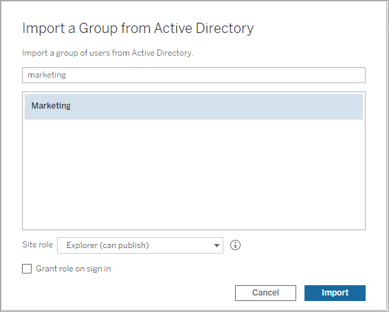
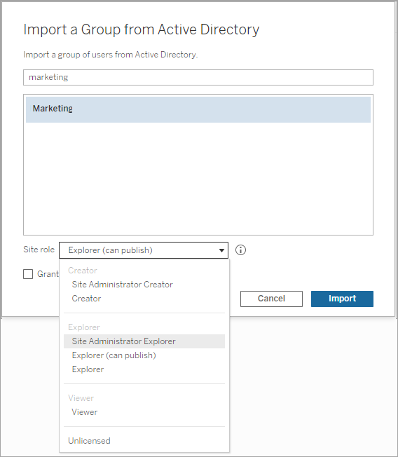

Create Groups via Active Directory
==================================
You can import Active Directory groups to create matching groups on
Tableau Server, as well as a user for each member of an Active Directory
group that is not already on the server.

**Note**: In the context of user and group synchronization, Tableau
Server configured with LDAP identity store is equivalent to Active
Directory. Active Directory synchronization features in Tableau Server
function seamlessly with properly configured LDAP directory solutions.

Each user is assigned a site role as part of the import process. If any
of the users to be imported exist in [Tableau
Server], the site role assigned during the import
process is applied only if it gives the user more access to the server.
Importing users does not demote site roles.

Before importing groups, review [User Management in Deployments with
External Identity
Stores](https://help.tableau.com/current/server/en-us/users_manage_ad.htm) to understand how multiple domains, domain naming, NetBIOS, and
Active Directory user name format influence Tableau user management.

1.  In a site, click [Groups], and then click [Add
    Groups]

2.  Type the name of the Active Directory group you want to import, and
    then select the group name in the resulting list.

    

3.  Select the minimumsite role for the users.

    

4.  Optional: Select [Grant role on sign in] to provision
    new site roles and licenses when group users sign in. For more
    information, see [Grant License on Sign
    In](https://help.tableau.com/current/server/en-us/grant_role.htm){.MCXref
    .xref}.

5.  Click [Import].

::: {.note}
**Note:** You cannot change the name of groups imported from Active
Directory. The group name can only be changed in Active Directory.
