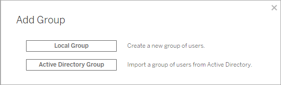
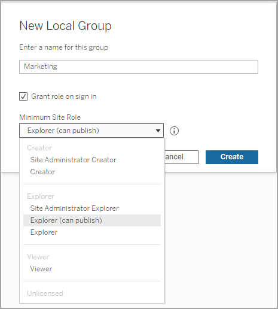

Create a Local Group
====================
Local groups are created using the [Tableau
Server] internal user management system. After
you create a group you can add and remove users, as well as set a
minimum site role to grant to users in the group when they sign in.

1.  In a site, click **Groups**, and then click [Local
    Group].

    

2.  Type a name for the group.

3.  To set a minimum site role for the group, select [Grant site role on
    sign in] and select a minimum site role from the
    drop-down list.

    

4.  Click [Create].
