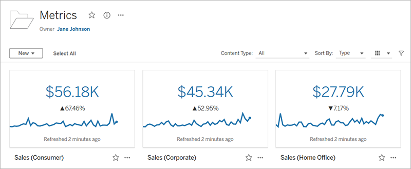
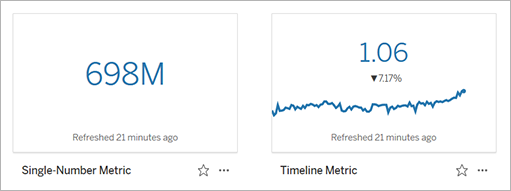
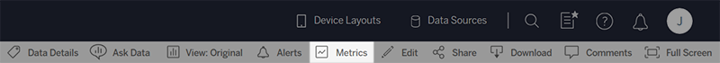
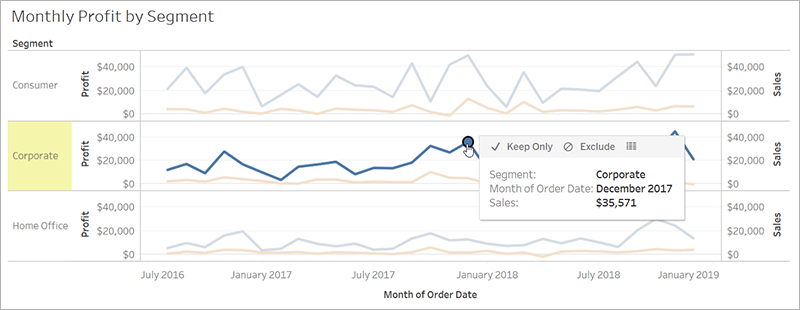
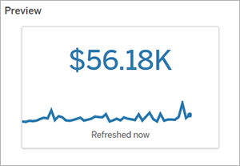
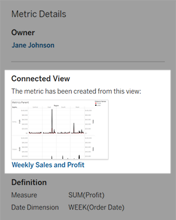

Create and Troubleshoot Metrics
===============================

[Version: 2020.3]{.article__tags--version}\
[Applies to: Tableau Online, Tableau
Server]{.article__tags--applies-to}\
[]{.article__tags--role}

Metrics help you track changes to your data. You can quickly monitor key
numbers, because metrics update automatically and display their current
value on the grid and list view for your content. This means that you
don't need to open a metric to see your data.

If you have multiple dashboards you frequently check, create metrics for
the numbers you want to monitor, then track them in one place by adding
them to your favorites or creating them in the same project.

How metrics are defined
-----------------------

A metric\'s value is defined by an aggregate measure, such as sum of
sales, and an optional date dimension, such as order date. For
information about dimensions and measures, see [Dimensions and Measures,
Blue and
Green](https://help.tableau.com/current/pro/desktop/en-us/datafields_typesandroles.htm).
Any filters applied to the measure before the metric was created will
apply to the metric value, for example, filters for segment or region.

**Timeline metrics and single-number metrics**

A metric that has a date dimension as part of its definition will have a
timeline. Because metrics are defined based on the mark you select when
you create a metric, you include a timeline by selecting a mark on a
chart with a date axis or header.

When you open a metric, the timeline shows the value of the measure
based on the granularity of the date dimension, for example, daily sales
or monthly users. Move your mouse along the timeline to see historical
values.

If the mark you select doesn\'t have a date dimension associated with
it, your metric will be a single-number metric. Single-number metrics
still refresh, and their values update when the data changes, but they
don\'t show previous values on a timeline.

Create a metric
----------------

If you have a site role of Creator or Explorer (can publish), you can
create metrics on Tableau Online or Tableau Server. Metrics are
formatted automatically and optimized for viewing on both mobile and
desktop devices.

1.  Navigate to the view that you want to create a metric from.

2.  On the view toolbar, click the [Metrics] button.

    

    The metrics pane opens.

3.  Select a mark. If you encounter an error, see [When you can't create
    a
    metric](https://help.tableau.com/current/server/en-us/metrics_create.htm#when-you-cant)

    The measure, and optional date dimension, associated with this mark
    will define your metric. Any filters you apply to this mark will be
    applied to your metric.

    

    The metrics pane shows a preview of your metric. The value in the
    preview is the most recent value for the metric, which may differ
    from the value of the mark you selected in the case of metrics with
    a date dimension.

    

4.  The [Name] field is pre-populated based on your
    selection. You can give the metric a different name. A metric must
    have a unique name within the project it belongs to.

5.  Under [Description], enter an optional message to help
    others understand your metric. For example, describe filters applied
    to the metric or indicate the data source used by the metric.

6.  Under [Definition] \> [Measure], select the
    measure to use for your definition from the drop-down. This option
    appears only if the mark you selected has more than one measure
    associated with it.

7.  []{#choose-project}Under [Project], click [Change
    Location] to choose a different project for the metric.
    By default, your metric will be added to the same project that the
    view belongs to.

8.  Click the [Create] button.

    A message appears with a link to the metric in the project you added
    it to.

    

Though metrics are created from a view, they exist independent of that
view. This means you manage metrics similar to how you manage workbooks.
For example, you can set permissions for a metric or move it to another
project. For information about managing content on your Tableau site,
see [Manage Web
Items](https://help.tableau.com/current/pro/desktop/en-us/qs_content_page.htm).

#### Overwrite a metric

1.  Create a metric with the same name in the same project as the metric
    you want to overwrite.

    The Overwrite Metric dialog appears.

2.  Click the [Overwrite] button.

When you overwrite a metric, the metric continues to appear for those
who have added it to their favorites, and any changes made to
permissions for the previous metric will apply to the new metric.

#### 

If you select a mark on a chart that doesn't support metrics, you will
get an error message explaining why you can't create a metric. The table
below summarizes these scenarios.

+-----------------------------------+-----------------------------------+
| Reason                            | Scenarios                         |
+===================================+===================================+
| You don't have access to the full | -   Row level security or user    |
| data for the chart.               |     filters limit the data you    |
|                                   |     can see. For more             |
|                                   |     information, see [Restrict    |
|                                   |     Access at the Data Row        |
|                                   |     Level](https://he             |
|                                   | lp.tableau.com/current/pro/deskto |
|                                   | p/en-us/publish_userfilters.htm). |
|                                   | -   You don't have permission to  |
|                                   |     see the full data. For more   |
|                                   |     information, see [View        |
|                                   |     Underlying                    |
|                                   |     Data](https://hel             |
|                                   | p.tableau.com/current/pro/desktop |
|                                   | /en-us/inspectdata_viewdata.htm). |
+-----------------------------------+-----------------------------------+
| The password for the workbook's   | -   The workbook prompts for a    |
| data source is not embedded or is |     password.                     |
| no longer valid. For more         | -   Credentials are passed using  |
| information, see [Set Credentials |     single sign-on (SSO).         |
| for Accessing Your Published      |                                   |
| Data](https://help.tableau.com    |                                   |
| /current/pro/desktop/en-us/publis |                                   |
| hing_sharing_authentication.htm). |                                   |
+-----------------------------------+-----------------------------------+
| The data isn't at the correct     | -   The data in the chart isn\'t  |
| level of granularity.             |     aggregated. Metrics use       |
|                                   |     aggregations, such as sum or  |
|                                   |     average. For more             |
|                                   |     information, see [Data        |
|                                   |     Aggregation in                |
|                                   |     Tableau](https://help.ta      |
|                                   | bleau.com/current/pro/desktop/en- |
|                                   | us/calculations_aggregation.htm). |
|                                   | -   There are multiple values per |
|                                   |     cell of data---a result of    |
|                                   |     data blending. For more       |
|                                   |     information, see              |
|                                   |     [Troubleshoot Data            |
|                                   |     Ble                           |
|                                   | nding](https://help.tableau.com/c |
|                                   | urrent/pro/desktop/en-us/multiple |
|                                   | connections_troubleshooting.htm). |
+-----------------------------------+-----------------------------------+
| The date dimension is not         | -   The chart includes both date  |
| supported.                        |     parts and date values. For    |
|                                   |     more information, see [Change |
|                                   |     Date                          |
|                                   |     Levels](htt                   |
|                                   | ps://help.tableau.com/current/pro |
|                                   | /desktop/en-us/dates_levels.htm). |
|                                   | -   The date dimension uses the   |
|                                   |     ISO 8601 calendar rather than |
|                                   |     the standard Gregorian        |
|                                   |     calendar. For more            |
|                                   |     information, see [ISO-8601    |
|                                   |     Week-Based                    |
|                                   |     Calendar](https               |
|                                   | ://help.tableau.com/current/pro/d |
|                                   | esktop/en-us/dates_calendar.htm). |
|                                   | -   The date dimension is         |
|                                   |     aggregated at the custom      |
|                                   |     level of Month / Year or      |
|                                   |     Month / Day / Year. For more  |
|                                   |     information, see [Custom      |
|                                   |     Dates](htt                    |
|                                   | ps://help.tableau.com/current/pro |
|                                   | /desktop/en-us/dates_custom.htm). |
+-----------------------------------+-----------------------------------+

##### How metrics refresh
-------------------------------------------------------------------------------------------------

When a metric refreshes, it checks the connected view (the view the
metric was created from) for new data. A refresh doesn't necessarily
update the value of a metric, because there may be no changes to the
data.

Metrics refresh at a frequency either based on an extract's refresh
schedule or, for live data, every 60 minutes. The time of the last
refresh is displayed on the metric.

##### Fix failing refreshes
---------------------------------------------------------------

If a metric isn't able to access the connected view or its underlying
data, the refresh will fail. If the refresh for your metric fails,
you'll receive an email notification, which notes the time of the
failure and the affected metric.

Metric refreshes may fail for one of the following reasons.

-   The connected view was deleted or modified.
-   Permissions changed for the connected view.
-   The password for the data source is no longer embedded or is no
    longer valid.
-   There was a temporary connectivity issue, which will resolve itself.

To identify the cause of the failure, inspect the [Connected
View] under Metric Details.

####  If the connected view is still listed

Open the view to investigate the cause of the failure.

  Evidence                                                                                                                                                            Cause                                                                                    Solution
  ----------------------------------------------------------------------------------- ---------------------------------------------------------------------------------------- ------------------------------------------------------------------------------------------------------------------
  The workbook prompts for a password or displays an error when connecting to the data source.                                                                        The password for the data source is not embedded or is no longer valid.                  The content owner or a Tableau administrator can edit the data source connection to embed the password. For more information, see [Edit Connections](https://help.tableau.com/current/online/en-us/to_connections_modify.htm).
  You can\'t view the full data, following the instructions on [View Underlying Data](https://help.tableau.com/current/pro/desktop/en-us/inspectdata_viewdata.htm).   You no longer have permission to access to the full data.                                The content owner or a Tableau administrator can change the permissions for the view. For more information, see [Permissions](https://help.tableau.com/current/online/en-us/permissions.htm).
  The measure or date dimension that defines the metric is no longer present.                                                                                         The view has been modified so the metric can\'t connect to the data needed to refresh.   The content owner or a Tableau administrator can check the revision history and restore previous versions. For more information, see [View Revision History](https://help.tableau.com/current/pro/desktop/en-us/qs_revision_history.htm#view-revision-history)

####  If there is no connected view listed

The view was deleted or you no longer have permission to access the
view. Contact your Tableau administrator for assistance.

##### Resume suspended refreshes
--------------------------------------------------------------------------------------------------------

If a refresh fails enough times, the refresh is suspended. You'll
receive an email notification if the refresh for your metric is
suspended.

When a metric refresh is suspended, Tableau no longer attempts to get
new data for the metric. Metrics with suspended refreshes continue to
present historical data.

If the cause of the failure is fixed, you can resume the refresh.

1.  Open the affected metric.
2.  On the warning message, click [Resume refresh].

Tableau attempts to perform the refresh. If this attempt succeeds,
you'll receive a notification, and the refresh will resume on schedule.
If the attempt doesn't succeed, your refresh remains suspended.

Try overwriting the metric if the connected view is still available. For
more information, see [Overwrite a
metric](https://help.tableau.com/current/server/en-us/metrics_create.htm#overwrite).
Otherwise, you can keep the metric to reference past data or delete the
metric.
