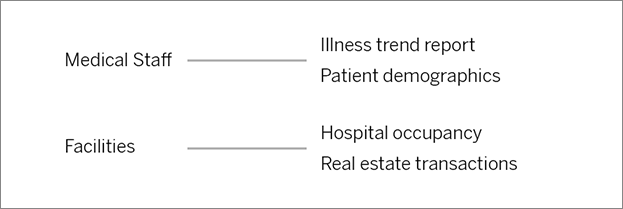
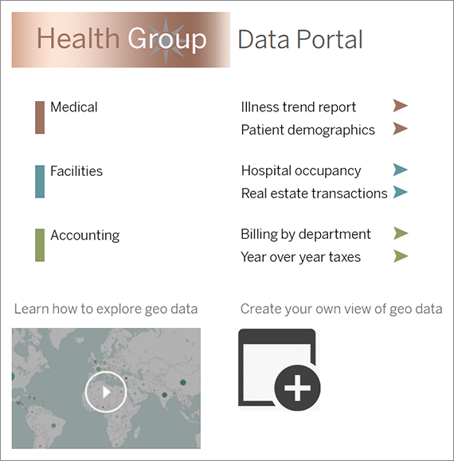

Dashboard-based Custom Portals
==============================
**Note:** This overview was inspired by the work of Tableau Zen Master
Mark Jackson. For more details about the process, [check out Mark\'s
blog](http://ugamarkj.blogspot.sg/2013/12/customizing-tableau-server-experience.html).

The [standard Tableau Online or Tableau Server
interface](https://help.tableau.com/current/pro/desktop/en-us/help.html#navigating.html)
works great for many organizations, but if you want to create a
company-branded experience and don\'t have API developer skills,
consider creating a custom portal based on a Tableau dashboard. A custom
portal lets you organize content around specific departments or job
roles, and you can even incorporate training that helps people interact
with data more fully. As the volume of Tableau content grows, a custom
portal guides your users directly to the data they need, while providing
ready access to related views and [Tableau
Server] search so they can easily explore
further.

##### Sketch out a portal design
----------------------------------------------------------------------------------------------------------

Begin outside of Tableau, on paper or in a wireframing application.
Consider the structure of your organization and the number of Tableau
views that apply to each group of users. Do you simply need one level of
navigation that points immediately to content? Or might you need to
start with a main page that provides navigational links for separate
groups of users or report types, followed by a second level with related
dashboards and views?

After you get buy-in on your design from key stakeholders and data
consumers, you\'re ready to move on to the next phase.

##### Gather images for logos and navigation elements
-----------------------------------------------------------------

Start thinking about images while refining your initial mockup, and then
gather them from libraries of clip-art or approved brand graphics, or
create them from scratch in an application like Photoshop or SnagIt.
PowerPoint can also be a good source if you plan to create navigation
thumbnails of common chart types.

##### Lay out text, images, and selected sheets on a dashboard
--------------------------------------------------------------------------

Create a workbook with a dashboard for the portal, using a [tiled
layout](https://help.tableau.com/current/pro/desktop/en-us/dashboards_organize_floatingandtiled.html#Tiled_vs._Floating_Layouts)
for more predictable positioning and scaling of elements on different
devices. Then start adding Text and Image objects, as well as any sheets
for data views you want to highlight right up front in your portal. To
refine spacing between these dashboard elements, insert Blank objects
and adjust their size. For more information, see [Create a
Dashboard](https://help.tableau.com/current/pro/desktop/en-us/dashboards_create.html#Add_objects).

**Tip:** For dynamic elements that show popular or recently created
content, include sheets based on [custom administrative
views](https://help.tableau.com/current/server/en-us/adminview_postgres.htm).

##### Link dashboard elements to content
------------------------------------------------------------------------------------------------------------------

If you have a second level of navigation in your portal, use [filter
actions](https://help.tableau.com/current/pro/desktop/en-us/actions_filter.html)
to point to a secondary dashboard from the main one. To create links
that directly open data views, right-click Image objects and choose Set
URL. (In our example below, each colored arrow and accompanying text is
an image that links to a view URL.) You can even point to empty views
with preloaded data sources, encouraging users to create new Tableau
content in the web-authoring workspace.

**Tip:** To add hyperlinks to text objects, include the full URL (for
example, `http://www.tableau.com`).

##### Publish, test, and refine your portal
---------------------------------------------------------------------------------------------------------------------

Publish the workbook to your server and distribute the dashboard URL to
your users. Portal design, like data analysis itself, is a cyclical
process. Now that your portal is out in the wild, start gathering user
feedback so you can continuously improve the experience

**Tip:** As a finishing touch, hide the Tableau toolbar to give your
portal a custom feel. After the question mark at the end of the
dashboard URL, add `:embed=y&amp;:toolbar=n`
