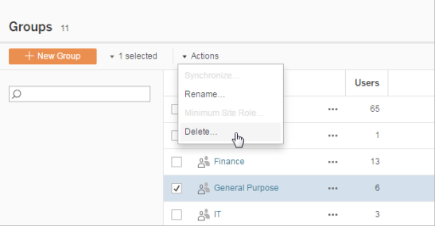

Delete Groups
=============
You can delete any group from the server (with the exception of the All
Users group). When you delete a group, the users are removed from the
group but they are not deleted from the server.

1.  In a site, click [Groups].

2.  On the Groups page, select one or more groups to delete.

3.  Select [Actions ]\> [Delete].

    
