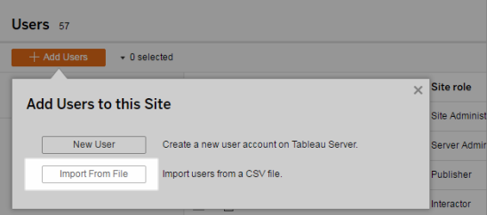
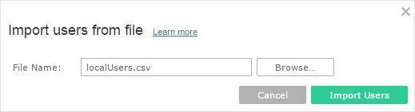
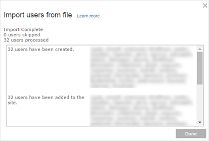
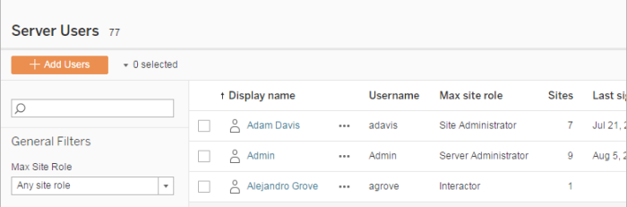
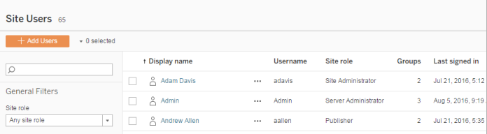
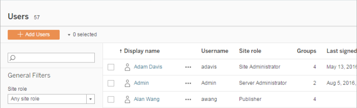

Import Users
============
To automate the process of adding users to a site, you can create a
CSV file that contains user information, and then import the file.

Site administrators can import users to a particular site; server
administrators (Tableau Server only) can import users at the server
level, to later add them to multiple sites.

**Note:** This topic contains the steps for importing, assuming that you
have already created the CSV file. If you have not created the file yet,
see [CSV Import File
Guidelines](https://help.tableau.com/current/server/en-us/csvguidelines.htm) for a list of file format requirements and import options.

[[]{.icon--med-lg .icon--arrow-up .heading-item__icon}](https://help.tableau.com/current/server/en-us/users_import.htm#){.heading-item__link .print-hidden} Add users from a CSV file
-------------------------------------------------------------------------------------------------------------------------------------------------------------------------------------

The following steps describe how to add users to a site or to the
server. The images reflect adding users at the site level.

1.  Do one of the following:

    -   To add users at the site level, select [Users], and
        then [Add Users].

        

    -   To add users at the server level on a **single-site** server,
        select [Users], and then [Add Users].

    -   To add users at the server level on a **multi-site** server,
        open the list of sites, and select [Manage All
        Sites]. Select [Users], and then [Add
        Users].

2.  Click [Import From File], click [Browse] and
    navigate to the file, and then click [Import Users].

    

    Tableau displays the results of the import process (names in this
    image are blurred).

    

3.  Click [Done].

[[]{.icon--med-lg .icon--arrow-up .heading-item__icon}](https://help.tableau.com/current/server/en-us/users_import.htm#){.heading-item__link .print-hidden} How users' site roles are assigned or maintained {#how-users’-site-roles-are-assigned-or-maintained}
------------------------------------------------------------------------------------------------------------------------------------------------------------------------------------------------------------

When you import at the site level or on a single-site server using
`tabcmd`, you can specify the site role for all users in the CSV file.
If a user already exists in the [Tableau Server]
site, the site role assigned during the import process will be applied,
even if it is more restrictive than users' existing site role. The
exception is that you cannot affect a server administrator's site role.

For a multi-site server, when you import users in the Server Users page,
you create server users with no site affiliation. Because these users do
not belong to a site, they cannot have a site role. The only site role a
user can have at the server level is [Unlicensed] or [Server
Administrator].

You can also specify the user's site role when you assign site
membership to a user. For information, see [Manage users' site
membership](https://help.tableau.com/current/server/en-us/users_view.htm#manage-site-membership).

::: {.sectiontitle}
[[]{.icon--med-lg .icon--arrow-up .heading-item__icon}](https://help.tableau.com/current/server/en-us/users_import.htm#){.heading-item__link .print-hidden} Importing at the server level in multi-site environments {#importing-at-the-server-level-in-multisite-environments}
--------------------------------------------------------------------------------------------------------------------------------------------------------------------------------------------------------------------
:::

If the server is running multiple sites and you are a server
administrator, you can import a CSV file from two locations. Where
existing user accounts are concerned, each location has different
capabilities.

-   The [Server Users] page appears in a multi-site
    environment. Only server administrators can access this page.

    

    You can import the CSV file from here if you want to update existing
    user accounts in addition to adding new ones. For example, if you
    import a file that has a new password for each existing user, their
    passwords will be reset.

-   The [Site Users] page.

    

    Server administrators can add new user accounts with CSV imports. If
    the CSV file includes existing users, the [Password] and
    [Display Name] fields must either match the existing or
    be left blank. If new passwords or full names are used, the import
    will fail.

[[]{.icon--med-lg .icon--arrow-up .heading-item__icon}](https://help.tableau.com/current/server/en-us/users_import.htm#){.heading-item__link .print-hidden} Importing to a single-site environment {#importing-to-a-singlesite-environment}
--------------------------------------------------------------------------------------------------------------------------------------------------------------------------------------------------

Server and site administrators on a single-site server perform CSV user
imports from the [Users] page in a site.

[[]{.icon--med-lg .icon--arrow-up .heading-item__icon}](https://help.tableau.com/current/server/en-us/users_import.htm#){.heading-item__link .print-hidden} []{#MultisiteSinglesiteUserImport}Multi-site versus single-site import {#multisite-versus-singlesite-import}
----------------------------------------------------------------------------------------------------------------------------------------------------------------------------------------------------------------------------------

Users can belong to more than one site on the same server, but they must
use the same credentials for each site. This becomes important when
you\'re adding users to a site and those users might already be members
of a different site. If you try to import a user who already exists, and
if the user\'s credentials in the CSV file don't match the existing
credentials, the import fails for that user.

If you're importing users to a site and think the users might already
exist on the server, you can try leaving the **Password** field in the
CSV file blank (while including the delimiters for the field). If a user
who is defined in the CSV already exists in another site, the user is
added to the site where you're importing. However, if the user *doesn't*
already exist on the server, the user is created, and the CSV import
window alerts you that the new user doesn't have a password. You can
then use the server administrator pages to assign a password to any user
who doesn't have one.

**Note**: If the server is configured to use Active Directory for
authentication, user passwords are managed by Active Directory, and you
can leave the password field in the CSV file blank.
