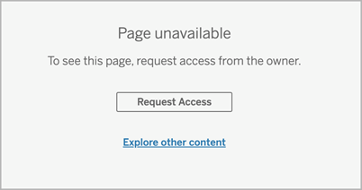

Let Site Users Request Access to Content
========================================
Permissions determine if a user has viewing access to workbook, view, or
content inside a project. If an existing site user clicks on content or
a project they don't have access to, they can select Request Access to
send a request to the owner controlling permissions for that piece of
content.

When someone requests access, the owner who controls permissions for
that content (either at the project or workbook level) receives an email
with the name and email of the requester, the content or project
requested, and a link to the project or content controlling permissions
on the requested item.

For example, if a user requests access to a workbook and content
permissions are locked to the project, then the project owner receives
the request. Likewise, if a user requests access to a workbook and
project permissions are managed by the workbook owner, then the workbook
owner receives the request.

Once permission is granted, the owner can email the requester to let
them know they have view capability to the project or workbook.

[[]{.icon--med-lg .icon--arrow-up .heading-item__icon}](https://help.tableau.com/current/server/en-us/Request_access.htm#){.heading-item__link .print-hidden} Default settings
------------------------------------------------------------------------------------------------------------------------------------------------------------------------------

The Request Access setting is enabled by default on a new site. To
enable the setting if it\'s been disabled:

1.  Go to the General tab of the Settings page for your site.
    -   If you have a single site, on the side navigation, click
        [Settings] and [General].
    -   If you have multiple sites, select the site you want to
        configure and click [Settings] and
        [General].
2.  On the General tab, scroll down to Request Access and select [Let
    users request access to projects, workbooks, and views].
3.  Click [Save].

[[]{.icon--med-lg .icon--arrow-up .heading-item__icon}](https://help.tableau.com/current/server/en-us/Request_access.htm#){.heading-item__link .print-hidden} Configure project permissions
-------------------------------------------------------------------------------------------------------------------------------------------------------------------------------------------

You can control who will receive the access request by adjusting the
project's content permissions. If content permissions are:

-   Locked to the project: the project owner receives the request.
-   Managed by the owner: The workbook owner receives the request.

To manage content access using projects, see [Use Projects to Manage
Content
Access](https://help.tableau.com/current/server/en-us/projects.htm) and
[Permissions](https://help.tableau.com/current/server/en-us/permissions.htm#lock-project-permissions).

For more information about how permission rules are evaluated, see
[Permissions](https://help.tableau.com/current/server/en-us/permissions.htm#evaluate-permission-rules): Evaluate permission rules.

[[]{.icon--med-lg .icon--arrow-up .heading-item__icon}](https://help.tableau.com/current/server/en-us/Request_access.htm#){.heading-item__link .print-hidden} Change project permissions
----------------------------------------------------------------------------------------------------------------------------------------------------------------------------------------

*For administrators and project leaders*

Permissions can be set at the project level for both the project itself
and for any content in the project. For example, if workbook permissions
are configured at the project level, all workbooks published into that
project inherit those default permissions. However, the
[Creator]{.Variablessiterole-author} can choose to change the
permissions during publishing, or certain users can change the
permissions on published content. To enforce the permissions established
at the project level, **Content Permissions** can be locked to the
project. For more information, see [Let Site Users Request Access to
Content](https://help.tableau.com/current/server/en-us/Request_access.htm#LockProject).

To set permissions at the project level:

1.  Navigate to the project
2.  Open the Actions menu (\...) and click **Permissions**. The
    permissions dialog box opens.
3.  To modify an existing permission rule, open the Actions menu (\...)
    for that row and click **Edit**.
4.  To create a new rule,
    a.  Select [+ Add a user or group rule].
    b.  If necessary, use the drop-down box to the right to change
        between groups and users.
    c.  Select a group or user from the drop-down box. This creates a
        row where you can configure the permission rule.
5.  In the row for the permission rule, choose an existing permission
    role template from the drop-down box for each section, or create a
    custom rule by expanding a
    section ()
    and clicking the capabilities.\
    One click sets the capability to **Allowed**, two clicks sets it to
    **Denied**, and a third click clears the selection
    (**Unspecified**).
6.  When finished, click **Save**.

[[]{.icon--med-lg .icon--arrow-up .heading-item__icon}](https://help.tableau.com/current/server/en-us/Request_access.htm#){.heading-item__link .print-hidden} Change content permissions
----------------------------------------------------------------------------------------------------------------------------------------------------------------------------------------

*For administrators, project leaders, and content owners*

If project permissions are not locked, permissions for individual pieces
of content can be modified.

**Warning**: Tableau recommends managing permissions at the project
level within the Tableau site. These steps are relevant only for content
in projects where permissions are managed by the owner.

### [[]{.icon--med-lg .icon--arrow-up .heading-item__icon}](https://help.tableau.com/current/server/en-us/Request_access.htm#){.heading-item__link .print-hidden} []{#contentpermissions}Set permissions on content

1.  Navigate to the content (workbook, data source, flow, data role)
2.  Open the Actions menu (\...) and click **Permissions**. The
    permissions dialog box opens.
3.  To modify an existing permission rule, open the Actions menu (\...)
    for that row and click **Edit**.
4.  To create a new rule,
    a.  Select [+ Add a user or group rule].
    b.  If necessary, use the drop-down box on the right to change
        between groups and users.
    c.  Select a group or user from the drop-down box. This creates a
        row where you can configure the permission rule.
5.  In the row for the permission rule, choose an existing permissions
    role template from the drop-down box or create a custom rule by
    clicking the capabilities.
6.  When finished, click **Save**.

### [[]{.icon--med-lg .icon--arrow-up .heading-item__icon}](https://help.tableau.com/current/server/en-us/Request_access.htm#){.heading-item__link .print-hidden} Set permissions on a view

In some situations, it may be valuable to specify permissions on a view
independently from the workbook that contains it. To set permissions on
a published view, navigate to the view within a published workbook and
follow steps above.

**Warning**: While it is possible to set view-level permissions within a
workbook, we strongly recommend managing permissions at the project (or
workbook) level as much as possible. For views to inherit permissions,
the project must be locked or the workbook must be published with **Show
Sheets as Tabs**. See [Let Site Users Request Access to
Content](https://help.tableau.com/current/server/en-us/Request_access.htm#sheettabs) for more information.
