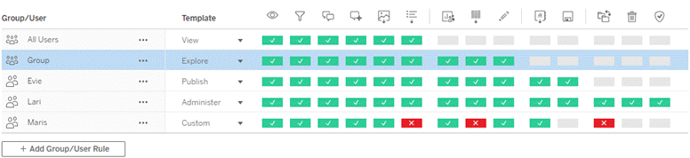
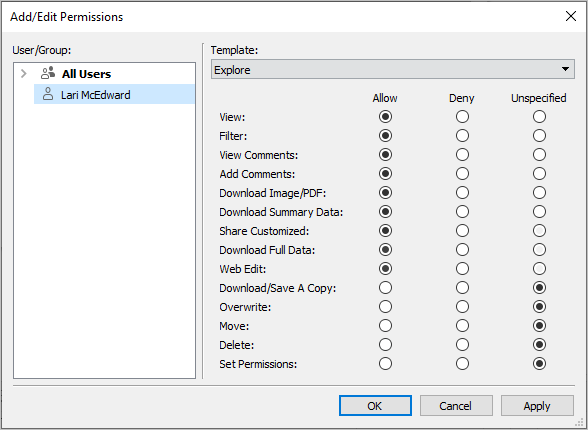
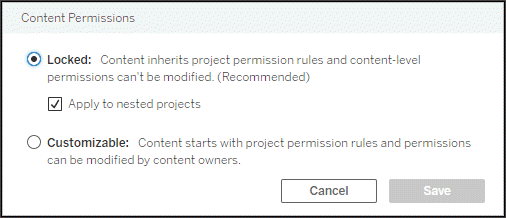
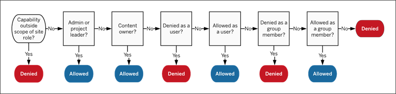
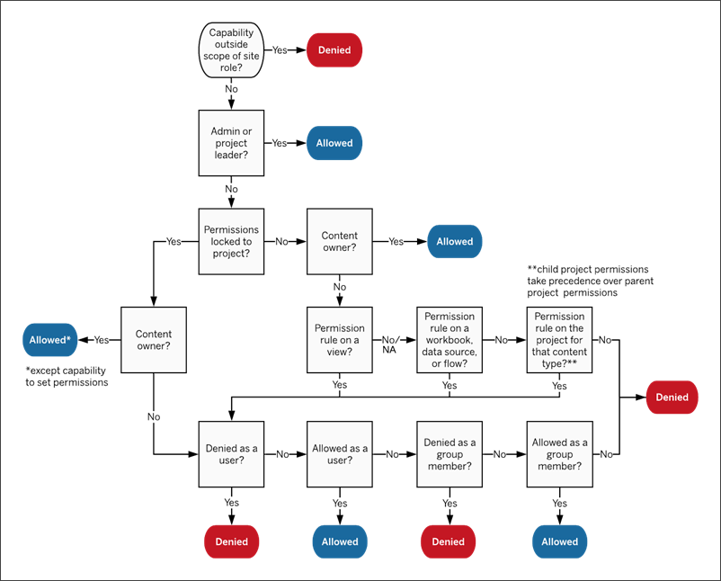

Permissions
===========
Permissions determine how users can interact with content such as
workbooks and data sources. Permissions are set in the permission dialog
or via the [REST API[(Link opens in a new
window)]{.sr-only}](https://help.tableau.com/current/api/rest_api/en-us/REST/rest_api_ref_permissions.htm).
At the top of the dialog, permission rules configure capabilities for
groups or users. Below, the permissions grid displays the effective
permissions for users.

If the Data Management Add-on is present, permissions for external
assets have additional considerations. For more information, see [Manage
Permissions for External
Assets](https://help.tableau.com/current/server/en-us/dm_perms_assets.htm).

Permissions fundamentals
-------------------------

**Projects and groups**

Tableau sites use *projects* to organize content and *groups* to
organize users. Managing permissions is easier when permission rules
are:

-   Set at the project level instead of on individual pieces of content.
-   Established for groups instead of individuals.

Permissions can only be established for users, groups, projects, or
content that already exist. For more information about creating users
and groups, creating projects, and publishing content, see [Manage Users
and
Groups](https://help.tableau.com/current/server/en-us/users.htm), [Use Projects to Manage Content
Access](https://help.tableau.com/current/server/en-us/projects.htm) , and [Publish Data Sources and Workbooks[(Link opens in a new
window)]{.sr-only}](https://help.tableau.com/current/pro/desktop/en-us/publish_overview.htm).

**Capabilities and permission rules** 

Permissions are made up of *capabilities*---the ability to perform
actions like view content, web edit, download data sources, or delete
content. *Permission rules* establish what capabilities are allowed or
denied for a user or group on a piece of content.

**Note:** When talking about permissions in general, it's common to see
a phrase like "a user must have the delete *permission*." This is easy
to understand in a broad context. However, when working with permissions
at a technical level like in this article, it's more accurate to say
"the delete *capability.*" In this topic we'll use the more precise term
*capability*, but you should be aware that you might see *permission* in
other places.

The interplay between license level, site role, and potentially multiple
permission rules factor into the final determination of what a user can
or can't do. For each user this becomes their *effective permissions*.
For more information, see [Effective
permissions](https://help.tableau.com/current/server/en-us/permissions.htm#EffectivePermissions).

Some tasks such as creating new workbooks from a browser (web authoring)
or moving content might require specific configurations of several
capabilities rather than being captured in a single capability. For more
information, see [Permission settings for specific
scenarios](https://help.tableau.com/current/server/en-us/permissions.htm#Permissi).

[[]{.icon--med-lg .icon--arrow-up .heading-item__icon}](https://help.tableau.com/current/server/en-us/permissions.htm#){.heading-item__link .print-hidden} []{#setpermissions}Set permissions
---------------------------------------------------------------------------------------------------------------------------------------------------------------------------------------------

Explore the tabs below for details on how to set permission rules at the
project level, at the content level, or when publishing content from
Tableau Desktop.

**Note**: The phrase "project permissions" can have two meanings. There
are the permission capabilities for a project itself---View and
Publish---that control how a user can interact with a project. There is
also the concept of project-level permission rules for other content
types. In this article "project-level permissions" means permission
rules for workbooks, data sources, and the other content that are
configured in the permission dialog for a project. This is in contrast
to "content-level" permission rules that can be set on a specific
workbook, data source, etc.

-   [Project-level
    permissions](https://help.tableau.com/current/server/en-us/permissions.htm#projectlevel-permissions){#projectlevel-permissions
    .tabs__tab-link .is-active}
-   [Content-level
    permissions](https://help.tableau.com/current/server/en-us/permissions.htm#contentlevel-permissions){#contentlevel-permissions
    .tabs__tab-link}
-   [Set permissions at
    publish](https://help.tableau.com/current/server/en-us/permissions.htm#set-permissions-at-publish){#set-permissions-at-publish
    .tabs__tab-link}

*For administrators, project owners, and project leaders*

To set permissions at the project level:

1.  Navigate to the project
2.  Open the Actions menu (\...) and click **Permissions**. The
    permissions dialog opens.
3.  To modify an existing permission rule, select the appropriate tab
    for that content type and click a capability.
4.  To create a new rule, click [+ Add Group/User Rule] and
    start typing to search for a group or user. For each tab, choose an
    existing template from the drop-down box or create a custom rule by
    clicking the capabilities.
5.  When finished, click **Save**.

**Tip**: Permission rules set at the project level act as a default for
content saved in that project and any nested projects it contains.
Whether those project-level default rules are enforced or only
preliminary depends on the [content permission] setting.
This setting can be configured in two ways, either [Locked]
or [Customizable]. For more information, see [Lock content
permissions](https://help.tableau.com/current/server/en-us/permissions.htm#LockProject).
:::

*For administrators, project leaders, and content owners*

If project content permissions are customizable, permissions for
individual pieces of content can be modified. The information below is
not relevant to content in locked projects. For more information, see
[Lock content
permissions](https://help.tableau.com/current/server/en-us/permissions.htm#LockProject).

**Tip**: While it is possible to set permissions on individual content
in customizable projects, we recommend managing permissions at the
project level.

### []{#contentpermissions}Set permissions on content

1.  Navigate to the content (workbook, data source, flow, data role)
2.  Open the Actions menu (\...) and click **Permissions**. The
    permissions dialog opens.
3.  To modify an existing permission rule, click a capability.
4.  To create a new rule, click [+ Add Group/User Rule] and
    start typing to search for a group or user. Choose an existing
    template from the drop-down or create a custom rule by clicking the
    capabilities.
5.  When finished, click **Save**.

### Set permissions on a view

**Tip**: While it's possible to set view-level permissions within a
workbook, we strongly recommend managing permissions at the project or
workbook level.

If a workbook is published with **Show Sheets as Tabs** checked, the
views in that workbook will inherit all permissions set for the
workbook. The permission dialog for a view will be read-only.

In some situations, it may be valuable to specify permissions on a view
independently from the workbook that contains it. If the workbook is
published with **Show Sheets as Tabs** unchecked, the views will start
with the workbook permissions but will be independent thereafter and can
be set independently. Note that this means if the permission rules are
modified for the workbook, those changes won't be applied to the
views---each view's permissions will need to be managed individually.

See [Show or Hide Sheet
Tabs](https://help.tableau.com/current/server/en-us/permissions.htm#sheettabs) for more information.
:::

*For content publishers*

If project content permissions are customizable, permissions for
individual content can be set when publishing from [Tableau
Desktop]{.VariablesTabsProductDesktop}. The information below is not
relevant for content in locked projects. For more information, see [Lock
content
permissions](https://help.tableau.com/current/server/en-us/permissions.htm#LockProject).

**Tip**: While it's possible to set permissions on individual content in
customizable projects, we recommend managing permissions at the project
level.

1.  From the publishing dialog , click the Edit link for
    **Permissions**.\
    If the Edit link is unavailable, permissions are locked to the
    project and can't be modified except by the project owner, project
    leader, or an administrator.\

2.  The Add/Edit Permissions dialog shows any existing permission rules.
    Click [Add] to add a new permission rule or
    [Edit] to modify an existing permission rule

    a.  Select the group or user from the left pane. You can expand a
        group to see which users it contains.
    b.  Use the selector at the top of the right pane to choose an
        existing template, or use the radio buttons to create a custom
        rule.

    

    Note that effective permissions can't be inspected from the
    publishing dialog.

3.  When finished, click **OK** and resume publishing.

**Note**: Permissions can't be set while publishing flows from [Tableau
Prep Builder]{.VariablesTabsProductPrepBuilder}. To set permissions on a
flow, refer to the steps for Project-level permissions or Content-level
permissions.
:::
:::
:::

**Tip**: By default, all users are added to an "All Users" group that
has basic permissions for content. To start with a clean slate when
building your own permission rules, we recommend that you delete the
rule entirely or edit the rule for All Users to remove any permissions
(set the permission role template to None). This will help prevent any
ambiguity down the road by reducing the number of rules that applies to
any given user and therefore making effective permissions easier to
understand.

[[]{.icon--med-lg .icon--arrow-up .heading-item__icon}](https://help.tableau.com/current/server/en-us/permissions.htm#){.heading-item__link .print-hidden} []{#permissioncapabilities}Permission capabilities
-------------------------------------------------------------------------------------------------------------------------------------------------------------------------------------------------------------

Permissions are made up of capabilities, or the ability to perform a
given action on a piece of content, such as view, filter, download, or
delete. Each row in the Permission Rules area of the dialog is a
*permission rule*. Permission rules are the setting for each capability
(allowed, denied, or unspecified) for the group or user in that row.
Permission rules have *templates* available that make it easier to
assign capabilities quickly. Permission rules can also be copied and
pasted.

**Note**: In the permission dialog for projects, there are tabs for each
content type (Projects, Workbooks, Data Sources, and---if you have the
[Data Management Add-on]{.VariablesDM_sku}---Data Roles and Flows). When
a permission rule is added, the default for all capabilities across all
content types is Unspecified. To allow or deny capabilities for each
content type, you must go to each tab in turn. In the permission dialog
for a specific piece of content, there are no tabs and the permission
rules only apply to that piece of content.

### [[]{.icon--med-lg .icon--arrow-up .heading-item__icon}](https://help.tableau.com/current/server/en-us/permissions.htm#){.heading-item__link .print-hidden} Templates

Templates group sets of capabilities that are often assigned together
based on common user scenarios, [View],
[Explore], [Publish], and
[Administer]. Assigning a template sets its included
capabilities to [Allowed], with the rest left as
[Unspecified]. The templates are cumulative, so the Explore
template includes everything from the View template plus additional
capabilities. All content also has a template for **None** (which sets
all capabilities to unspecified) and **Denied** (which sets all
capabilities to denied).

Templates are meant to be a starting point and can be adjusted after
they are applied. Capabilities can also be granted or denied without
using a template at all. In both cases, the template column will then
show [Custom].

### [[]{.icon--med-lg .icon--arrow-up .heading-item__icon}](https://help.tableau.com/current/server/en-us/permissions.htm#){.heading-item__link .print-hidden} Copy and paste permissions

If there is a permission rule that needs to be assigned to multiple
groups or users, you can copy and paste from one rule to another. You
can't copy from or paste onto a rule that involves Project Leader
status.

1.  Open the action menu (\...) for the existing rule you want to copy
    from and select [Copy Permissions]. This will only be
    available when the rule is not in edit mode.
2.  Select an existing rule you want to paste over. You can also create
    a new rule by clicking [+ Add Group/User Rule] and
    selecting a group or user.
3.  Open the action menu (\...) and select [Paste
    Permissions].

### [[]{.icon--med-lg .icon--arrow-up .heading-item__icon}](https://help.tableau.com/current/server/en-us/permissions.htm#){.heading-item__link .print-hidden} Capabilities

Explore the tabs below for details on the capabilities for each content
type:

-   [Projects](https://help.tableau.com/current/server/en-us/permissions.htm#projects){#projects
    .tabs__tab-link .is-active}
-   [Workbooks](https://help.tableau.com/current/server/en-us/permissions.htm#workbooks){#workbooks
    .tabs__tab-link}
-   [Data
    Sources](https://help.tableau.com/current/server/en-us/permissions.htm#data-sources){#data-sources
    .tabs__tab-link}
-   [Other content
    types](https://help.tableau.com/current/server/en-us/permissions.htm#other-content-types){#other-content-types
    .tabs__tab-link}

Projects only have two capabilities and two templates. Prior to 2020.1,
Project Leader was treated as a permission capability rather than a
setting. For more information about project leaders and how to assign
them in 2020.1 and later, see [Project
administration](https://help.tableau.com/current/server/en-us/permissions.htm#projectpermissions).

#### View template

 **View**
allows a user to see the project. If a user hasn't been granted the view
capability, the project won't be visible to them. Granting the view
capability for a project does not mean a user can see any content in the
project, just the existence of the project itself.

#### Publish template

 **Publish**
allows a user to publish content to the project from [Tableau
Desktop]{.VariablesTabsProductDesktop} or [Tableau Prep
Builder]{.VariablesTabsProductPrepBuilder}. The publish capability is
also required to move content into the project or save content to the
project from web authoring. Prior to 2020.1, this capability was called
Save.
:::

#### View template

 **View**
allows a user to see the workbook or view. If a user hasn't been granted
the view capability, the workbook won't be visible to them.

 **Filter**
allows a user to interact with filters in the view, including keep only
and exclude filters. Users lacking this capability won't see filter
controls in the view.

**View Comments** allows a user to view the comments associated with the
views in a workbook.

 **Add
Comments** allows a user to add comments to views in a workbook.

**Download Image/PDF** allows a user to download each view as a PNG,
PDF, or PowerPoint.

**Download Summary Data** allows a user to view the aggregated data in a
view, or in the marks they've selected, and download that data (as a
CSV).

#### Explore template

**Share Customized** allows a user to save customizations made to the
view (such as filters and selections) as custom views. For users with a
site role of Explorer or above, they can share these customizations,
which makes them appear as options for other users. For more
information, see [Use Custom Views[(Link opens in a new
window)]{.sr-only}](https://help.tableau.com/current/pro/desktop/en-us/customview.htm).

**Download Full Data** allows a user to view the underlying data in a
view, or in the marks they've selected, and download that data (as a
CSV).

 **Web
Edit** allows a user to edit the view in a browser-based authoring
environment.

-   Note: Creating new content in the browser or saving views from the
    web edit interface requires a specific combination of capabilities.
    For more information, see [Web Editing and Web
    Authoring](https://help.tableau.com/current/server/en-us/permissions.htm#webauthor)
-   The Web Editing feature must also be enabled for the entire site or
    even users with this capability allowed won't be able to web edit.
    For more information, see [Set a Site\'s Web Authoring Access[(Link
    opens in a new
    window)]{.sr-only}](https://help.tableau.com/current/server/en-us/web_author_enable.htm).

#### Publish template

**Download Workbook/Save a Copy** allows a user to download a packaged
workbook (as a TWBX). Allows a user to save (publish) a copy from the
web edit interface as a new workbook. Prior to 2020.1, this capability
was called Download Workbook/Save As.

 **Overwrite**
allows a user to overwrite (save) the content asset on the server. Prior
to 2020.1, this capability was called Save.

-   When allowed, the user can re-publish a workbook, data source, or
    flow, or save a workbook in web authoring, thereby becoming the
    owner and gaining access to all permissions. Subsequently, the
    original owner's access to the workbook is determined by their
    permissions just like any other user.

#### Administer template

 **Move**
allows a user to move workbooks between projects. For more information,
see [Move
content](https://help.tableau.com/current/server/en-us/permissions.htm#MoveContent) .

 **Delete**
allows a user to delete the workbook.

 **Set
Permissions** allows a user to create permission rules for the workbook.

**Note**: In a workbook that is configured to not show navigational
sheet tabs, views (sheets, dashboards, stories) inherit the workbook
permissions at publication, but any changes to permission rules must be
made on individual views. View capabilities are the same as those for
workbooks, except for **Overwrite**, **Download Workbook/Save a Copy**,
and **Move** which are only available at the workbook level.\
\
We recommend showing navigational sheet tabs whenever possible, so views
continue to inherit their permissions from the workbook. For more
information, see [Show or Hide Sheet
Tabs](https://help.tableau.com/current/server/en-us/permissions.htm#sheettabs).
:::

#### View template

 **View**
allows a user to see the data source on the server

**Connect** allows a user to connect to a data source in Tableau
Desktop, Tableau Prep Builder, Ask Data, or web editing.

-   If a workbook author embeds their credentials to a published data
    source in a published workbook, they are essentially embedding their
    **Connect** capability. Therefore, users can see the data in the
    workbook regardless of their own **Connect** capability for that
    data source. If the workbook author doesn't embed their credentials
    to the published data source, the user needs their own **Connect**
    capability to the data source in order to consume the workbook. For
    more information, see [Data access for published Tableau data
    sources](https://help.tableau.com/current/server/en-us/permissions.htm#PublishedData)
-   A user must have the **Connect** capability for a data source in
    order to use Ask Data. For more information, see [Enable Ask Data
    for Sites and Data Sources[(Link opens in a new
    window)]{.sr-only}](https://help.tableau.com/current/pro/desktop/en-us/ask_data_enable.htm#ensure-that-users-can-access-a-data-source).

#### Explore template

**Download Data Source** allows a user to download the data source from
the server (as a TDSX)

-   Cube data sources, like those for Microsoft Analysis Services or
    Oracle Essbase connections, must be used locally. To download the
    published data source to Tableau Desktop, the user must have the
    Download capability. For more information, see [Cube Data
    Sources](https://help.tableau.com/current/server/en-us/datasource_cube.htm)

#### Publish template

 **Overwrite**
allows a user to publish data sources to the server and overwrite data
sources on the server. Prior to 2020.1, this capability was called Save.

#### Administer template

 **Delete**
allows a user to delete the data source

 **Set
Permissions** allows a user to create and edit permission rules for the
data source
:::

 
:::
:::
:::
:::
:::
:::
:::
:::

View template

Explore template

Publish template

Administer template

Flows

 **View**
allows a user to view the flow.

**Download flow** allows a user to download the flow (as a TFLX).

 **Run**
allows a user to run the flow.

**Overwrite**\* allows a user to publish flows and overwrite published
flows.

 **Move**
allows a user to move content between projects. For more information,
see [Move
content](https://help.tableau.com/current/server/en-us/permissions.htm#MoveContent) .

 **Delete**
allows a user to delete the content.

 **Set
Permissions** allows a user to create permission rules for the content.

 

Data Roles

 **View**
allows a user to view data roles.

n/a

**Overwrite**\* allows a user to publish data roles and overwrite
published data roles.

Metrics

 **View**
allows a user to view metrics.

n/a

**Overwrite**\* allows a user to publish metrics and overwrite published
metrics.

\*Prior to 2020.1, the Overwrite capability was called Save.

[[]{.icon--med-lg .icon--arrow-up .heading-item__icon}](https://help.tableau.com/current/server/en-us/permissions.htm#){.heading-item__link .print-hidden} []{#permissionmanagement}Permission management
---------------------------------------------------------------------------------------------------------------------------------------------------------------------------------------------------------

Using projects can simplify permission management through the use of
features such as nested project hierarchies, hiding projects from
certain users or groups, authorizing project leaders, and locking
permissions.

**Tip**: How permissions are set at the project level is very important,
especially for the Default project. When a new top-level project is
created it inherits its default permission rules (for all content types)
 from the Default project. When a new project is created nested inside
another project, the child project inherits its default permission rules
from the parent project.

### [[]{.icon--med-lg .icon--arrow-up .heading-item__icon}](https://help.tableau.com/current/server/en-us/permissions.htm#){.heading-item__link .print-hidden} []{#projectpermissions}Project administration

Projects are containers used to organize and manage access to content.
By giving non-administrators privileges to manage projects, certain
content administration tasks can be handled at the project level.

**Project Leaders**: Projects can have project leaders, users who have
been set as a [project leader]. This setting automatically
grants a user their maximum capabilities---depending on their site
role---for that project and all content in that project. Project leaders
with site role of Explorer (can publish) and above will therefore have
all capabilities. Project leaders are essentially local admins for the
project without access to site or server settings.

**Hierarchy**: Only administrators can create top-level projects.
Project owners and project leaders can create nested projects inside
their projects. Project owners and leaders have full administrative
access to the project and its content, as well as any nested projects it
contains. In a hierarchy, project leaders are implicitly given project
leader access to all child content. To remove project leader access, you
must do so at the level in the hierarchy where the role was explicitly
assigned.

**Ownership**: A project can have multiple project leaders, but each
project has exactly one owner. By default, a project is owned by the
user who created it. A project's owner can be changed (by the existing
owner or an administrator, but not a project leader) to any user with a
site role of Explorer (can publish) or Creator, or an administrator site
role. Project ownership can be changed regardless of whether the project
permissions are locked. Note that this refers to project ownership.
Content ownership can be changed by project owners, project leaders, and
administrators.

**Deleting**: Content can only exist inside a project. Only
administrators can create and delete top-level projects, but project
leaders can create or delete nested projects. Deleting projects also
deletes all the content and nested projects they contain. To delete a
project without losing its content, move the content to another project
first. Deleting projects can't be undone.

For a deeper dive into project administration, see [Use Projects to
Manage Content
Access](https://help.tableau.com/current/server/en-us/projects.htm) and [Add Projects and Move Content Into
Them](https://help.tableau.com/current/server/en-us/projects_add.htm).

### [[]{.icon--med-lg .icon--arrow-up .heading-item__icon}](https://help.tableau.com/current/server/en-us/permissions.htm#){.heading-item__link .print-hidden} []{#Set}Set a project leader

Project leaders are users who have administrator-like access for a
specific project or project hierarchy. Prior to 2020.1, [Project
Leader] was a capability that could be set to allowed,
denied, or unspecified like any other capability. Starting in 2020.1,
project leaders are now assigned through the action menu and function as
a setting rather than a capability.

To assign project leader status to a group or user

1.  Open the permission dialog for the appropriate project.
2.  Select an existing permission rule, or click [+ Add Group/User
    Rule] and chose the desired group or user.
3.  Open the action menu (\...) for that permission rule and select [Set
    Project Leader\...].

**Note**: If the action menu includes an option for [Enable "Set Project
Leader"], this will need to be selected before the group or
user can be set as a project leader. This option only appears when that
group or user was denied the Project Leader capability (prior to
2020.1). That denied capability needs to be removed before they can be
set as a project leader.

Once a permission rule has been used to establish a group or user as a
project leader, the templates and capabilities are no longer editable
because all capabilities are allowed for project leaders. If a project
leader is established on a project that contains nested projects, they
will have inherited project leader status on all nested projects and
their content.

Project leader status is always applied downward through the entire
project hierarchy and can only be removed from the level where it was
set. To remove project leader status, follow the same steps as above but
select [Remove as Project Leader] from the action menu. Once
a group or user has been removed as project leader, that permission rule
will have all capabilities set to Unspecified. This may mean their
access to and capabilities for that project will be removed if there is
no other permission rule giving them permissions to the content. To keep
their access to the project and its content, they will need to have
capabilities set like any other group or user.

### [[]{.icon--med-lg .icon--arrow-up .heading-item__icon}](https://help.tableau.com/current/server/en-us/permissions.htm#){.heading-item__link .print-hidden} []{#LockProject}Lock content permissions

Permission rules set at the project level act as a default for content
saved in that project and any nested projects it contains. Whether those
project-level default rules are enforced or only preliminary depends on
the [content permission] setting. This setting can be
configured in two ways, either [Locked] (recommended) or
[Customizable]. Locking a project removes the ability for
content owners to modify the permission rules on their content. Locking
permissions can be applied to nested projects or just to the parent
project itself.

-   When the content permissions are [locked (including nested
    projects)], permission rules set at the project level
    are enforced for all content in the project and all nested projects.
    (This was the default behavior for locking projects prior to 2020.1)
-   When the content permissions are **locked** (not including nested
    projects), permission rules set at the project level are enforced
    for content in the project, but nested projects can be configured
    independently with their own permission rules and as locked or
    customizable. (This is new behavior for locking projects as of
    2020.1)
-   When the content permissions are [customizable],
    permission rules set at the project level are applied to all content
    in the project by default. However, permission rules can be modified
    for individual pieces of content during or after publishing. (This
    was called **Managed by the owner** prior to 2020.1)

**Note**: Whether permission rules are locked or customizable, the
permissions on content are always applied. *Locked* and *customizable*
refer only to how project-level permissions are inherited by content in
the project and who can change them. Even in a project with customizable
permissions, only specific users can modify permissions (content or
project owner, project leader, admins, or those with the Set Permission
capability).

In a locked project:

-   The project permission rules per content type are applied to all
    content.
-   Only administrators, project owners, and project leaders can modify
    permissions.
-   Content owners lose the Set Permission capability but retain all
    other capabilities on their content.
-   Permissions are predictable for all content in the project.

In a customizable project:

-   The project permission rules are applied by default when content is
    published into the project or nested projects are created, but
    permissions can be modified during publication or after the content
    is created.
-   Any user with the Set Permissions capability can modify permission
    rules for that content.
-   Content owners have all capabilities on their content.
-   Permissions can be different across content in the project.

#### Set content permissions (lock a project)

New top-level projects inherit all initial permission rules from the
Default project but not the content permissions setting, which is set to
[Customizable]. This can be changed to [Locked]
if desired.

To configure the [Content Permissions]:

1.  You must be logged into the site as an administrator, project owner,
    or project leader
2.  Open the permissions dialog for a project
3.  Click the Content Permissions [Edit] link in the upper
    left and select the desired option in the Content Permissions dialog

**Note**: If the upper left corner doesn't show an **Edit** link in step
3 above, you may be on the permissions dialog for (a) a nested project
or a piece of content in a locked project, in which case the link should
bring you to the managing project, (b) a piece of content in a
customizable project, which won't show anything, or (c) a view, which
will indicate how the view permissions are tied to the workbook. For
more information on the interplay of permissions for views and
workbooks, see [Show or Hide Sheet
Tabs](https://help.tableau.com/current/server/en-us/permissions.htm#sheettabs).

#### Change content permissions

When the content permission setting for a project is changed, the
outcome depends on the new setting. Changes to permission rules in a
locked hierarchy must be done at the level of the managing project.

Changing from

Changing to

Outcome

Locked (including nested projects)

Locked

Doesn't modify existing permission rules.

Any nested projects become customizable.

Customizable

Doesn't modify existing permission rules, though they become
customizable.

Any nested projects become customizable.

Locked

Locked (including nested projects)

Overwrites existing custom permission rules for all nested projects and
their content. This can't be undone.

Customizable

Doesn't modify existing permission rules, though they become
customizable.

Any nested projects retain their content permission settings and
permission rules.

Customizable

Locked (including nested projects)

Overwrites existing custom permission rules for content in the project,
as well as all nested projects and their content This can't be undone.

Locked

Overwrites existing custom permission rules for content in the project.
This can't be undone.

Any nested projects retain their permission rules and remain
customizable.

#### []{#moveproject}Move projects and content

When a project is moved into another project, the permissions settings
on the project being moved are maintained unless the destination project
is scoped to include nested projects.

-   If the destination project is set to **locked (including nested
    projects)**, the permissions for the project being moved are
    overwritten.
-   If the destination project is set to **locked** (not including
    nested projects), the permissions for the project being moved are
    not overwritten. Whether or not the moved project is locked or
    customizable is preserved from its original setting.
-   If the destination project is set to **customizable**, the
    permissions for the project being moved are not overwritten but they
    are now editable.
    -   If the project being moved was previously nested under a parent
        that was *locked (including nested projects)*, when moved, the
        project takes on the setting of *locked (including nested
        projects)* and becomes the managing project for any projects it
        contains. Note: This is the same outcome if a project is moved
        to become a top-level project.

[[]{.icon--med-lg .icon--arrow-up .heading-item__icon}](https://help.tableau.com/current/server/en-us/permissions.htm#){.heading-item__link .print-hidden} []{#EffectivePermissions}Effective permissions
---------------------------------------------------------------------------------------------------------------------------------------------------------------------------------------------------------

A permission rule establishes who is impacted (a group or user) and what
capabilities they are **Allowed**, **Denied**, or **Unspecified**. While
it seems straightforward to simply set a permission rule and have that
be the whole story, whether a user has a capability may be unclear
because of membership in multiple groups and the interplay of site roles
and ownership with permission rules.

Multiple factors are evaluated in a specific order, yielding *effective
permissions* on a piece of content.

**Tip**: To help keep things as straightforward as possible, we
recommend (1) setting permission rules for groups instead of users, (2)
managing permissions locked at the project level instead of setting
permissions on individual content, and (3) deleting the All User group's
permission rule or setting all capabilities to None.

Hovering over a capability brings up a tooltip that explains the
effective permission. Here are some common examples of why effective
permissions---what the user can or can't do in actuality---might appear
different than what a given permission rule states:

-   A user might have a capability they are denied in a permission rule
    because their site role includes it (administrators).
-   A user might have a capability they are denied in a permission rule
    because their user scenario allows it (because they own the content
    or are a project owner or leader).
-   A user might lack a capability they are allowed in a permission rule
    because their site role doesn't allow it.
-   A user might lack a capability they are allowed in a permission rule
    because a conflicting group or user rule denied it.
-   A user might lack a capability they are allowed in a permission rule
    at one level of content (such as a workbook) because another level
    of content denied it (such as a view).

A capability is allowed for a user if and only if the following three
conditions are all met:

-   The capability is within the scope of their site role.\
-   They have that capability:
    -   based on a specific user scenario (such as being the content
        owner or a project leader, or they're an administrator site
        role),\
        OR
    -   because they have been allowed the capability as a user,\
        OR
    -   because they are both in a group that has been allowed the
        capability and no rules deny them the capability as a user or
        member of another group.
-   There is no conflicting permissions settings at another content
    level that takes precedence.

Any other situation denies the user the capability.

### [[]{.icon--med-lg .icon--arrow-up .heading-item__icon}](https://help.tableau.com/current/server/en-us/permissions.htm#){.heading-item__link .print-hidden} []{#EvaluatePermRules}Evaluate permission rules

Permissions in Tableau are restrictive. Unless a capability is granted
to a user, they are denied permission. The following logic evaluates if
a capability is allowed or denied for an individual:

1.  **Site role:** If a site role doesn't permit a capability, the user
    is denied. If the user\'s site role does permit the capability, then
    specific user scenarios are evaluated.
    -   For example, a Viewer site role can't web edit. See [General
        capabilities allowed with each site
        role](https://help.tableau.com/current/server/en-us/users_site_roles.htm#site-role-capabilities-summary){.MCXref
        .xref} for more information on what each site role can do.

2.  **Specific user scenarios:** 

    -   If the user is an admin they have all capabilities on all
        content.
    -   If the user is a project owner or project leader, they have all
        capabilities on all content in their projects.
    -   If the user is the content owner, they have all
        capabilities\* on their content.
    -   If these scenarios do not apply to the user, then user rules are
        evaluated.

    \*Exception: Content owners won't have the **Set Permissions**
    capability in projects where permissions are locked. Only
    administrators, project owners, and project leaders can set
    permission rules in locked projects.

3.  **User rules:** If the user is denied a capability, it is denied. If
    they are allowed a capability, it is allowed. If a capability is
    unspecified, then group rules are evaluated.

4.  **Group rules:** If the user is in *any* group that is denied a
    capability, it is denied. If the user is in a group that is allowed
    a capability (and not in any groups that are denied that
    capability), it is allowed.
    -   That is to say, if a user is a member in two groups, and one is
        allowed a capability and one is denied the same capability, the
        denial takes precedence for that user and they are denied.

5.  If none of the above conditions apply, the user is denied that
    capability. In effect, this means that capabilities left as
    unspecified will result in denied.

A final effective permission of **Allowed** therefore occurs in three
circumstances:

-   Allowed by site role (Server Administrator, Site Administrator
    Creator, Site Administrator Explorer)
-   Allowed because the user is the content owner, project owner, or
    project leader
-   Allowed by a group or user rule (and not denied by a rule of higher
    precedence)

**Denied** occurs in three circumstances:

-   Denied by site role
-   Denied by a rule (and not allowed by a rule of higher precedence)
-   Not granted by any rule

### [[]{.icon--med-lg .icon--arrow-up .heading-item__icon}](https://help.tableau.com/current/server/en-us/permissions.htm#){.heading-item__link .print-hidden} Evaluate permissions set at multiple levels

If project content permissions are *customizable*, it's possible to
configure permission rules in multiple places. There are specific rules
that determine what permissions are applied on the content.

-   If there are nested projects, permissions set at the child level
    take precedence over permissions set at the parent level.
-   Changes to permissions at the project level are not enforced for
    existing content.
-   If there are permissions set on content (workbook, data source, or
    flow) during or after publication, these take precedence over rules
    set at the project level.
-   If a workbook doesn't show navigational sheet tabs, any changes to
    the workbook-level permissions *won't* be inherited by the views and
    any changes to permissions must be done on the view.
-   Configuring the workbook to show navigational sheet tabs will
    override existing view-level permissions and sync them with the
    workbook-level permissions. See [Show or Hide Sheet
    Tabs](https://help.tableau.com/current/server/en-us/permissions.htm#sheettabs)

[This image shows how capabilities are evaluated through multiple levels
of content. ]{.caption}

[[]{.icon--med-lg .icon--arrow-up .heading-item__icon}](https://help.tableau.com/current/server/en-us/permissions.htm#){.heading-item__link .print-hidden} []{#permissionsiterolelicense}Permissions, site roles, and licenses
------------------------------------------------------------------------------------------------------------------------------------------------------------------------------------------------------------------------------

Adding a user to a Tableau Server requires a license (or they can be
added as unlicensed, but an unlicensed user can't log in or interact
with content). For each site the user belongs to they have exactly one
site role, restricted by their license. A user has permissions for
content on the site, restricted by what their site role allows. Licenses
and site roles apply to users. Permission capabilities apply to content.

**Licenses** are assigned to a user when they are created on the Tableau
Server or Tableau Online site. Users are licensed as a **Creator**,
**Explorer**, or **Viewer**.

-   License levels are consumed based on the maximum site role a user
    can have on that server.
    -   Server Administrator, Site Administrator Creator, and Creator
        site roles use a Creator license.
    -   Site Administrator Explorer, Explorer (can publish), and
        Explorer site roles use at least an Explorer license.
    -   Viewer site role uses at least a Viewer license.
    -   An unlicensed user can exist on the server but they cannot log
        in.
-   For Tableau Server, a user consumes only one license per server,
    even if they are a member of multiple sites. If a user is a member
    of multiple sites, their required license level is determined by
    their highest site role. (For example, if a user has a Creator site
    role in one site and a Viewer site role in two others, they consume
    a Creator license.)

**Site roles** are assigned to a user for each site they are a member
of.

-   Site roles determine the maximum capabilities a user can have in
    that site. (For example, a user with a site role of Viewer will
    never be able to download a data source even if that capability is
    explicitly granted to them on a specific data source.)
-   Site roles do not inherently grant any capabilities in and of
    themselves---with the exception of the administrator site roles.
    Administrators always have all capabilities applicable to their
    license level.

**Permissions** consist of capabilities, like the ability to save to a
project, web edit a workbook, connect to a data source, etc. They apply
to group or user on a specific piece of content (project, data source,
workbook, view, or flow).

-   Permission capabilities are not given to a group or user in a vacuum
    but rather in the context of content. A user can have different
    capabilities for different content assets.
-   Permissions are evaluated based on the interplay of a user's site
    role and the permission rules for that user or any groups they are
    members of.
-   Some actions such as web authoring might require combinations of
    capabilities.

[]{.icon--xl .accordion__icon .icon--chevron-right2 role="button"
tabindex="0" aria-expanded="false" aria-label="Expand"} Site Roles and
their maximum capabilities
:::

These tables indicates what capabilities are available to each site
role. There may be other ways for a user with a site role to perform an
action. For example, although Viewers can't be given the [Share
Customized] capability, they can share views by copying the
URL. See [General capabilities allowed with each site
role](https://help.tableau.com/current/server/en-us/users_site_roles.htm#site-role-capabilities-summary) for more information on what each site role can do.

#### Projects

  ------------------------------------------------------------ ------------------------------------------------------------------- ------------------------------------------------------------------- ------------------------------------------------------------------- -------------------------------------------------------------------
  Capability                                                   Creator                                                             Explorer (can publish)                                              Explorer                                                            Viewer

              
  View                                                                                                                                                                                                                                                                     

               
  Publish                                                                                                                                                                                                                                                                  
  ------------------------------------------------------------ ------------------------------------------------------------------- ------------------------------------------------------------------- ------------------------------------------------------------------- -------------------------------------------------------------------

#### Workbooks

  -------------------------------------------------------------------------- ------------------------------------------------------------------- ------------------------------------------------------------------- ------------------------------------------------------------------- -------------------------------------------------------------------
  Capability                                                                 Creator                                                             Explorer (can publish)                                              Explorer                                                            Viewer

   View                     

   Filter                 

   View             
  Comments                                                                                                                                                                                                                                                                               

   Add               
  Comments                                                                                                                                                                                                                                                                               

                   
  Download Image/PDF                                                                                                                                                                                                                                                                     

                 
  Download Summary Data                                                                                                                                                                                                                                                                  

                 
  Share Customized                                                                                                                                                                                                                                                                       

                
  Download Full Data                                                                                                                                                                                                                                                                     

   Web Edit              

              
  Download Workbook/Save a Copy                                                                                                                                                                                                                                                          

   Overwrite                 

   Move                  \*                                                                  

   Delete                  

   Set                   
  Permissions                                                                                                                                                                                                                                                                            
  -------------------------------------------------------------------------- ------------------------------------------------------------------- ------------------------------------------------------------------- ------------------------------------------------------------------- -------------------------------------------------------------------

#### Data Sources

  -------------------------------------------------------------------------- ------------------------------------------------------------------- ------------------------------------------------------------------- ------------------------------------------------------------------- -------------------------------------------------------------------
  Capability                                                                 Creator                                                             Explorer (can publish)                                              Explorer                                                            Viewer

   View                     

   Connect               

              
  Download Data Source                                                                                                                                                                                                                                                                   

   Overwrite                 

   Delete                  

   Set                   
  Permissions                                                                                                                                                                                                                                                                            
  -------------------------------------------------------------------------- ------------------------------------------------------------------- ------------------------------------------------------------------- ------------------------------------------------------------------- -------------------------------------------------------------------

#### Data Roles

  ---------------------------------------------------------------- ------------------------------------------------------------------- ------------------------------------------------------------------- ------------------------------------------------------------------- -------------------------------------------------------------------
  Capability                                                       Creator                                                             Explorer (can publish)                                              Explorer                                                            Viewer

   View           

                   
  Overwrite                                                                                                                                                                                                                                                                    

   Move        \*                                                                  

                 
  Delete                                                                                                                                                                                                                                                                       

               
  Set Permissions                                                                                                                                                                                                                                                              
  ---------------------------------------------------------------- ------------------------------------------------------------------- ------------------------------------------------------------------- ------------------------------------------------------------------- -------------------------------------------------------------------

#### Flows

*Note that Flows are part of the* [Data Management
Add-on]{.VariablesDM_sku style="font-style: italic;"} *.*

  -------------------------------------------------------------------------- ------------------------------------------------------------------- ------------------------------------------------------------------- ------------------------------------------------------------------- -------------------------------------------------------------------
  Capability                                                                 Creator                                                             Explorer (can publish)                                              Explorer                                                            Viewer

   View                     

              
  Download Flow                                                                                                                                                                                                                                                                          

   Run Flow               

   Overwrite                 

   Move                  \*                                                                  

   Delete                  

   Set                   
  Permissions                                                                                                                                                                                                                                                                            
  -------------------------------------------------------------------------- ------------------------------------------------------------------- ------------------------------------------------------------------- ------------------------------------------------------------------- -------------------------------------------------------------------

#### Metrics

  ---------------------------------------------------------------- ------------------------------------------------------------------- ------------------------------------------------------------------- ------------------------------------------------------------------- -------------------------------------------------------------------
  Capability                                                       Creator                                                             Explorer (can publish)                                              Explorer                                                            Viewer

   View           

                   
  Overwrite                                                                                                                                                                                                                                                                    

   Move        \*                                                                  

                 
  Delete                                                                                                                                                                                                                                                                       

               
  Set Permissions                                                                                                                                                                                                                                                              
  ---------------------------------------------------------------- ------------------------------------------------------------------- ------------------------------------------------------------------- ------------------------------------------------------------------- -------------------------------------------------------------------

 

*\*Although the Explorer role can be given the* [Move]{.uicontrol
style="font-style: italic;"} *capability, they can't have the*
[Publish]{.uicontrol style="font-style: italic;"} *capability on a
project and therefore there is no place for them to move content to.
The* [Move]{.uicontrol style="font-style: italic;"} *capability should
therefore be considered not possible for Explorer site roles.*

:::
:::

[[]{.icon--med-lg .icon--arrow-up .heading-item__icon}](https://help.tableau.com/current/server/en-us/permissions.htm#){.heading-item__link .print-hidden} []{#Permissi}Permission settings for specific scenarios
------------------------------------------------------------------------------------------------------------------------------------------------------------------------------------------------------------------

Certain actions require combinations of permission capabilities and
possibly site roles. The following are some common scenarios and their
necessary permission configurations

### [[]{.icon--med-lg .icon--arrow-up .heading-item__icon}](https://help.tableau.com/current/server/en-us/permissions.htm#){.heading-item__link .print-hidden} []{#SaveSaveAs}Saving, publishing, and overwriting

In the context of permissions, saving is essentially publishing. As
such, the [Overwrite] and [Save a Copy]
capabilities can only be given to users with a site role that allows
publishing: Administrator, Creator, or Explorer (can publish). Explorer
or Viewer site roles can't publish, overwrite, or save a copy.

(Prior to version 2020.1, the *Publish* and *Overwrite* capabilities
were called *Save*, and the *Download Workbook/Save a Copy* capability
was called *Download Workbook/Save As*.)

-   The [Publish] capability for a project allows a user to
    publish content into that project.
-   The [Overwrite] capability allows a user to save over an
    existing piece of content; they become the owner.
-   The [Save a Copy] capability allows a user to save a new
    copy of the content. This is usually done in conjunction with web
    authoring and means the user can save their modifications.

It's important to note that users aren't able to Save or Save As a piece
of content unless they have the [Publish] capability for at
least one project, because all content must be published into a project.
Without the [Publish] capability at the project level, the
content can't be published.

In web editing, the **Save** option in the File menu only appears to the
content owner. If a user who is not the owner has the
[Overwrite] capability (allowing them to save the content),
they must use **File \> Save As** and name the workbook the exact same
name. This prompts a warning that they are about to overwrite the
existing content, which they can do. Conversely, a user with only the
[Save a Copy] capability trying to use the same name gets an
error stating they don't have permission to overwrite the existing
content.

If a user who is not the content owner overwrites content, they become
the owner, with all the permissions that entails. The original owner's
access to the content is then determined by their permissions as a user
rather than the owner.

**Note**: [Download Workbook/Save a Copy] is a joint
capability for workbooks. Explorers can be given this capability but
they are only able to download the workbook, not save a copy. Giving the
capability to Explorer (can publish), Creator, or Administrator site
roles gives them both the ability to download workbooks *and* save a
copy.

### [[]{.icon--med-lg .icon--arrow-up .heading-item__icon}](https://help.tableau.com/current/server/en-us/permissions.htm#){.heading-item__link .print-hidden} []{#webauthor}Web Editing and Web Authoring

Web editing and web authoring refer to the general ability for users to
edit or create workbooks directly in the browser. The permission
capability is called *Web Edit* and the site setting is called *Web
Authoring*. This section will refer to any web-based editing or
publishing action as *web authoring*.

To enable this functionality, there are several requirements.

-   **Site setting**: Web authoring must be turned on for the entire
    Tableau site. See [Set a Site\'s Web Authoring Access[(Link opens in
    a new
    window)]{.sr-only}](https://help.tableau.com/current/server/en-us/web_author_enable.htm).
    Without this setting enabled, no users can create new workbooks or
    edit existing workbooks from the browser, *even if they have the web
    edit capability*.
-   **User site role**: The user must have the appropriate site role.
    -   Viewers can never web edit.
    -   Explorers can be given the web edit capability but can't
        publish. Essentially, they can use web editing to answer deeper
        questions based on existing content on the fly, but can't save
        their edits.
    -   Explorers (can publish) or Site Administrator Explorers
        can publish, but they can only use data that is already
        published to the site.
    -   Creators, Site Administrator Creators, and Server Administrators
        can publish and create new data sources.
-   **Permission capabilities**: The user must have the necessary
    permission capabilities based on the desired functionality. See [Set
    Web Edit, Save, and Download Access on
    Content](https://help.tableau.com/current/server/en-us/web_author_who.htm)

#### Required Permission Capability Settings

  --------------- ---------- ------------------------------------------------------------------- -------------------------------------------------------------------------- ------------------------------------------------------------------- ------------------------------------------------------------------- -------------------------------------------------------------------
  Desired         Minimum     Web                 Publish  
  functionality   Site Role  Edit                                                                Download/ Save a Copy                                                      Overwrite *(workbook)*                                              *(project)*                                                         Connect (data source)

  Web author      Explorer       Deny          Optional                                                            
  without being              Allow                                                                                                                                          Deny                                                                                                                                    Allow
  able to save                                                                                                                                                                                                                                                                                                      

  Web author and  Explorer       Allow           
  save as new     (can       Allow                                                                                                                                          Deny                                                                Allow                                                               Allow
  content         publish)                                                                                                                                                                                                                                                                                          

  Web author and  Explorer       Allow          
  save            (can       Allow                                                                                                                                          Allow                                                               Allow                                                               Allow
  (overwrite)     publish)                                                                                                                                                                                                                                                                                          
  content                                                                                                                                                                                                                                                                                                           

  Web author with Creator       Optional                                                                   Optional                                                               Optional
  new data and               Allow                                                                                                                                                                                                              Allow                                                               
  save new                                                                                                                                                                                                                                                                                                          
  content                                                                                                                                                                                                                                                                                                           
  --------------- ---------- ------------------------------------------------------------------- -------------------------------------------------------------------------- ------------------------------------------------------------------- ------------------------------------------------------------------- -------------------------------------------------------------------

[Optional indicates this capability is not involved in the desired
functionality]{.caption}

### [[]{.icon--med-lg .icon--arrow-up .heading-item__icon}](https://help.tableau.com/current/server/en-us/permissions.htm#){.heading-item__link .print-hidden} []{#PublishedData}Data access for published Tableau data sources

Data sources published to a Tableau site can have native authentication
as well as permissions within the Tableau environment.

When the data source is published to the Tableau site, the publisher can
choose how to [Set Credentials for Accessing Your Published Data[(Link
opens in a new
window)]{.sr-only}](https://help.tableau.com/current/pro/desktop/en-gb/publishing_sharing_authentication.htm#workbook-connections-to-tableau-data-sources)
which addresses how data source credentials are handled (such as
requiring users to log into a database or enter their credentials for
Google Sheets). This authentication is controlled by whatever technology
holds the data. This can be embedded when the data source is published,
or the data source publisher can choose to prompt the user for their
credentials to the data source. For more information, see [Publish a
Data Source[(Link opens in a new
window)]{.sr-only}](https://help.tableau.com/current/pro/desktop/en-us/publish_datasources.htm#publishing-steps).

There are also data source capabilities that allow or deny users the
ability to see ([View]) and connect to the published data
source ([Connect]) in the context of Tableau. These
capabilities are set like any other permissions in Tableau.

When a workbook is published that uses a published data source, the
author can control how the Tableau authentication will behave for
someone consuming the workbook. The author sets the workbook's access to
the published data source, either as [Embed password] (using
the author's Connect access to the data source) or [Prompt
users] (using the Connect access of the person viewing the
workbook), which may require data source authentication as well.

-   When the workbook is set to **Embed password**, anyone who looks at
    the workbook will see the data based on the author's access to the
    data source.
-   If the workbook is set to **Prompt users**, the Tableau-controlled
    access is checked for the data source. The person consuming the
    workbook must have the Connect capability for the published data
    source to see the data. If the published data source is also set to
    Prompt user, the viewer must also enter their credentials for the
    data source itself.

  -------------------------------------------- ---------------------------------------- --------------------------------------------------------------------------------------------------------------------------------------------
  Workbook authentication to the data source   Data source authentication to the data   How data access is evaluated for someone consuming the workbook
  Embed password                               Embed password                           User sees the data as if they were the workbook author
  Embed password                               Prompt user                              User sees the data as if they were the workbook author. (The author is prompted for data source authentication, not the user.)
  Prompt user                                  Embed password                           User must have their own **Connect** capability to the published data source
  Prompt user                                  Prompt user                              User must have their own **Connect** capability to the published data source and are prompted for their credentials to the underlying data
  -------------------------------------------- ---------------------------------------- --------------------------------------------------------------------------------------------------------------------------------------------

Note that this applies to consuming a workbook, not web editing. To web
edit, the user must have their own Connect capability.

### [[]{.icon--med-lg .icon--arrow-up .heading-item__icon}](https://help.tableau.com/current/server/en-us/permissions.htm#){.heading-item__link .print-hidden} []{#MoveContent}Move content

To move an item, open its Action menu (\...) and click
[Move]. Select the new project for the item, then click
[Move Content]. If Move is unavailable or there are no
available destination projects, verify the appropriate conditions are
met:

-   Administrators can always move content and projects to any location.
-   Project leaders and project owners can move content and nested
    projects among their projects.
    -   Note that non-administrators can't move projects to become
        top-level projects
-   Other users can move content only if all three of the following
    requirements are met:
    -   Creator or Explorer (Can Publish) site role.
    -   Publishing rights ([View] and [Publish]
        capabilities) for the destination project
    -   Owner of the content, or---for workbooks and flows---having the
        [Move] capability.

When a project is moved, the permissions for its content might change.

-   Project leaders or project owners always gain permissions for items
    moved into their projects.
-   When a project is moved into a **locked (including nested)**
    project, the permission templates for the locked project are
    enforced on the moved project and all its content and nested
    projects. (Note that this might strip the user moving the project of
    their ability to move it again if they don't have the correct
    permissions in the locked project.)
-   When a project is moved into an **unlocked** project (customizable),
    the existing permissions are retained for the moved project and its
    content. If the project leader status has only implicitly been
    granted (from a higher-level project), that status is removed,
    though any explicitly set project leader status is retained.

### [[]{.icon--med-lg .icon--arrow-up .heading-item__icon}](https://help.tableau.com/current/server/en-us/permissions.htm#){.heading-item__link .print-hidden} []{#metricperms}Metrics {#metrics}

Metrics are created from views in published workbooks. A user can create
metrics if they:

-   Are a Creator or Explorer (can publish) site role
-   Have the **Publish** capability on a project
-   Have the **Download Full Data** capability for the relevant view or
    workbook

For more information, see [Create and Troubleshoot
Metrics](https://help.tableau.com/current/server/en-us/metrics_create.htm) and [Set Up for
Metrics](https://help.tableau.com/current/server/en-us/metrics_admin.htm).

#### Permissions for metrics

Because metrics are independent content, it's important to note that the
permissions for metrics are managed independently from the view they
were created from. (This is unlike data-driven alerts and subscriptions,
where the content of the alert or subscription can only be seen if the
user has the correct permissions for the view itself.)

Although the capabilities for metrics are straightforward, the **View**
capability should be considered carefully. It may be possible for a
workbook with restricted permissions to be the basis for a metric with
more open permissions. To protect sensitive data, you might want to
prevent metric creation for specific workbooks.

#### Prevent metric creation

The ability to create a metric cannot be directly disabled on a
per-workbook level (only per-site), but permissions can regulate access
between metrics and workbooks.

To prevent metrics for a specific workbook, deny the **Download Full
Data** capability on the workbook.

To ensure this capability cannot be changed , deny **Download Full
Data** at the project level for all workbooks in the project, and lock
the content permissions for the project.

### [[]{.icon--med-lg .icon--arrow-up .heading-item__icon}](https://help.tableau.com/current/server/en-us/permissions.htm#){.heading-item__link .print-hidden} []{#sheettabs}Show or Hide Sheet Tabs

Although it is not recommended as a general practice, there are times
when it can be useful to set permissions on views independently of the
workbook that contains them. To do so, two conditions must be met.
(1) The workbook must be published into an unlocked project and (2) the
workbook can't show sheets as tabs.

**Note**: In the context of published content, sheet tabs is a distinct
concept from sheet tabs in Tableau Desktop. Showing and hiding sheet
tabs in Tableau Desktop refers to actually hiding sheets themselves.
Showing and hiding sheet tabs for published content is related to
navigation in a workbook. When sheet tabs are shown, published content
has navigational sheet tabs along the top of each view.

When a workbook shows sheets as tabs, all views inherit the workbook
permissions and any changes to the workbook permissions affect all of
its views. When a workbook is published without showing sheets as tabs,
all views assume the workbook permissions upon publication, but any
subsequent changes to the workbook's permission rules *will not be
inherited by the views*. View-level permissions can be set only on views
that are already published, not during the publishing process.

Changing the configuration of sheets as tabs on a published workbook
will also impact the permission model. Show Tabs will override any
existing view-level permissions and reinstate the workbook-level
permissions for all views. Hide Tabs will break the relationship between
the workbook and its views.

-   To configure sheets as tabs on a published workbook, open the
    Actions menu (\...) for the workbook and select **Tabbed Views**.
    Choose **Show Tabs** or **Hide Tabs** as desired.
-   To configure sheets as tabs during publishing, refer to [Show sheets
    as tabs[(Link opens in a new
    window)]{.sr-only}](https://help.tableau.com/current/pro/desktop/en-us/publish_workbooks_howto.htm#show-sheets-as-tabs).
-   To set view-level permissions, see [Set permissions on
    content](https://help.tableau.com/current/server/en-us/permissions.htm#contentpermissions)

Remember, in an unlocked project, any modifications to the
workbook-level permissions will not be applied if navigational sheet
tabs are hidden.

It is possible to have the [View] capability for a view
without the [View] capability for the workbook or project
that contain it. In these instances, a user may be able to see the
project and workbook name when looking at the view, such as in the
navigational breadcrumb. This is expected and accepted behavior.

[[]{.icon--med-lg .icon--arrow-up .heading-item__icon}](https://help.tableau.com/current/server/en-us/permissions.htm#){.heading-item__link .print-hidden} Other articles in this section
-----------------------------------------------------------------------------------------------------------------------------------------------------------------------------------------

-   [Quick Start: Set Up
    Permissions](https://help.tableau.com/current/server/en-us/qs_permissions.htm)
-   [Manage Content
    Ownership](https://help.tableau.com/current/server/en-us/owner.htm)
-   [Manage Permissions for External
    Assets](https://help.tableau.com/current/server/en-us/dm_perms_assets.htm)

