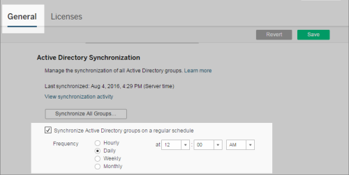
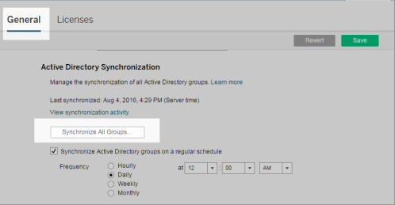
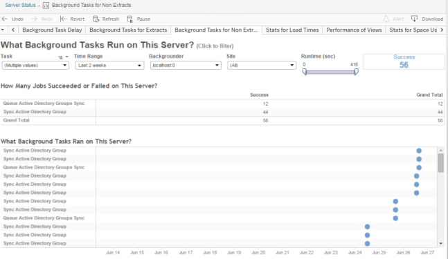

Quick Start: Synchronize All Active Directory Groups on a Schedule
==================================================================
After you import Active Directory groups in [Tableau
Server], you can make sure they stay synchronized
in [Tableau Server] by setting up a schedule. You
can also synchronize all Active Directory groups on the server
on-demand, at any time. The minimum site role setting for the group is
applied when users are synchronized.

**Note**: In the context of user and group synchronization, Tableau
Server configured with LDAP identity store is equivalent to Active
Directory. Active Directory synchronization features in Tableau Server
function seamlessly with properly configured LDAP directory solutions.

::: {.grid-section .grid-ul}
::: {classstring="quickstart"}
[[]{.icon--med-lg .icon--arrow-up .heading-item__icon}](https://help.tableau.com/current/server/en-us/qs_ad_group_sync.htm#){.heading-item__link .print-hidden} [1]{.step-bg} Set a minimum site role for synchronization {#1-set-a-minimum-site-role-for-synchronization}
-------------------------------------------------------------------------------------------------------------------------------------------------------------------------------------------------------------------------
:::

In a site, click [ Groups]. Select a group, and then click
[Actions]\> [Minimum Site Role]. Select the
minimum site role, and then click [Change Site Role]. Server
and site administrators can set the minimum site role for group users to
be applied during Active Directory synchronization. If you don\'t set a
minimum site role, new users are added as [Unlicensed].

Synchronizing can promote a user\'s site role, but will never demote a
user\'s site role.
:::

::: {.grid-section .grid-ur}
::: {classstring="quickstart"}
[[]{.icon--med-lg .icon--arrow-up .heading-item__icon}](https://help.tableau.com/current/server/en-us/qs_ad_group_sync.htm#){.heading-item__link .print-hidden} [2]{.step-bg} Set the schedule {#2-set-the-schedule}
----------------------------------------------------------------------------------------------------------------------------------------------------------------------------------------------
:::

Server administrators can enable synchronization for all Active
Directory groups on the [General] tab of the
[Settings] page for the server. Enable synchronization,
select the frequency settings, and then click [Save].

All Active Directory groups on the server are synchronized according to
the same schedule.
:::

::: {.grid-section .grid-ll}
::: {classstring="quickstart"}
[[]{.icon--med-lg .icon--arrow-up .heading-item__icon}](https://help.tableau.com/current/server/en-us/qs_ad_group_sync.htm#){.heading-item__link .print-hidden} [3]{.step-bg} Run synchronization on-demand (optional) {#3-run-synchronization-ondemand-optional}
----------------------------------------------------------------------------------------------------------------------------------------------------------------------------------------------------------------------
:::

On the [General] tab of the [Settings] page,
click [Synchronize All Groups] to synchronize all Active
Directory groups on [Tableau Server] immediately.
Click this button at any time to ensure new users and changes are
reflected in all Active Directory groups on the server.

Click [Synchronize All Groups] to synchronize all Active
Directory groups on the server outside of a schedule.
:::

::: {.grid-section .grid-lr}
::: {classstring="quickstart"}
[[]{.icon--med-lg .icon--arrow-up .heading-item__icon}](https://help.tableau.com/current/server/en-us/qs_ad_group_sync.htm#){.heading-item__link .print-hidden} [4]{.step-bg} View the status of synchronization tasks {#4-view-the-status-of-synchronization-tasks}
----------------------------------------------------------------------------------------------------------------------------------------------------------------------------------------------------------------------
:::

Server and site administrators can view the results of Active Directory
synchronization jobs in the **Background Tasks for Non Extracts**
administrative view. On the server or in a site, click
[Status]. Under [Analysis], click [Background
Tasks for Non Extracts] and filter on the [Queue Active
Directory Groups Sync] and [Sync Active Directory
Group] tasks.

**Queue Active Directory Groups Sync** queues the **Sync Active
Directory Group** tasks to be run.
