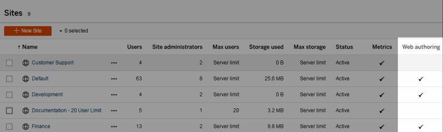
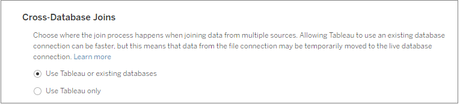
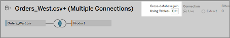

Set a Site's Web Authoring Access and Functions
===============================================

[Version: 2020.3]{.article__tags--version}\
[Applies to: Tableau Online, Tableau
Server]{.article__tags--applies-to}\
[]{.article__tags--role}

Tableau Server administrators can specify at the site level whether to
allow users to edit published views in the web environment and configure
other web authoring functionality.

By default web authoring functionality is enabled for all sites. Users
with the [Web Edit] capability can create and edit workbooks
directly on the server. Turn off web authoring if you want users to be
able to view and interact with published workbooks but not make any
changes to the core information.

The steps below describe how to set web authoring and other associated
functionality for an entire site. For more granular control over which
users can use web editing, you can use projects, groups, and
permissions. See [Set Web Edit, Save, and Download Access on
Content[(Link opens in a new
window)]](https://help.tableau.com/current/server/en-us/web_author_who.htm).

##### Turn web authoring on or off for a site
------------------------------------------------------------------------------------------------------------------------

1.  In a web browser, sign in to the server as an administrator and go
    to the site in which you want web authoring to be enabled. In that
    site, click [Settings].

2.  Select [Allow users to use web authoring] to enable the
    functionality.

    Clear the check box to turn off web authoring for that site.

    

3.  If your site is already in production, and you want the change to
    take effect immediately, restart the server.

    Otherwise, the change takes effect after server session caching
    expires or the next time users sign in after signing out.

####  Notes

-   When you enable web authoring, make sure that, on the appropriate
    workbooks or views, the permission rule for a user or group allows
    the **Web Edit** capability.

-   If you turn off web authoring on a production site and do not
    complete the last step to restart the server, users might continue
    to have authoring access until their session caches expire or they
    sign out.

##### See which sites allow web authoring
--------------------------------------------------------------------------------------------------------------------

To confirm which sites allow web authoring, on the site-selection menu
at the top, select [Manage All Sites], and then go to the
[Sites] page.

##### Configure cross-database join options
----------------------------------------------------------------------------------------------------------------------

To improve performance for cross-database joins, users can allow Tableau
to perform the join using the live database they are connected to
instead of using Hyper. While this option is faster, if Tableau uses the
connected database to perform the join, data from the file data source
that the user is connected to is temporarily moved into temp tables in
the database. Because this moves data outside of Tableau, as an
administrator you may want to restrict access to this feature for users
with web authoring permissions.

1.  In a web browser, sign in to the server as an administrator and go
    to the site in which you want web authoring to be enabled. In that
    site, click [Settings].
2.  In the [Cross-Database Joins] setting, select one of the
    following options:
    -   [Use Tableau or existing databases] - Select this
        option if you want to allow users to choose whether they want to
        allow Tableau to use the live database to perform cross database
        joins. Published data sources with this option enabled will
        continue to use the user\'s database for cross-database joins.

    -   [Use Tableau only] - Select this option to restrict
        users to use only Hyper to perform cross data-base joins.

        

        If you select [Use Tableau only], the option to
        choose how Tableau performs the cross-database join won\'t
        display in the canvas when the user connects to a supported data
        source and supported database. For more information about this
        feature, see [Improve performance for cross-database joins[(Link
        opens in a new
        window)]](https://help.tableau.com/current/pro/desktop/en-us/joining_tables.htm#cross_dbase_joins_perf).

        
