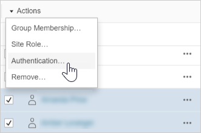

Set the User Authentication Type for SAML
=========================================
On a site that has been configured for site-specific SAML,
administrators can specify users' authentication type. For example, if
Tableau Server was configured for site-specific SAML and server-wide
SAML, administrators can specify which users authenticate with
site-specific SAML and which users authenticate with server-wide SAML.

You can assign authentication type at the time you add users to [Tableau
Server], as well as any time afterward.

1.  When you're signed in to the [Tableau Server]
    site, select **Users**.

2.  On the [Site Users] page, select the check boxes next to
    the users you want to assign an authentication type.

3.  On the [Actions] menu, select
    [Authentication].

    

4.  In the Authentication dialog box, select [Site SAML] or
    [Server Default].

##### Notes
----------------------------------------------------------------------------------------

-   Users that authenticate with site-specific SAML can only belong to
    one site. If a user needs to belong to multiple sites, set their
    authentication type to the server default. Depending on how
    site-specific SAML was configured by the server administrator, the
    server default is either local authentication or server-wide SAML.

-   If you change users' authentication to site-specific SAML, the next
    time they sign in, they will be directed to your identity provider's
    site to provide their credentials.
