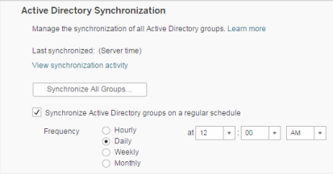
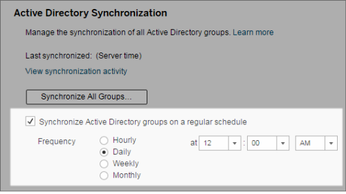
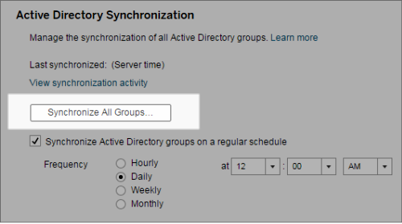
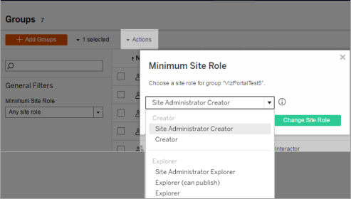

Synchronize External Directory Groups on the Server
===================================================
As a server administrator, you can synchronize all external directory
(such as Active Directory) groups (that have been configured on Tableau
Server) on a regular schedule or on-demand on the [General]
tab of the [Settings] page for the server.

**Note**: In the context of user and group synchronization, Tableau
Server configured with LDAP identity store is equivalent to Active
Directory. Active Directory synchronization features in Tableau Server
function seamlessly with properly configured LDAP directory solutions.

[[]{.icon--med-lg .icon--arrow-up .heading-item__icon}](https://help.tableau.com/current/server/en-us/groups_globalsync.htm#){.heading-item__link .print-hidden} Before you begin
---------------------------------------------------------------------------------------------------------------------------------------------------------------------------------

Before synchronizing groups as described in this topic, you must first
import the external directory group into Tableau Server. See [Create
Groups via Active
Directory](https://help.tableau.com/current/server/en-us/groups_create_ad.htm).

[[]{.icon--med-lg .icon--arrow-up .heading-item__icon}](https://help.tableau.com/current/server/en-us/groups_globalsync.htm#){.heading-item__link .print-hidden} Synchronize external directory groups on a schedule
--------------------------------------------------------------------------------------------------------------------------------------------------------------------------------------------------------------------

1.  **Single-site**: Click [Settings]\>
    [General].

    **Multisite**: In the site menu, click **Manage All Sites** and then
    click [Settings]\> [General].

2.  Scroll down the page to [Active Directory
    Synchronization], and then select [Synchronize Active
    Directory groups on a regular schedule].

    

3.  Select the frequency and time of synchronization.

4.  Click [Save].

[[]{.icon--med-lg .icon--arrow-up .heading-item__icon}](https://help.tableau.com/current/server/en-us/groups_globalsync.htm#){.heading-item__link .print-hidden} Synchronize all external directory groups on demand
--------------------------------------------------------------------------------------------------------------------------------------------------------------------------------------------------------------------

At any time, you can synchronize external directory (such as Active
Directory) groups with [Tableau Server] to ensure
that new users and changes in the external directory are reflected in
all external directory groups on [Tableau
Server].

1.  **Single-site**: Click [Settings]\>
    [General].

    **Multisite**: In the site menu, click **Manage All Sites**, and
    then click [Settings]\> [General].

    

2.  Under [Active Directory Synchronization], click
    [Synchronize All Groups].

[[]{.icon--med-lg .icon--arrow-up .heading-item__icon}](https://help.tableau.com/current/server/en-us/groups_globalsync.htm#){.heading-item__link .print-hidden} View synchronization activity
----------------------------------------------------------------------------------------------------------------------------------------------------------------------------------------------

You can view the results of synchronization jobs in the **Background
Tasks for Non Extracts** administrative view. **Queue Active Directory
Groups Sync** is the task that queues and indicates the number of **Sync
Active Directory Group** tasks to be run.

1.  **Single-site**: Click [Status].

    **Multisite**: In the site menu, click **Manage All Sites** and then
    click [Status].

2.  Click the [Background Tasks for Non Extracts] link.

3.  Set the [Task] filter to include **Queue Active
    Directory Groups Sync** and **Sync Active Directory Group**.

You can quickly navigate to this administrative view by clicking the
[View synchronization activity] link in the
[Settings] page for the server.

[[]{.icon--med-lg .icon--arrow-up .heading-item__icon}](https://help.tableau.com/current/server/en-us/groups_globalsync.htm#){.heading-item__link .print-hidden} Set the minimum site role for users in an external directory group
-----------------------------------------------------------------------------------------------------------------------------------------------------------------------------------------------------------------------------------

In the[ Groups - Details] page, you can set the minimum site
role for group users to be applied during Active Directory
synchronization.

This setting does not run synchronization; instead, it sets the minimum
site role to applied to the group every time synchronization runs. The
result is that when you synchronize external directory groups, new users
are added to the site with the minimum site role. If a user already
exists, the minimum site role is applied if it gives the user more
access in a site. If you don\'t set a minimum site role, new users are
added as [Unlicensed] by default.

**Note:** A user\'s site role can be promoted but never demoted based on
the minimum site role setting. If a user already has the ability to
publish, that ability will always be maintained. For more information on
minimum site role, see [Site roles and Active Directory import and
synchronization](https://help.tableau.com/current/server/en-us/users_site_roles.htm#MinSiteRoleImport).

1.  In a site, click [Groups].

2.  On the Groups page, select a group.

    Click [Actions] \> [Minimum Site Role].

3.  Select the minimum site role, and then click **Change Site Role**.

    

[[]{.icon--med-lg .icon--arrow-up .heading-item__icon}](https://help.tableau.com/current/server/en-us/groups_globalsync.htm#){.heading-item__link .print-hidden} What happens when users are removed in the source external directory? 
---------------------------------------------------------------------------------------------------------------------------------------------------------------------------------------------------------------------------------------

Users cannot be automatically removed from the Tableau Server through an
external directory sync operation. Users that are disabled, deleted, or
removed from groups in the external directory remain on Tableau Server
so that administrators can audit and reassign the user\'s content before
removing the user\'s account completely. For more information, see [Sync
behavior when removing users from Active
Directory](https://help.tableau.com/current/server/en-us/users_manage_ad.htm#Sync).

[[]{.icon--med-lg .icon--arrow-up .heading-item__icon}](https://help.tableau.com/current/server/en-us/groups_globalsync.htm#){.heading-item__link .print-hidden} []{#Improvin}Improving group synchronization performance
-------------------------------------------------------------------------------------------------------------------------------------------------------------------------------------------------------------------------

External directory synchronization is performed by the backgrounder
process. The Backgrounder process is the same process that is used for
managing and creating extracts, and is also used to generate
subscription content. In large organizations with dynamic group
membership and heavy extract usage, the external directory group
synchronization process may be disruptive. We recommend running group
synchronization during non-business hours.

By default, the Backgrounder process performs synchronization in a
serial operation. This means that each group is synchronized, one after
the other, in a single Backgrounder process. If you are running multiple
instances of Backgrounder processes either on a single Tableau Server or
across a distributed deployment, consider enabling parallel processing
for external directory synchronization. When parallel Backgrounder
processing is enabled, the group synchronization is distributed across
multiple Backgrounder processes for better performance.

To enable parallel backgrounder processing for group synchronization,
open TSM CLI and enter the following commands:

`tsm configuration set -k backgrounder.enable_parallel_adsync -v true`

`tsm pending-changes apply`
