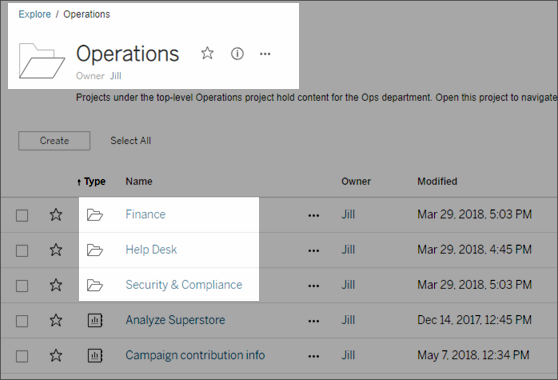

Use Projects to Manage Content Access
=====================================
When Tableau Desktop users publish a workbook or data source to a site
on [Tableau Server], they can select a *project*
to publish it to. If they don't specify a project, their content is
published to the [Default] project.

As an administrator, you can create projects to hold and organize
related *content*, or to delegate content management. Content on
[Tableau Server] are workbooks, views, and data
sources, and the projects that hold them. If the Data Management Add-on
is present, content types also include Flows and Data Roles.

The following image shows content within the top-level Operations
project in the web authoring environment. The Operations project
contains a few child projects (highlighted) and published workbooks. A
project can also contain other content types, such as data sources and
flows.

[[]{.icon--med-lg .icon--arrow-up .heading-item__icon}](https://help.tableau.com/current/server/en-us/projects.htm#){.heading-item__link .print-hidden} []{#why-projects}Why use projects
-----------------------------------------------------------------------------------------------------------------------------------------------------------------------------------------

Projects help you to create a scalable process for managing access to
the content published to [Tableau Server].
Advantages they have include:

-   They enable administrators to delegate content management to project
    leaders who work with the content more closely, without having to
    give them administrator access to site or server settings.
    -   Project leaders can create nested projects under their top-level
        project, enabling them to maintain their team's content within a
        single hierarchy.
    -   **Note:** Project owners can delete top-level projects they own.
        Project leaders cannot delete top-level projects.
-   They can make the site easier to navigate for self-service users.
    -   They segment the [Tableau Server] site
        into areas that give users access based on how they use the data
        published to those areas, or on the Tableau user group they work
        with.
    -   You can hide projects from groups who don't need to use them,
        create a distinguishable project-naming scheme, and take
        advantage of project descriptions to clarify how to use the
        project.
-   They enable you to track permissions effectively.
    -   You can create groups based on the level of content access users
        in the group need, and set default permissions on projects. This
        enables you to know exactly which capabilities new users get by
        default, and likewise which capabilities all users get when a
        new project is created.

### [[]{.icon--med-lg .icon--arrow-up .heading-item__icon}](https://help.tableau.com/current/server/en-us/projects.htm#){.heading-item__link .print-hidden} When to create project hierarchies (example)

Many organizations have several or more distinct groups of Tableau
users, each with its own priorities and leaders. These groups might
share some organization-wide content (or even draw from an org-wide pool
of data sources), but primarily they use data and reports that are
specific to their team. In this or similar scenario, an example for
using project hierarchies might look as follows:

1.  You, as a site or server administrator, can create top-level
    projects for each of your distinct Tableau teams.
2.  On each top-level project, you assign the Project Leader status to
    team leads, and change project ownership. Project leaders
    effectively are the content administrators, so it's important that
    they understand how permissions work in Tableau, along with Tableau
    content management best practices.
3.  Each project leader can manage their project, creating the structure
    within the project that works for their team. That is, they can
    create child projects they need, based on how their team members
    collaborate and share data and reports.

The benefit to you as the site administrator is that you can focus on
system health. The benefit to your Tableau users is that people who know
the best practices for working with Tableau and data can manage these
things for their teams, without having to submit IT requests to change
permissions or add projects.

**Why not use sites?**

If you manage your own Tableau Server deployment, you can create as many
sites as you want. However, for managing data and reports across your
company, projects allow the flexibility you need to administer shared
data and reports, and users who might belong to multiple groups. Many
Tableau administrators configure projects as described in the previous
section, to expose only what's necessary to users who need to work with
it. Projects work better than sites for evolving content from
development to staging to production.

Sites work well when content can remain completely separate during all
phases, and there is little to no user overlap. A good (and common)
example for using multiple sites is to create a site for each of
multiple external clients, whose published content you manage as a
consultant or vendor. Our own Tableau Online is an example of this on a
large scale. Another example might be to use a separate site for
sensitive content that you want only specific Human Resources or medical
staff to use.
:::

[[]{.icon--med-lg .icon--arrow-up .heading-item__icon}](https://help.tableau.com/current/server/en-us/projects.htm#){.heading-item__link .print-hidden} []{#project-admin}Project-level administration {#projectlevel-administration}
------------------------------------------------------------------------------------------------------------------------------------------------------------------------------------------------------

As a server or site administrator, you can delegate administration of
projects and their content, without exposing access to your site or
server settings. You can do this by changing the ownership of a project
or granting a group or user project leader status on a project.

The **project owner** is always one individual user. By default, the
user who creates a project is its owner. The project owner has
administrative access to the project and content in it---including
making someone else the owner and assigning Project Leader permissions.

The [project leader] setting provides a way to allow
multiple users administrative access to a project, its child projects,
and all workbooks and data sources in those projects.

A project leader does not have to be a project owner or administrator.
In addition to server and site administrators, the full scope of Project
Leader permissions is available to users with a [Creator] or
[Explorer (can publish)] site role.

### [[]{.icon--med-lg .icon--arrow-up .heading-item__icon}](https://help.tableau.com/current/server/en-us/projects.htm#){.heading-item__link .print-hidden} Project ownership and project leader access in project hierarchies

In a multi-level project hierarchy, a user or group that is set as a
project leader, at any level within the hierarchy, is implicitly given
project leader access to all of that project's child projects and their
content items.

To remove the project leader access, you must do so at the parent level
in the hierarchy on which the ownership or setting was explicitly
assigned.

Similarly, the owner of a project at any level has project leader access
to all content in that project, as well as to any of its child projects,
even if they do not own the child projects.

Only a project owner or administrator can change ownership of a content
resource, and this can be done regardless of whether the project
permissions are locked.

### [[]{.icon--med-lg .icon--arrow-up .heading-item__icon}](https://help.tableau.com/current/server/en-us/projects.htm#){.heading-item__link .print-hidden} []{#project-actions}Actions project-level administrators can take on projects {#actions-projectlevel-administrators-can-take-on-projects}

Project leaders and owners can perform the tasks in the following list,
as can server or site administrators.

-   Create and delete projects as follows:
    -   Server or site administrators can create or delete top-level or
        nested projects anywhere on the site.
    -   Project owners and project leaders can create and delete
        child (nested) projects in projects they own, or on which they
        have project leader status.
-   Project owners can change ownership of their projects. Both project
    owners and project leaders can assign the project leader status to
    groups or users.
    -   As a project leader or owner, if you assign the project leader
        status to someone else, remember that full access to this role's
        capabilities depends on the user's site role, as specified
        earlier in this section.
-   Set permissions for a project, as well as the child projects,
    workbooks, and data sources in it.
-   Lock permissions to apply the project's default settings to all
    workbooks, data sources, and optionally child projects and their
    content. For information, see [Lock content
    permissions](https://help.tableau.com/current/server/en-us/permissions.htm#LockProject)
    -   Permissions can be modified only from the project they're locked
        on. Only admins, the owner, or project leaders can change
        permissions.
-   Move workbooks and data sources to another project to which they
    have project leader or owner access. Moving the project can affect
    permissions. For information, see [Move
    content](https://help.tableau.com/current/server/en-us/permissions.htm#MoveContent){.MCXref
    .xref} .
-   Run, add, or remove extract refresh schedules.

See also [Project
administration](https://help.tableau.com/current/server/en-us/permissions.htm#projectpermissions).

[[]{.icon--med-lg .icon--arrow-up .heading-item__icon}](https://help.tableau.com/current/server/en-us/projects.htm#){.heading-item__link .print-hidden} []{#default-project-about}How the Default project acts as a permissions template
----------------------------------------------------------------------------------------------------------------------------------------------------------------------------------------------------------------------------------------

Tableau creates a **Default** project with every site.

The Default project serves as a template for new top-level projects you
create on the site. When you create a new top-level project, settings
and permissions from the Default template are applied to the new
project, including permissions set on content within the project.

**Note:** Nested projects (projects you create within other projects)
take the permissions set at their parent project, not the Default
project.

Before you create other top-level projects, you can take steps to set up
the Default project, to help you to know exactly:

-   Which type of user gets what level of access for each new project.
-   How you might need to modify permissions for each new project.

For more information, see [Steps to coordinate projects and
groups](https://help.tableau.com/current/server/en-us/projects_data_gov.htm#coord-projects-groups) in the topic Configure Projects, Groups, and Permissions for
Managed Self-Service.

[[]{.icon--med-lg .icon--arrow-up .heading-item__icon}](https://help.tableau.com/current/server/en-us/projects.htm#){.heading-item__link .print-hidden} []{#project-lock-perms}Prevent publishers from changing permissions on content they own {#ProjLock}
-----------------------------------------------------------------------------------------------------------------------------------------------------------------------------------------------------------------------------------------------

Administrators and project leaders can prevent users from changing the
permissions for workbooks and data sources in a project hierarchy. For
example, you can disable the option to set permissions during the
publishing process, and prevent publishers and content owners from
changing them after publishing. To do this, you *lock* content
permissions to the project. For more information, see [Lock content
permissions](https://help.tableau.com/current/server/en-us/permissions.htm#LockProject).
:::

[[]{.icon--med-lg .icon--arrow-up .heading-item__icon}](https://help.tableau.com/current/server/en-us/projects.htm#){.heading-item__link .print-hidden} Other articles in this section
--------------------------------------------------------------------------------------------------------------------------------------------------------------------------------------

-   [Add Projects and Move Content Into
    Them](https://help.tableau.com/current/server/en-us/projects_add.htm)
-   [Add a Project
    Image](https://help.tableau.com/current/server/en-us/custom_projectimage.htm)

