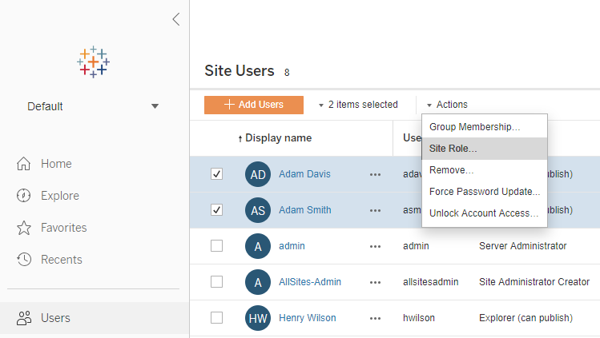
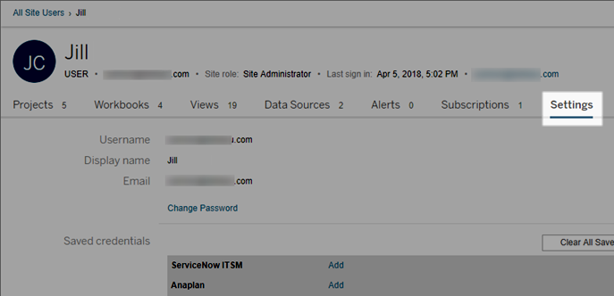
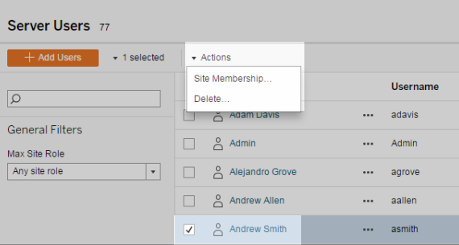
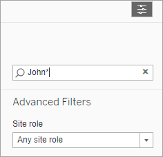
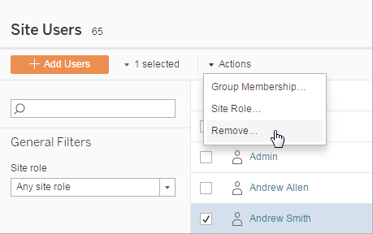
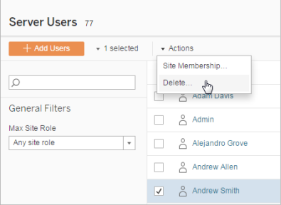

View, Manage, or Remove Users
=============================
Administrators can manage a site's users such as adding and removing
users, setting the groups they're members of, setting their site roles,
and so on. On Tableau Server, server administrators can manage users on
multiple sites at a time on the [All Sites] page.

::: {.accordion}
::: {.accordion__title}
[]{.icon--xl .accordion__icon .icon--chevron-right2 role="button"
tabindex="0" aria-expanded="false" aria-label="Expand"} View and manage
users on a site
:::

::: {.accordion__content .print-visible style="display: none;"}

Sign in to a site as an administrator, and then select
[Users]. On this page you can do any of the following to
manage users:

-   Set group membership, set site role, or remove the user from the
    site. If you've configured the site for SAML single sign-on, you can
    set the selected users' authentication type.

    

-   Select a user name to see details about them, such as content they
    own, views they subscribe to, and their account settings.

    The user [Settings] page is available when the following
    conditions are true:

    -   The user is a member only of sites that the site administrator
        controls

    -   Site administrators can manage users. This is always the case
        for Tableau Online and is the default for Tableau Server;
        Tableau Server administrators can change this access for site
        admins.

    

    If the server is configured to use the internal user management
    system (Local Authentication), you can edit the **Display Name**,
    [Email], and **Password** for users after they have been
    added. If you are making many changes, you may find it easier to
    import the changes from a CSV file. For details, see [Import
    Users](https://help.tableau.com/current/server/en-us/users_import.htm){.MCXref
    .xref} and [CSV Import File
    Guidelines](https://help.tableau.com/current/server/en-us/csvguidelines.htm){.MCXref
    .xref}.

:::
:::

::: {.accordion}
::: {.accordion__title}
[]{.icon--xl .accordion__icon .icon--chevron-right2 role="button"
tabindex="0" aria-expanded="false" aria-label="Expand"} View and edit
server users
:::

::: {.accordion__content .print-visible style="display: none;"}

Sign in to [Tableau Server] as a server
administrator. On the site menu, select [Manage All Sites],
and then select [Users].

:::
:::
:::

::: {.accordion}
::: {.accordion__title}
[]{.icon--xl .accordion__icon .icon--chevron-right2 role="button"
tabindex="0" aria-expanded="false" aria-label="Expand"} Manage users'
site membership
:::

::: {.accordion__content .print-visible style="display: none;"}

By default, server and site administrators can manage users at the
individual site level. Server administrators can also manage users and
their site roles on multiple sites. You do this at the [All
Sites] level (at the server level).

1.  In the site menu, select **Manage All Sites**, and then select
    [Users].

2.  On the Server Users page, select the check boxes next to the users,
    and then select [Actions] \> [Site
    Membership].

3.  Select one or more sites, and a site role for each site, and then
    click [Save].

:::
:::

::: {.accordion}
::: {.accordion__title}
[]{.icon--xl .accordion__icon .icon--chevron-right2 role="button"
tabindex="0" aria-expanded="false" aria-label="Expand"} Search for users
:::

::: {.accordion__content .print-visible style="display: none;"}

To search for a specific user

Use the filter toggle in the upper right to display the search box and
site role filter. Then use the search box or filters to find the users
you want.

The search operation checks the display name and user name attributes.

You can use the asterisk (\*) character as a search wildcard. For
example, searching for `John*` will return all user names that start
with *John*.

:::
:::

::: {.accordion}
::: {.accordion__title}
[]{.icon--xl .accordion__icon .icon--chevron-right2 role="button"
tabindex="0" aria-expanded="false" aria-label="Expand"} Remove users
from a site
:::

::: {.accordion__content .print-visible style="display: none;"}

You can remove a user only if the user does not own any content
(projects, workbooks, views, or data sources). If you attempt to remove
a user who owns content, the user site role will be set to Unlicensed,
but the user will not be removed.

If the default All Users group has enabled Grant site role on sign in,
that user\'s content must be reassigned to another user or removed
before they can be unlicensed or removed. For more information on Grant
role on sign in, see [Removing users affected by Grant role on sign
in](https://help.tableau.com/current/server/en-us/grant_role.htm#remove). For more information on changing content ownership, see [Manage
Content
Ownership](https://help.tableau.com/current/server/en-us/owner.htm)

**Note:** On Tableau Server, when an administrator removes a user from a
site (and the user belongs only to that one site), the user is also
deleted from the server.

1.  Sign in to a site as an administrator, and go to the
    [Users] area. Select one or more users to remove, and
    then select [Actions] \> [Remove].

    

2.  Click **Remove** in the confirmation dialog.

:::
:::

::: {.accordion}
::: {.accordion__title}
[]{.icon--xl .accordion__icon .icon--chevron-right2 role="button"
tabindex="0" aria-expanded="false" aria-label="Expand"} Remove users
from the server
:::

::: {.accordion__content .print-visible style="display: none;"}

You can remove a user only if the user does not own any content
(projects, workbooks, views, or data sources). If you attempt to remove
a user who owns content, the user site role will be set to Unlicensed,
but the user will not removed.

If a user is a member of multiple sites, and they own content on any of
those sites, they are removed from the sites on which they don't own
content. The user remains a member on sites where they own content, but
demoted to the Unlicensed site role.

1.  In the site menu, click [Manage All Sites], and then
    click [Users]. In a single-site environment, click
    [Users].

    Select one or more users to delete, and then click
    [Actions] \> [Delete].

    

2.  Click **Delete** in the confirmation dialog box.

:::
:::
:::

::: {.accordion}
::: {.accordion__title}
[]{.icon--xl .accordion__icon .icon--chevron-right2 role="button"
tabindex="0" aria-expanded="false" aria-label="Expand"} Change passwords
for users of a single site
:::

::: {.accordion__content .print-visible style="display: none;"}

To change the password for a user with membership to a single site, sign
in to [Tableau Server] as a site administrator or
a server administrator.

1.  Ensure that the correct site is selected in the menu.

2.  Click [Users].

3.  Click the display name of a user.

4.  Click [Settings].

5.  Click the [Change Password] link, edit the password, and
    then click [Save Password].

    

